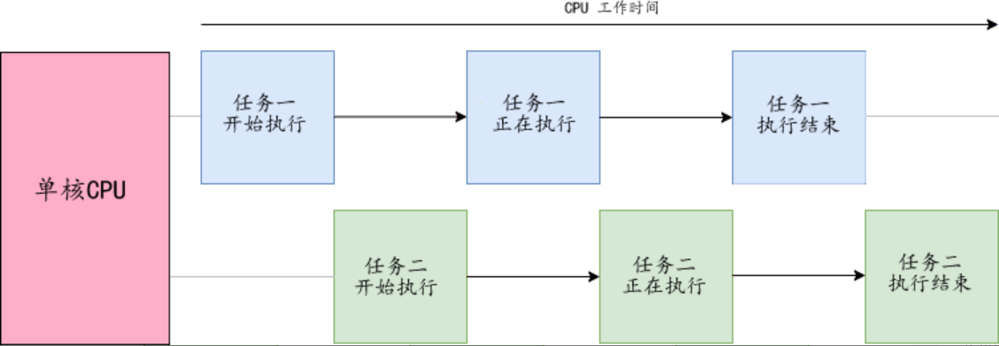
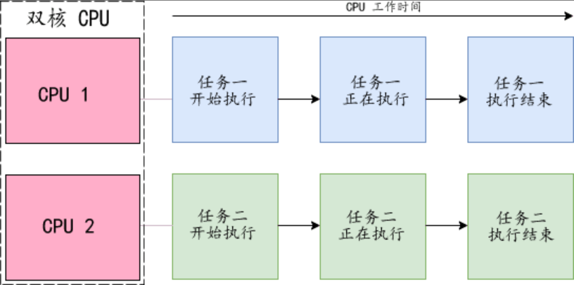
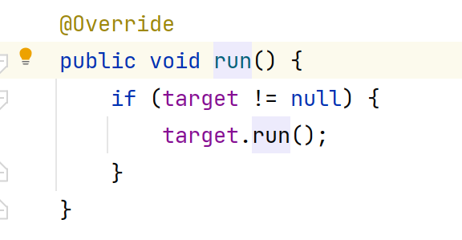
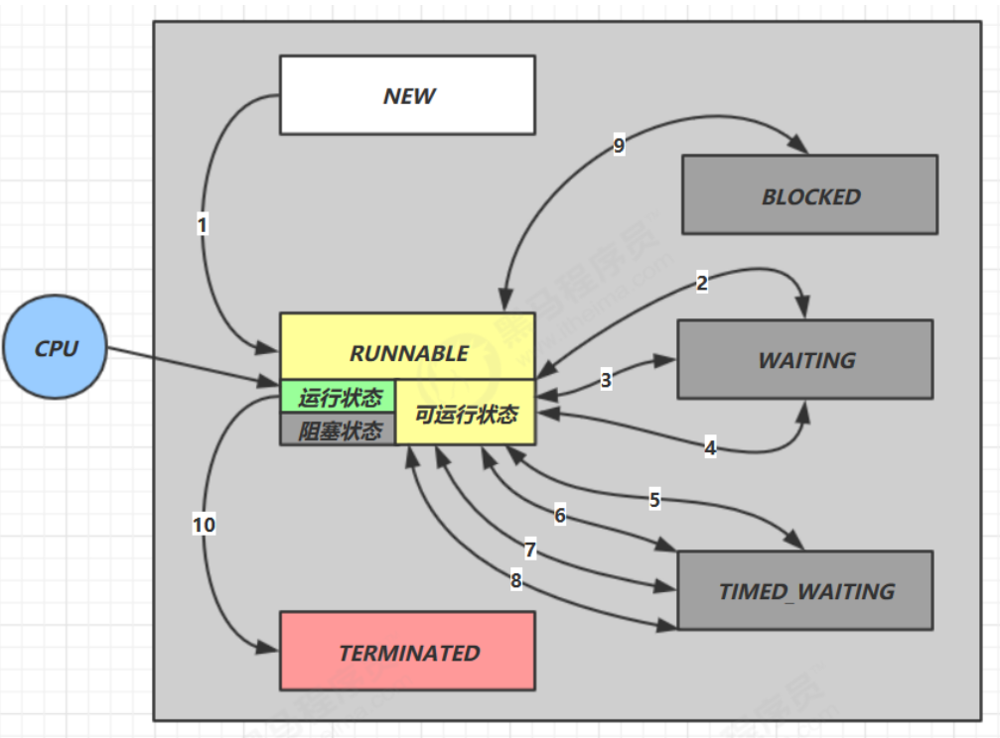
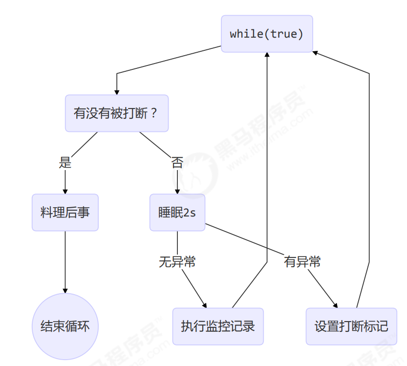
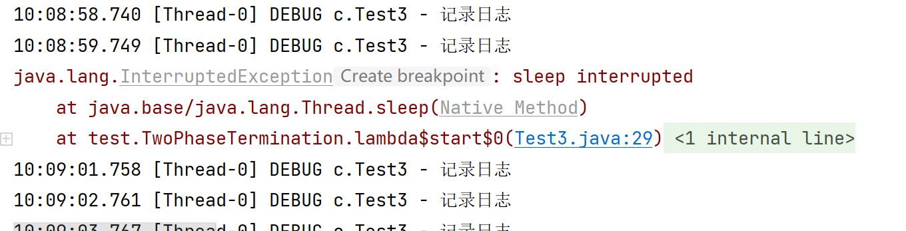

# 多线程

[TOC]

## 基础知识

### 并发和并行有什么区别？

**并发**

- 并发是指两个或多个任务在**同一时间段**内发生
- 把CPU运行时间划分成若干个时间段，再将时间段分配给各个线程执行。在一个时间段的线程代码运行时，其它线程处于挂起等待状态。
- 这些线程**微观上**都是被顺序执行的，只是由于每个线程分配的时间段特别短，线程执行的切换速度非常快，在**宏观上**看起来他们像是被同时执行的。



**并行**

- 并行是指两个或者多个任务在**同一时间点**发生
- 当一个CPU执行一个线程时，另一个CPU可以执行另一个线程，两个线程互不抢占CPU资源，可以同时进行。并行是真正的同时执行。



### 进程、线程和管程

**进程**

程序的一次执行过程，是系统运行程序的基本单位

**线程**

线程与进程相似，但线程是一个比进程更小的执行单位。一个进程在其执行的过程中可以产生多个线程。

**管程（Monitor）——锁**

执行线程要求先成功持有管程，然后才能执行方法，最后当方法完成（无论正常完成还是非正常完成）时释放管程。在方法执行期间，执行线程持有了管程，其他任何线程都无法在获取到同一个管程。

### 用户线程和守护线程

**用户线程**

- 一般不做特别配置，**默认**都是用户线程；
- 它会完成这个程序需要完成的业务操作；

**守护线程**

- 是一种特殊的线程，**为其他线程服务的**，如：垃圾回收线程；
- 加入系统只剩下守护线程，JVM会自动退出；
- `public final boolean isDaemon()`：判断是否为守护线程；
- `public final void setDaemon(boolean on)`：设置守护线程。

### 创建多线程的方式及其优缺点？

1. **继承`Thread`类**

   `MyThread`类：

   ```java 
   public class MyThread extends Thread{
       @Override
       public void run() {
           for (int i = 0; i < 10; i++) {
               int random = (int) (Math.random() * 1000);
               try {
                   Thread.sleep(random);
               } catch (InterruptedException e) {
                   e.printStackTrace();
               }
               System.out.println("run" + Thread.currentThread().getName());
           }
       }
   }
   ```

   `Test`类：

   ```java
   public class Test {
       public static void main(String[] args) {
           MyThread myThread = new MyThread();
           myThread.setName("myThread");
           myThread.start();
           for (int i = 0; i < 10; i++) {
               int random = (int) Math.random();
               try {
                   Thread.sleep(1000);
               } catch (InterruptedException e) {
                   e.printStackTrace();
               }
               System.out.println("run=" + Thread.currentThread().getName());
           }
       }
   }
   ```

2. **实现`Runnable`接口**

   `MyRunnable`类：

   ```java
   public class MyRunnable implements Runnable{
       @Override
       public void run() {
           System.out.println("运行中!");
       }
   }
   ```

   `Test`类：

   ```java
   public class Test {
       public static void main(String[] args) {
           MyRunnable myRunnable = new MyRunnable();
           Thread thread = new Thread(myRunnable);
           thread.start();
           System.out.println("运行结束!");
       }
   }
   ```

   实现`Runnable`接口的好处

   - 避免了单继承的局限性；
   - 更适合处理有共享资源的情况。

### 分析下列程序执行结果

```java
public class MyThread extends Thread {
   public MyThread() {
       System.out.println("MyThread---begin");
       System.out.println("Thread.currentThread().getName(): "
               + Thread.currentThread().getName());
       System.out.println("this.getName(): " + this.getName());
       System.out.println("MyThread---end");
   }

    @Override
    public void run() {
        System.out.println("MyThread---begin");
        System.out.println("Thread.currentThread().getName(): "
                + Thread.currentThread().getName());
        System.out.println("this.getName(): " + this.getName());
        System.out.println("MyThread---end");
    }
}
```

```java
public class Test {
    public static void main(String[] args) {
        MyThread myThread = new MyThread();
        Thread thread = new Thread(myThread);
        thread.setName("A");
        thread.start();
    }
}
```

**运行结果：**

```
MyThread---begin
Thread.currentThread().getName(): main
this.getName(): Thread-0
MyThread---end
MyThread---begin
Thread.currentThread().getName(): A
this.getName(): Thread-0
MyThread---end
```

重点理解`Thread`类中的`run()`方法的调用：



### 线程中操作系统层面的5种状态和Java API层面的6种状态

1. **操作系统层面**

   

2. **Java API层面**

   

   - `NEW`、`TERMINATED`和操作系统层面的相似；
   - `RUNNABLE`为调用了`start()`方法后，该状态涵盖了操作系统层面的**可运行状态**、**运行状态**、**阻塞状态**；
   - `BLOCKED`、`WATING`、`TIMED_WAITING`是Java API层面对**阻塞状态**的细分。

### 线程安全的三个方面

1. **原子性**：互斥访问，同一个时刻只能有一个线程来对它进行操作

   ```java
   public class Test {
       private static int i = 0;
       private static Object obj = new Object();
   
       public static void main(String[] args) throws InterruptedException {
           Thread t1 = new Thread(() -> {
               synchronized (obj) {
                   for (int j = 0; j < 5000; j++) {
                       i++;
                   }
               }
           }, "t1");
           Thread t2 = new Thread(() -> {
               synchronized (obj) {
                   for (int j = 0; j < 5000; j++) {
                       i--;
                   }
               }
           }, "t2");
           t1.start();
           t2.start();
           t1.join();
           t2.join();
           System.out.println(i);
       }
   }
   ```

2. **可见性**：一个线程对主内存的修改可以及时的被其他线程观察到

   ```java
   public class Test {
       private static volatile boolean run = true;
   
       public static void main(String[] args) throws InterruptedException {
           new Thread(() -> {
               while (run) {
   
               }
           },"t1").start();
           Thread.sleep(1000);
           run = false;
       }
   }
   ```

3. **有序性**：一个线程观察其他线程中指令执行顺序，由于指令重排序存在，观察结果一般杂乱无序

   ```java
   int num = 0;
   boolean ready = false;
   
   // 线程1：执行此方法
   public void actor1(I_Result r) {
       if (ready) {
           r.r1 = num + num;
       } else {
           r.r1 = 1;
       }
   }
   
   // 线程2：执行此方法
   public void actor2(I_Result r) {
       num = 2;
       ready = true;
   }
   ```

   可能的结果：1，4，**0（重排）**

   解决办法：`volatile`修饰的变量，可以禁用指令重排（`volatile boolean ready = true`）

### volatile关键字

1. **保证内存可见性**

   可见性是指线程之间的可见性，⼀个线程修改的状态对另⼀个线程是可见的。也就是⼀个线程修改的结果，另⼀个线程马上就能看到；

   实现原理：

   - 当对⾮`volatile`变量进⾏读写的时候，每个线程先从主内存拷贝变量到CPU缓存中，如果计算机有多个CPU， 每个线程可能在不同的CPU上被处理，这意味着每个线程可以拷贝到不同的CPU cache中；
   - `volatile`变量不会被缓存在寄存器或者对其他处理器不可见的地⽅，保证了每次读写变量都从主内存中读，跳 过CPU cache这⼀步。当⼀个线程修改了这个变量的值，新值对于其他线程是⽴即得知的。 

   ```java
   public class Test {
       private static volatile boolean run = true;
   
       public static void main(String[] args) throws InterruptedException {
           new Thread(() -> {
               while (run) {
                   
               }
           },"t1").start();
           Thread.sleep(1000);
           run = false;
       }
   }
   ```

2. **禁止指令重排**

3. 与`synchronized`对比：

   - volatile可以保证数据的可见性，但不能保证原子性；
   - synchronized可以保证原子性，也可以间接保证可见性，因为它会将私有内存和公共内存中的数据做同步

## 并发编程——模式

### 两阶段终止模式



代码实现：

```java
@Slf4j(topic = "c.Test3")
class TwoPhaseTermination {
    // 监控线程监控当前线程是否被打断
    private Thread monitor;

    // 启动监控线程
    public void start() {
        monitor = new Thread(() -> {
            while (true) {
                Thread current = Thread.currentThread();
                if (current.isInterrupted()) {
                    log.debug("料理后事");
                    break;
                }
                try {
                    Thread.sleep(1000); // 阻塞时线程被打断会抛异常，打断标记不会设置为true
                    log.debug("记录日志");
                } catch (InterruptedException e) {
                    e.printStackTrace();
                    // 重新设置打断标记
                    current.interrupt();
                }
            }
        });
        monitor.start();
    }

    // 停止监控线程
    public void stop() {
        monitor.interrupt();
    }
}
```

不加`current.interrupt()`的**运行结果**：



仅抛出异常，但由于没有重新设置打断标记，故没有终止。