[toc]

# Java基础

## 包装类

### Integer的享元机制

```java
Integer a = 100;
Integer b = 100;
System.out.println(a == b);  //true
System.out.println(a.equals(b)); //false
```

原因：Integer用到了享元模式的设计，它针对与[-128, 127]的数字做了缓存。使用`Integer a = 100`进行赋值操作时，它默认使用`valueOf`进行自动装箱，从而触发了缓存机制，使得`a`和`b`指向了相同的内存地址。


### Integer和int的区别

1. 作为成员变量，Integer类型的初始值是null，int类型的初始值为0；
2. Integer存储在堆内存中，而int类型存储在栈空间；
3. Integer是对象类型，它封装了很多的方法和属性，我们在使用时候更加灵活。

## 面向对象

### static方法可以被继承吗

1. 在Java中，静态方法可以被继承，但不能被重写(override)。
   当子类继承父类时，会继承父类中的**所有静态方法和静态变量**。子类可以通过类名直接调用父类的静态方法，也可以通过子类名直接调用子类的静态方法。
2. 然而，静态方法不具有多态性，因此不能被子类重写(`override`)。在子类中声明一个与父类中静态方法名称、参数列表和返回类型相同的静态方法，不会覆盖父类的静态方法。在子类中可以重新实现同名的静态方法，但此时父类中的静态方法仍然可以通过父类名调用。
3. 总之，静态方法是属于类的，不是属于实例的，因此它们不需要通过实例化对象来调用，子类可以继承父类中的所有静态方法，但不能重写(override)它们。

### 对象的内存分析

分析以下代码的内存存放结构：

```java
public class TestChinese {
    public static void main(String[] args) {
        Chinese.country = "中国";
        
        Chinese c1 = new Chinese();
        c1.name = "谷哥";
        c1.age = 32;
        
        Chinese c2 = new Chinese();
        c2.name = "谷姐";
        c2.age = 32;
    }
}
```

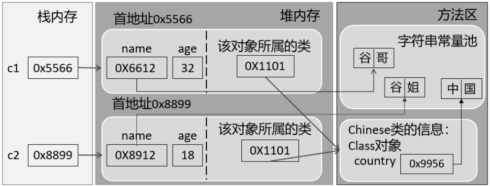

### String类

#### 为什么JDK9要将String的底层实现由char[]改为byte[]?

- 节省内存空间：byte占一个字节，char占用两个字节；

- 如果一个字符串只包含英文字符或者ASCII字符，那么只用一个字节就可以表示所有字符；
- 将`char[]`改为`byte[] + encoding flag field`

# JVM

## 基础概念

### JVM是什么？有什么好处？

**Java Virtual Machine**：Java程序的运行环境（Java二进制字节码的运行环境）

好处：

- 一次编写，到处运行
- 自动内存管理，垃圾回收机制


### JVM由哪几部分组成？运行流程是什么？


**类加载机制**：类的数据从Class文件加载到内存，并对数据进行校验、转换解析和初始化，最终形成可以被虚拟机直接使用的Java类型（《深入理解JVM》）

## 内存管理

### 什么是程序计数器？

- 程序计数器记录正在执行的字节码指令的地址。它是线程私有的，每个线程一份，内部保存字节码的行号；
- 唯一一个不会出现 `OutOfMemoryError` 的内存区域，它的生命周期随着线程的创建而创建，随着线程的结束而死亡。

### 使用PC寄存器存储字节码指令地址有什么用呢？（为什么使用PC寄存器记录当前线程地执行地址？）

因为CPU需要不停地切换各个线程，这时候切换回来以后，就得知道接着从哪开始继续执行。

JVM的字节码解释器就需要通过改变PC寄存器的值来明确下一条应该执行什么样的字节码指令。

### 什么是虚拟机栈？

虚拟机栈描述的是**Java方法执行的线程内存模型**。

### 栈帧中存储有什么？

- **局部变量表**（Local Varibales）
- **操作数栈**（Operand Stack）
- 动态链接（Dynamic Linking）（或指向运行时常量池的方法引用）
- 方法返回地址（Return Address）（或方法正常退出或者异常退出的定义）
- 一些附加信息

### 关于局部变量表

- 存放**方法参数**、定义在方法体内的**局部变量**；
- 局部变量表中存储空间的单位为**局部变量槽**（slot），局部变量表所需的内存空间在**编译期间完成分配**；
- 如果当前帧是构造方法或者实例方法创建的，那么index为0的slot处将存放该对象引用`this`；
- 局部变量表中的变量不存在系统初始化的过程。一旦定义了局部变量必须**人为初始化值**，否则无法使用。

### 虚拟机栈中可能出现的异常

Java虚拟机规范允许Java栈的大小时动态的或者时固定不变的

- 如果用**固定大小**的Java虚拟机栈，那每一个线程的Java虚拟机栈容量可以在线程创建的时候独立选定。如果线程请求分配的栈容量超过Java虚拟机栈允许的最大容量，Java虚拟机就会抛出一个**`StackOverflowError`**异常
- 如果Java虚拟机栈**可以动态扩展**，并且在尝试扩展的时候无法申请到足够的内存，或者在创建新的线程时没有足够的内存去创建对应的虚拟机栈，那Java虚拟机将会抛出一个**`OutofMemoryError`**异常

### 方法内的局部变量是否线程安全？

- 如果方法内局部变量没有逃离方法的作用范围，它是线程安全的；
- 如果局部变量引用了对象，并逃离方法的作用范围，需要考虑线程安全问题。

### ++i 和 i++

```java
int j = i++ + ++i;
```

- i++: 先从**局部变量表**中load到**操作数栈**中，再把局部变量表中的值加1；
- ++i: 先在局部变量表中将i加1，再load到操作数栈中。

### 为什么要把Java堆分代？

- 经研究，不同对象的生命周期不同，70%~99%的对象是临时对象；
- 分代的唯一理由是**优化GC性能**；
- 分代将新创建的对象放到某一地方，当GC的时候就会先把这部分“朝生夕死”的对象区域进行垃圾回收。


### 解释一下方法区？

- 方法区（Method Area）是各个线程共享的内存区域；
- 主要存储类的信息、运行时常量池（类型信息、常量、静态变量、即时编译器编译后的代码缓存等数据）；
- 虚拟机启动的时候创建，关闭虚拟机时释放；
- 如果方法区域中内存无法满足分配请求，则会抛出`OutOfMemoryError:Metaspace`

### JDK中方法区的演进

HotSpot虚拟机中方法区的演进：

| 时间           | 变化                                                         |
| :------------- | ------------------------------------------------------------ |
| `jdk1.6`及以前 | 有永久代（permanent generation），**静态变量存放在永久代上** |
| `jdk1.7`       | 有永久代，但已经逐步“去永久代”，**字符串常量池、静态变量**移除，保存在堆中 |
| `jdk1.8`及以后 | 无永久代，类型信息、字段、方法、常量保存在本地内存元空间中，但**字符串常量池、静态变量仍在堆** |

仅仅在HotSpot虚拟机上存在永久代，其他虚拟机不存在永久代的概念。

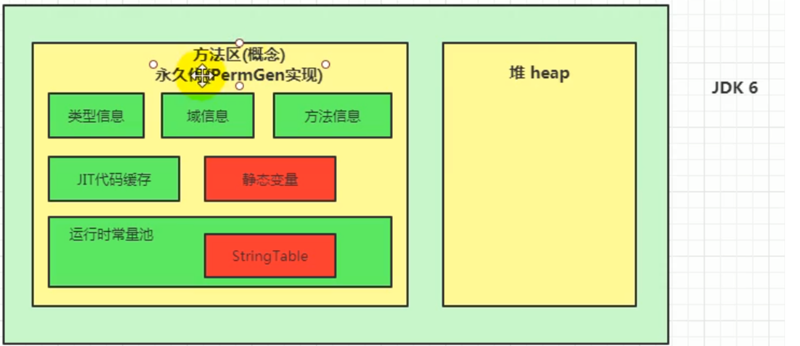


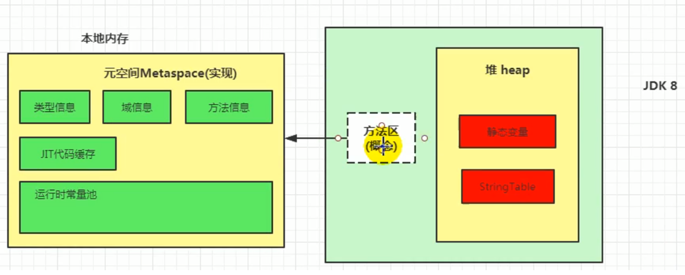

### 关于non-final的类变量和全局常量（static final）

- 全局常量在编译时候就会被分配（有ConstantValue属性）；
- non-final类变量被类的所有实例共享，即使没有类的实例也可以访问它；
- non-final类变量在类加载的准备阶段被设置初始值（jdk8及以后分配在堆中），在初始化阶段执行类构造器`<clinit>()`方法。

### 为什么要用元空间代替永久代？

- 整个永久代有一个JVM本身设置的固定大小上限，无法进行调整，而元空间使用的是本地内存，受本机可用内存的限制，虽然元空间仍旧可能溢出，但是比原来出现的几率会更小；

  > 当元空间溢出时会得到如下错误：`java.lang.OutOfMemoryError: MetaSpace`

- 元空间里面存放的是类的元数据，这样加载多少类的元数据就不由 `MaxPermSize` 控制了, 而由系统的实际可用空间来控制，这样能加载的类就更多了；

- 在 JDK8，合并 HotSpot 和 JRockit 的代码时, JRockit 从来没有一个叫永久代的东西，合并之后就没有必要额外的设置这么一个永久代的地方了。

### 介绍一下运行时常量池

- **常量池**：可以看作是一张表，虚拟机指令根据这张表找到要执行的类名、方法名、参数类型、字面量等信息；
- 当类被加载，它的常量池信息就会放入**运行时常量池**，并把里面的符号地址变为真实地址。


### 介绍Java类实例化的过程

1. **判断对象对应的类是否加载、连接、初始化**
   - 虚拟机遇到一条`new`指令，首先去检查这个指令的参数能否在`Metaspace`的常量池中定位到一个类的符号引用，并且检查这个符号引用代表的类是否已经被加载、解析和初始化（即判断类元信息是否存在）。如果没有，那么在双亲委派模式下，使用当前类加载器以`ClassLoader+包名+类名`为Key进行查找对应的`.class `文件。如果没有找到文件，则抛出`ClassNotFoundException`异常；如果找到，则进行类加载，并生成对应的`Class`类对象。
2. **为对象分配内存**
   - 如果内存规整——指针碰撞（标记-复制、标记-整理算法）
   - 如果内存不规整——虚拟机需要维护一个列表，空闲列表分配（标记-清除算法）
3. **处理并发安全问题**
4. **初始化分配到的空间**
   - 所有属性**设置默认值**，保证对象实例字段在不赋值时可以直接使用
5. **设置对象的对象头**
   - 将对象的所属类（即类的元数据信息）、对象的HashCode和对象的GC信息、锁信息等数据存储在对象的对象头中。这个过程的具体设置方式取决于JVM实现。
6. **执行`init`方法进行初始化**
   - 初始化成员变量，执行实例化代码块，调用类的构造方法，并把堆内对象的首地址赋值给引用变量。

### 对象在JVM中是怎么存储的？

**对象的内存布局**：对象头、实例数据、对齐填充

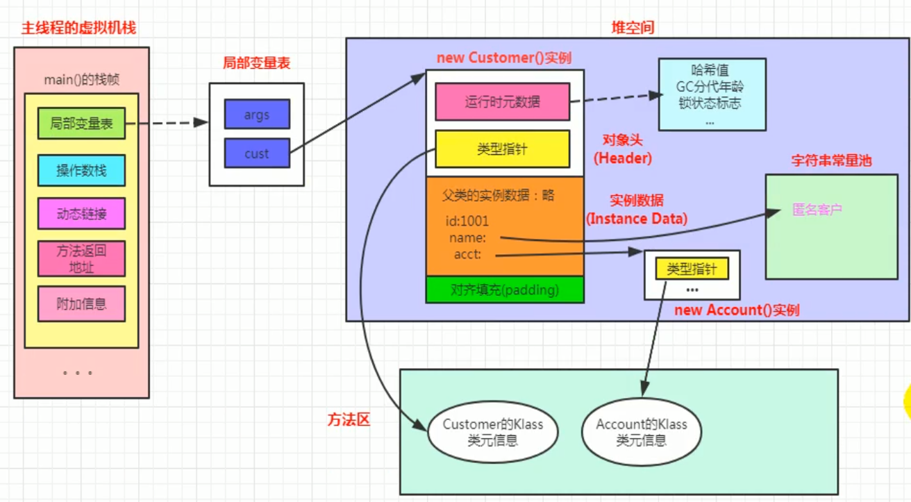

### Java对象头里有什么？

HotSpot虚拟机对象的对象头部分包含两类信息：

- 存储对象自身的运行时数据（**Mark Word**）：如哈希码、GC分代年龄、锁状态标志、线程持有的锁、偏向线程ID、偏向时间戳等；
- **类型指针**：对象指向它的类型元数据的指针，Java虚拟机通过这个指针来确定该对象是哪个类的实例。

### 对象的访问定位有哪两种方式？

- 句柄访问

  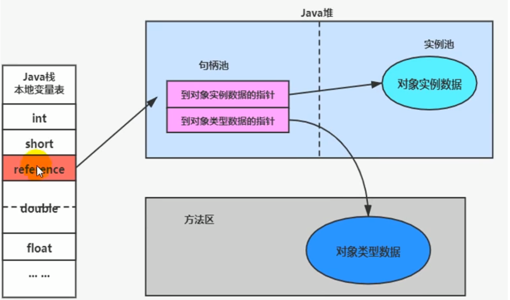

- 直接指针访问（HotSpot默认）

  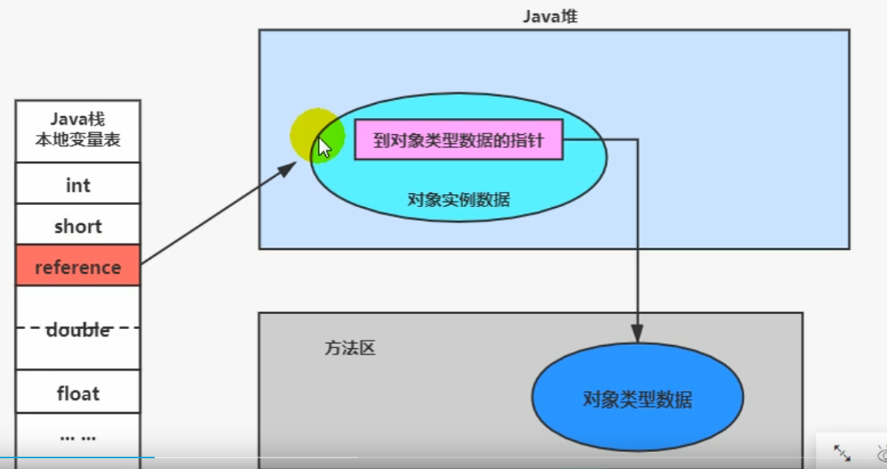

## String

### 字符串拼接操作

- 常量与常量的拼接结果在常量池，原理是**编译期优化**；常量池中不会存在相同内容的常量；
- 只要其中有一个是变量，结果就在堆中。变量拼接的原理是`StringBuilder`；
- 如果拼接的结果调用`intern()`方法，则主动将常量池中还没有的字符串对象放入池中，并返回此对象地址；

```java
public void test2() {
    String s1 = "javaEE";
    String s2 = "hadoop";

    String s3 = "javaEEhadoop";
    String s4 = "javaEE" + "hadoop"; // 编译期优化
    // 如果拼接符号的前后出现了变量，则相当于在堆空间中new String()
    String s5 = s1 + "hadoop";
    String s6 = "javaEE" + s2;
    String s7 = s1 + s2;

    System.out.println(s3 == s4); // true
    System.out.println(s3 == s5); // false
    System.out.println(s3 == s6); // false
    System.out.println(s3 == s7); // false
    System.out.println(s5 == s6); // false
    System.out.println(s5 == s7); // false
    System.out.println(s6 == s7); // false

    String s8 = s6.intern();
    System.out.println(s3 == s8); // true
}
```


## 垃圾回收

### 对象什么时候被垃圾回收？

如果一个或多个对象没有任何引用指向它了，那么这个对象现在就是垃圾。如果定位了垃圾，则有可能会被垃圾回收器回收。

定位垃圾的方式有两种：

- 引用计数法
- 可达性分析算法

### 引用计数法的优缺点

**优点**：实现简单，垃圾对象便于辨识；判定效率高，回收没有延迟性

**缺点**

- 需要单独的字段存储计数器，增加了存储空间开销
- 每次复制需要更新计数器，增加了时间开销
- **无法处理循环引用的情况**

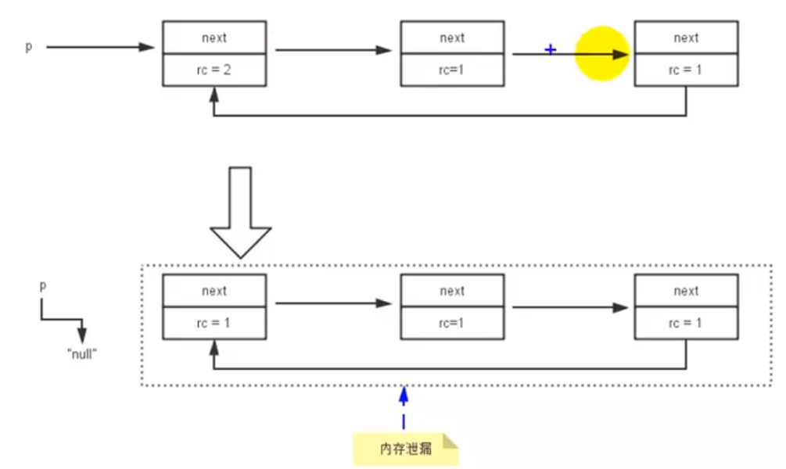

### STW(stop-the-world)机制

- 如果出现分析过程中对象引用关系还在不断变化，则分析结果的准确性无法保证（**为什么要有STW**）

- STW和采用哪款GC无关，G1也不能完全避免Stop-the-world；

### GC Roots有哪些？

- 虚拟机栈（栈帧中的本地变量表）中引用的对象
- 方法区中类静态属性引用的对象
  - 如Java类的引用类型静态变量
- 方法区中常量引用的对象
  - 如字符串常量池里的引用
- 本地方法栈中JNI引用的对象


### 对象的finalization机制

`finalize()`方法是`Object`类提供的方法。在GC准备释放对象所占用的内存空间之前，它将首先调用`finalize()`方法（也可能不调用）

1. 如果对象`objA`到GC Roots没有引用链，则进行**第一次标记**；
2. 进行筛选，判断`objA`有无必要执行`finalize()`方法：
   - `objA`没有重写`finalize()`或`finalize()`已经被虚拟机调用过，则虚拟机视为“没有必要执行”；
   - 如果对象重写了`finalize()`方法且未被执行过，那么`objA`会被插入到`F-Queue`队列中，由一个虚拟机自动创建的、低优先级的`Finalizer`线程触发其`finalize()`方法执行；
   - 稍后GC会对F-Queue队列中的对象进行**第二次标记**，判断其是否进行回收（是否逃脱死亡成功，略）。`finalize()`不会被再次调用了。

### JVM垃圾回收算法有哪些？

- **标记-清除算法：**

  - **标记**：Collector从引用根节点开始遍历，标记所有被引用的对象。一般是在对象的Header中记录为可达对象；
  - **清除**：Collector对堆内存从头到尾进行线性的遍历，如果发现某个对象在其Header中没有标记为可达对象，则将其回收

  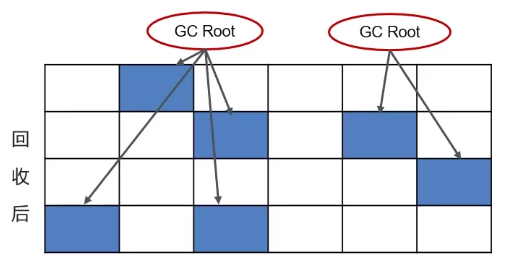

  - 缺点：
    - 效率不高
    - 需要停止整个应用程序（STW）
    - 产生内存碎片（需要维护一个空闲列表）

- **标记-整理算法**

  - **标记**：同标记-清除算法；
  - **整理**：将所有存活对象压缩到内存的一端，按顺序排放。然后清理边界外的所有空间；
  - 优点：
    - 消除了标记清除算法中内存区域分散的缺点
    - 消除了复制算法中内存减半的高额代价
  - 缺点：
    - 效率低于复制算法
    - STW

- **复制算法**

  - 将原有内存空间一分为二，每次只使用其中的一块；
  - 正在使用的对象复制到另一个内存空间中，然后将内存空间清空，交换两个内存的角色，完成垃圾回收；
  - 优点：
    - 运行高效
    - 不会出现碎片问题
  - 缺点：
    - 需要2倍内存空间

- **对比**

  |          | Mark-Sweep         | Mark-Compact     | Copying                               |
  | -------- | ------------------ | ---------------- | ------------------------------------- |
  | 速度     | 中等               | 最慢             | 最快                                  |
  | 空间开销 | 少（但会堆积碎片） | 少（不堆积碎片） | 通常需要或对象的2倍大小（不堆积碎片） |
  | 移动对象 | 否                 | 是               | 是                                    |

### 说一下JVM中的分代回收

#### 堆的区域划分

- 堆被分为了两份：新生代和老年代【1：2】
- 对于新生代，内部又被分为了三个区域：Eden区，Survivor区（分为from和to）【8：1：1】

#### 对象回收分代回收策略

1. 新创建的对象，都会先被分配到Eden区；
2. Eden区内存不足，标记Eden区和from区的存活对象；
3. 将存活对象采用复制算法复制到to区中，复制完毕后Eden区和from区得到释放；
4. 经过一段时间后Eden区内存又出现不足，标记Eden区和to区存活对象，复制到from区；
5. Survivor区熬过几次回收（最多15次），晋升到老年代（Survivor区内存不足或大对象会提前晋升）。

### Minor GC、Major GC、Full GC的区别？

GC按照**回收区域**分为两大种类型：**部分收集**（Partial GC）和**整堆收集**（Full GC）

部分收集

- **新生代收集**（Minor GC / Young GC）：新生代的垃圾回收
  - 年轻代中的Eden代满，会触发Minor GC；这里的年轻代满指的是Eden代满，Survivor满不会引发GC；
  - 由于Java对象大多都具备**朝生夕灭**的特性，故Minor GC回收速度快，较频繁；
  - Minor GC会引发**STW**，暂停其他用户线程；垃圾回收结束，用户线程恢复；
- **老年代收集**（Major GC / Old GC）：新生代和老年代部分区域的垃圾回收，G1收集器持有
  - 对象从老年代消失时，Major GC 发生；
  - Major GC通常会伴随至少一次的Minor GC（老年代空间不足时，先Minor GC。之后空间还不足，则Major GC）；
  - Major GC的速度一般比Minor GC慢十倍以上，STW时间更长；
  - Major GC后内存还不足，就OOM了；
- **Full GC**：新生代 + 老年代的完整垃圾回收，STW时间长，尽量避免

### 说一下JVM有哪些垃圾回收器？

#### Serial收集器——串行回收

- Serial收集器采用**复制算法**、**串行回收**和**Stop-the-World**机制方式执行内存回收
- Serial Old是Serial收集器的老年代版本，使用**标记-整理**算法；

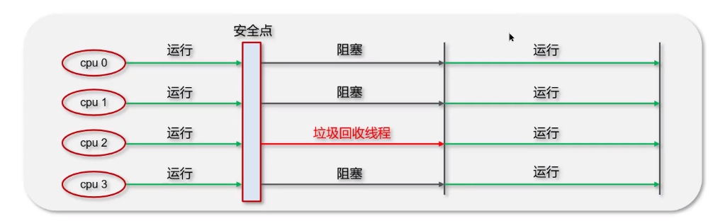

#### ParNew收集器——Serial回收器的多线程并行版本

- 除了采用**并行回收**方式执行内存回收外，和Serial收集器几乎没有任何区别；
- 在年轻代中采用**复制算法**、**STW**机制；

#### Parallel Scavenge收集器

- 和ParNew收集器一样，采用了复制算法、并行回收和STW机制；
- 不同之处：**吞吐量优先**的垃圾收集器（目标为达到一个可控制的吞吐量）；

- Parallel Old收集器是Parallel Scavenge的老年代版本，采用**标记-压缩算法**、**并行回收**、**STW机制**；

#### CMS收集器


- 初始标记：标记GC Roots能关联到的对象，速度非常快；
- 并发标记：从GC Roots的直接关联对象开始遍历整个对象图的过程，这个过程耗时较长但不需要停顿用户线程。可以与垃圾收集线程一起并发运行；
- 重新标记：修正并发标记期间，因用户程序继续运作而导致标记产生变动的那一部分对象的标记记录；
- 并发清除：清理删除掉标记阶段判断死亡的对象，释放内存空间。

**注意**：只有**初始标记、重新标记**需要Stop-the-World。

#### G1收集器

见下


### Java的四种引用

#### 强引用（Strong Reference）——不回收

- 指在程序代码中普遍存在的引用赋值，如`Object obj = new Object();`
- 强引用所指向的对象在任何时候都不会被系统回收；系统宁愿抛出`OutOfMemory`异常，也不会回收强引用所指向的对象；
- 强引用可能导致内存泄漏。

#### 软引用（Soft Reference）——内存不足即回收

- 当内存足够时，不会回收软引用的可达对象；
- 当内存不足时，会回收软引用的可达对象；

#### 弱引用（Weak Reference）——发现即回收

- 只被弱引用关联的对象只能生存到下一次垃圾回收发生为止；

#### 虚引用（Phantom Reference）——对象回收跟踪

- 一个对象是否有虚引用的存在，完全不会决定对象的生命周期；一个对象仅持有虚引用，那么它和没有引用几乎是一样的；

## 类加载子系统

### 什么是类加载器，类加载器有哪些？

1. JVM只会运行二进制文件，类加载器的作用就是**将字节码文件加载到JVM中**，从而让Java程序能够启动起来；
2. 类加载器有哪些？
   - 启动类加载器（BootStrap ClassLoader）：
     - 使用C/C++语言实现，嵌套在JVM内部；
     - 加载Java的核心库（`<JAVA_HOME>lib`目录）;
     - 不继承自`java.lang.ClassLoader`，没有父加载器；
   - 扩展类加载器（Extension ClassLoader）：
     - 加载`<JAVA_HOME>lib\ext`目录中的类库；
     - 派生于`ClassLoader`类，父加载器为启动类加载器；
   - 应用程序类加载器（AppClassLoader）：
     - 用于加载用户类路径（ClassPath）上所有的类库；
     - 是程序中默认的类加载器；
   - 自定义类加载器

### 什么是双亲委派模型？

- 如果一个类加载器收到了类加载的请求，它首先不会自己去尝试加载这个类，而是把**这个请求委派给父类加载器去完成**；

- 每一个层次的类加载器都是如此，因此所有的加载请求最终**都应该传送到顶层的启动类加载器中**；
- 只有当父加载器反馈自己无法完成这个加载请求（它的搜索范围中没有找到所需的类）时，子加载器才会尝试自己去加载。

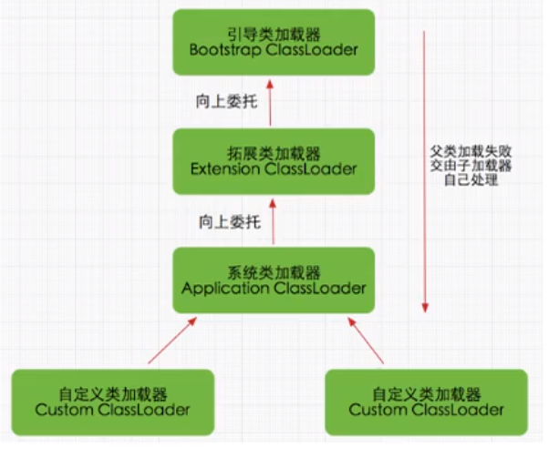

### JVM为什么采用双亲委派机制？

- 通过双亲委派机制可以**避免类的重复加载**。当父类已经加载后则无需重复加载，保证唯一性；
- 保护程序安全，防止核心API被随意篡改。

### 说一下类装载的执行过程？


#### 加载

查找和导入class文件

- 通过一个类的全限定名来获取定义此类的二进制字节流；
- 将这个字节流所代表的静态存储结构转化为方法区的运行时数据结构；
- 在内存中生成一个代表这个类的`java.lang.Class`对象，作为方法区这个类的各种数据的访问入口。

#### 验证

保证加载类的准确性

- 文件格式验证
- 元数据验证
- 字节码验证
- 符号引用验证

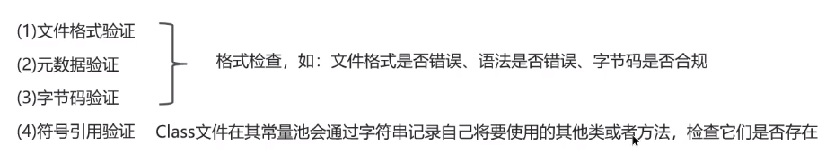

#### 准备

为类变量分配内存并设置类变量初始值

- 仅包括类变量，不包括实例变量；
- 在方法区中进行分配；
- `static`变量，分配空间在准备阶段完成（设置默认值），赋值在初始化阶段完成；
- `static`变量是`final`的基本类型，以及字符串常量，值以确定，赋值在准备阶段完成；
- `static`变量是`final`的引用类型，赋值在初始化阶段完成。

#### 解析

把类中的符号引用转换为直接引用

#### 初始化

- 初始化阶段就是执行类构造器`<clinit>()`方法的过程
- 对类的静态变量，静态代码块执行初始化操作

# 多线程

### 创建多线程的方式及其优缺点？

1. **继承`Thread`类**

   `MyThread`类：

   ```java 
   public class MyThread extends Thread{
       @Override
       public void run() {
           for (int i = 0; i < 10; i++) {
               int random = (int) (Math.random() * 1000);
               try {
                   Thread.sleep(random);
               } catch (InterruptedException e) {
                   e.printStackTrace();
               }
               System.out.println("run" + Thread.currentThread().getName());
           }
       }
   }
   ```

   `Test`类：

   ```java
   public class Test {
       public static void main(String[] args) {
           MyThread myThread = new MyThread();
           myThread.setName("myThread");
           myThread.start();
           for (int i = 0; i < 10; i++) {
               int random = (int) Math.random();
               try {
                   Thread.sleep(1000);
               } catch (InterruptedException e) {
                   e.printStackTrace();
               }
               System.out.println("run=" + Thread.currentThread().getName());
           }
       }
   }
   ```

2. **实现`Runnable`接口**

   `MyRunnable`类：

   ```java
   public class MyRunnable implements Runnable{
       @Override
       public void run() {
           System.out.println("运行中!");
       }
   }
   ```

   `Test`类：

   ```java
   public class Test {
       public static void main(String[] args) {
           MyRunnable myRunnable = new MyRunnable();
           Thread thread = new Thread(myRunnable);
           thread.start();
           System.out.println("运行结束!");
       }
   }
   ```

   实现`Runnable`接口的好处
   
   - 避免了单继承的局限性；
   - 更适合处理有共享资源的情况。

### 分析下列程序执行结果

```java
public class MyThread extends Thread {
   public MyThread() {
       System.out.println("MyThread---begin");
       System.out.println("Thread.currentThread().getName(): "
               + Thread.currentThread().getName());
       System.out.println("this.getName(): " + this.getName());
       System.out.println("MyThread---end");
   }

    @Override
    public void run() {
        System.out.println("MyThread---begin");
        System.out.println("Thread.currentThread().getName(): "
                + Thread.currentThread().getName());
        System.out.println("this.getName(): " + this.getName());
        System.out.println("MyThread---end");
    }
}
```

```java
public class Test {
    public static void main(String[] args) {
        MyThread myThread = new MyThread();
        Thread thread = new Thread(myThread);
        thread.setName("A");
        thread.start();
    }
}
```

**运行结果：**

```
MyThread---begin
Thread.currentThread().getName(): main
this.getName(): Thread-0
MyThread---end
MyThread---begin
Thread.currentThread().getName(): A
this.getName(): Thread-0
MyThread---end
```

重点理解`Thread`类中的`run()`方法的调用：


### 线程中操作系统层面的5种状态和Java API层面的6种状态

1. **操作系统层面**

   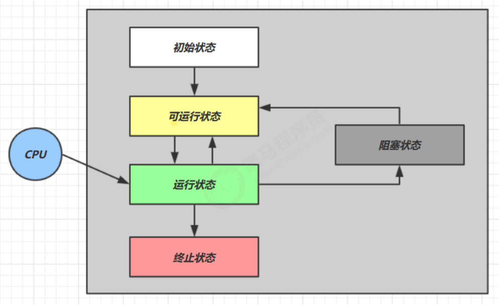

2. **Java API层面**

   

   - `NEW`、`TERMINATED`和操作系统层面的相似；
   - `RUNNABLE`为调用了`start()`方法后，该状态涵盖了操作系统层面的**可运行状态**、**运行状态**、**阻塞状态**；
   - `BLOCKED`、`WATING`、`TIMED_WAITING`是Java API层面对**阻塞状态**的细分。

### 线程安全的三个方面

1. **原子性**：互斥访问，同一个时刻只能有一个线程来对它进行操作

   ```java
   public class Test {
       private static int i = 0;
       private static Object obj = new Object();
   
       public static void main(String[] args) throws InterruptedException {
           Thread t1 = new Thread(() -> {
               synchronized (obj) {
                   for (int j = 0; j < 5000; j++) {
                       i++;
                   }
               }
           }, "t1");
           Thread t2 = new Thread(() -> {
               synchronized (obj) {
                   for (int j = 0; j < 5000; j++) {
                       i--;
                   }
               }
           }, "t2");
           t1.start();
           t2.start();
           t1.join();
           t2.join();
           System.out.println(i);
       }
   }
   ```

2. **可见性**：一个线程对主内存的修改可以及时的被其他线程观察到

   ```java
   public class Test {
       private static volatile boolean run = true;
   
       public static void main(String[] args) throws InterruptedException {
           new Thread(() -> {
               while (run) {
   
               }
           },"t1").start();
           Thread.sleep(1000);
           run = false;
       }
   }
   ```

3. **有序性**：一个线程观察其他线程中指令执行顺序，由于指令重排序存在，观察结果一般杂乱无序

   ```java
   int num = 0;
   boolean ready = false;
   
   // 线程1：执行此方法
   public void actor1(I_Result r) {
       if (ready) {
           r.r1 = num + num;
       } else {
           r.r1 = 1;
       }
   }
   
   // 线程2：执行此方法
   public void actor2(I_Result r) {
       num = 2;
       ready = true;
   }
   ```

   可能的结果：1，4，**0（重排）**

   解决办法：`volatile`修饰的变量，可以禁用指令重排（`volatile boolean ready = true`）

### volatile关键字

1. **保证内存可见性**

   可见性是指线程之间的可见性，⼀个线程修改的状态对另⼀个线程是可见的。也就是⼀个线程修改的结果，另⼀个线程马上就能看到；

   实现原理：

   - 当对⾮`volatile`变量进⾏读写的时候，每个线程先从主内存拷贝变量到CPU缓存中，如果计算机有多个CPU， 每个线程可能在不同的CPU上被处理，这意味着每个线程可以拷贝到不同的CPU cache中；
   - `volatile`变量不会被缓存在寄存器或者对其他处理器不可见的地⽅，保证了每次读写变量都从主内存中读，跳 过CPU cache这⼀步。当⼀个线程修改了这个变量的值，新值对于其他线程是⽴即得知的。 

   ```java
   public class Test {
       private static volatile boolean run = true;
   
       public static void main(String[] args) throws InterruptedException {
           new Thread(() -> {
               while (run) {
                   
               }
           },"t1").start();
           Thread.sleep(1000);
           run = false;
       }
   }
   ```

2. **禁止指令重排**

3. 与`synchronized`对比：

   - volatile可以保证数据的可见性，但不能保证原子性；
   - synchronized可以保证原子性，也可以间接保证可见性，因为它会将私有内存和公共内存中的数据做同步

## 并发编程——模式

### 两阶段终止模式


代码实现：

```java
@Slf4j(topic = "c.Test3")
class TwoPhaseTermination {
    // 监控线程监控当前线程是否被打断
    private Thread monitor;

    // 启动监控线程
    public void start() {
        monitor = new Thread(() -> {
            while (true) {
                Thread current = Thread.currentThread();
                if (current.isInterrupted()) {
                    log.debug("料理后事");
                    break;
                }
                try {
                    Thread.sleep(1000); // 阻塞时线程被打断会抛异常，打断标记不会设置为true
                    log.debug("记录日志");
                } catch (InterruptedException e) {
                    e.printStackTrace();
                    // 重新设置打断标记
                    current.interrupt();
                }
            }
        });
        monitor.start();
    }

    // 停止监控线程
    public void stop() {
        monitor.interrupt();
    }
}
```

不加`current.interrupt()`的**运行结果**：


仅抛出异常，但由于没有重新设置打断标记，故没有终止。
