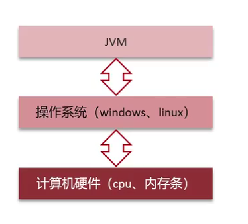
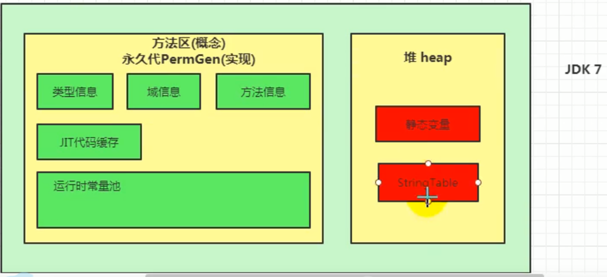
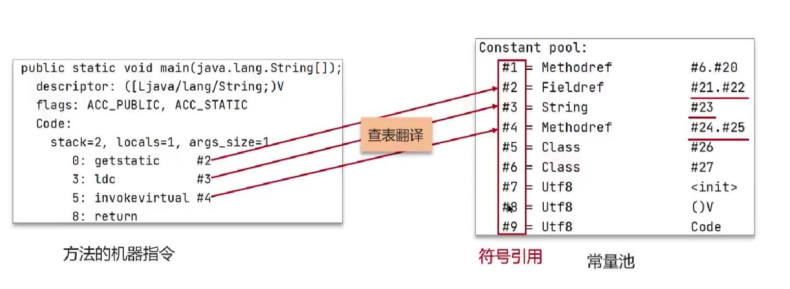

# Java基础

## 包装类

### Integer的享元机制

```java
Integer a = 100;
Integer b = 100;
System.out.println(a == b);  //true
System.out.println(a.equals(b)); //false
```

原因：Integer用到了享元模式的设计，它针对与[-128, 127]的数字做了缓存。使用`Integer a = 100`进行赋值操作时，它默认使用`valueOf`进行自动装箱，从而触发了缓存机制，使得`a`和`b`指向了相同的内存地址。


### Integer和int的区别

1. 作为成员变量，Integer类型的初始值是null，int类型的初始值为0；
2. Integer存储在堆内存中，而int类型存储在栈空间；
3. Integer是对象类型，它封装了很多的方法和属性，我们在使用时候更加灵活。

## 面向对象

### static方法可以被继承吗

1. 在Java中，静态方法可以被继承，但不能被重写(override)。
   当子类继承父类时，会继承父类中的所有静态方法和静态变量。子类可以通过类名直接调用父类的静态方法，也可以通过子类名直接调用子类的静态方法。
2. 然而，静态方法不具有多态性，因此不能被子类重写(override)。在子类中声明一个与父类中静态方法名称、参数列表和返回类型相同的静态方法，不会覆盖父类的静态方法。在子类中可以重新实现同名的静态方法，但此时父类中的静态方法仍然可以通过父类名调用。
3. 总之，静态方法是属于类的，不是属于实例的，因此它们不需要通过实例化对象来调用，子类可以继承父类中的所有静态方法，但不能重写(override)它们。

### 对象的内存分析

分析以下代码的内存存放结构：

```java
public class TestChinese {
    public static void main(String[] args) {
        Chinese.country = "中国";
        
        Chinese c1 = new Chinese();
        c1.name = "谷哥";
        c1.age = 32;
        
        Chinese c2 = new Chinese();
        c2.name = "谷姐";
        c2.age = 32;
    }
}
```


# JVM

## 基础概念

### JVM是什么？有什么好处？

Java Virtual Machine：Java程序的运行环境（Java二进制字节码的运行环境）

好处：

- 一次编写，到处运行
- 自动内存管理，垃圾回收机制



### JVM由哪几部分组成？运行流程是什么？


**类加载机制**：类的数据从Class文件加载到内存，并对数据进行校验、转换解析和初始化，最终形成可以被虚拟机直接使用的Java类型（《深入理解JVM》）

## 内存管理

### 什么是程序计数器？

- 程序计数器记录正在执行的字节码指令的地址。它是线程私有的，每个线程一份，内部保存字节码的行号；
- 唯一一个不会出现 `OutOfMemoryError` 的内存区域，它的生命周期随着线程的创建而创建，随着线程的结束而死亡。

### 使用PC寄存器存储字节码指令地址有什么用呢？（为什么使用PC寄存器记录当前线程地执行地址？）

因为CPU需要不停地切换各个线程，这时候切换回来以后，就得知道接着从哪开始继续执行。

JVM的字节码解释器就需要通过改变PC寄存器的值来明确下一条应该执行什么样的字节码指令。

### 什么是虚拟机栈？

虚拟机栈描述的是**Java方法执行的线程内存模型**。

### 栈帧中存储有什么？

- **局部变量表**（Local Varibales）
- **操作数栈**（Operand Stack）
- 动态链接（Dynamic Linking）（或指向运行时常量池的方法引用）
- 方法返回地址（Return Address）（或方法正常退出或者异常退出的定义）
- 一些附加信息

### 关于局部变量表

- 存放**方法参数**、定义在方法体内的**局部变量**；
- 局部变量表中存储空间的单位为**局部变量槽**（slot），局部变量表所需的内存空间在**编译期间完成分配**；
- 如果当前帧是构造方法或者实例方法创建的，那么index为0的slot处将存放该对象引用`this`；
- 局部变量表中的变量不存在系统初始化的过程。一旦定义了局部变量必须**人为初始化值**，否则无法使用。

### 虚拟机栈中可能出现的异常

Java虚拟机规范允许Java栈的大小时动态的或者时固定不变的

- 如果用**固定大小**的Java虚拟机栈，那每一个线程的Java虚拟机栈容量可以在线程创建的时候独立选定。如果线程请求分配的栈容量超过Java虚拟机栈允许的最大容量，Java虚拟机就会抛出一个`StackOverflowError`异常
- 如果Java虚拟机栈**可以动态扩展**，并且在尝试扩展的时候无法申请到足够的内存，或者在创建新的线程时没有足够的内存去创建对应的虚拟机栈，那Java虚拟机将会抛出一个`OutofMemoryError`异常

### 方法内的局部变量是否线程安全？

- 如果方法内局部变量没有逃离方法的作用范围，它是线程安全的；
- 如果局部变量引用了对象，并逃离方法的作用范围，需要考虑线程安全问题。

### ++i 和 i++

```java
int j = i++ + ++i;
```

- i++: 先从**局部变量表**中load到**操作数栈**中，再把局部变量表中的值加1；
- ++i: 先在局部变量表中将i加1，再load到操作数栈中。

### 为什么要把Java堆分代？

- 经研究，不同对象的生命周期不同，70%~99%的对象是临时对象；
- 分代的唯一理由是**优化GC性能**；
- 分代将新创建的对象放到某一地方，当GC的时候就会先把这部分“朝生夕死”的对象区域进行垃圾回收。


### 解释一下方法区？

- 方法区（Method Area）是各个线程共享的内存区域；
- 主要存储类的信息、运行时常量池（类型信息、常量、静态变量、即时编译器编译后的代码缓存等数据）；
- 虚拟机启动的时候创建，关闭虚拟机时释放；
- 如果方法区域中内存无法满足分配请求，则会抛出`OutOfMemoryError:Metaspace`

### JDK中方法区的演进

| 时间         | 变化                                                         |
| :----------- | ------------------------------------------------------------ |
| jdk1.6及以前 | 有永久代（permanent generation），静态变量存放在永久代上     |
| jdk1.7       | 有永久代，但已经逐步“去永久代”，字符串常量池、静态变量移除，保存在堆中 |
| jdk1.8及以后 | 无永久代，类型信息、字段、方法、常量保存在本地内存元空间中，但字符串常量池、静态变量仍在堆 |





### 为什么要用元空间代替永久代？

- 整个永久代有一个 JVM 本身设置的固定大小上限，无法进行调整，而元空间使用的是本地内存，受本机可用内存的限制，虽然元空间仍旧可能溢出，但是比原来出现的几率会更小；

  > 当元空间溢出时会得到如下错误：`java.lang.OutOfMemoryError: MetaSpace`

- 元空间里面存放的是类的元数据，这样加载多少类的元数据就不由 `MaxPermSize` 控制了, 而由系统的实际可用空间来控制，这样能加载的类就更多了；

- 在 JDK8，合并 HotSpot 和 JRockit 的代码时, JRockit 从来没有一个叫永久代的东西, 合并之后就没有必要额外的设置这么一个永久代的地方了。

### 介绍一下运行时常量池

- **常量池**：可以看作是一张表，虚拟机指令根据这张表找到要执行的类名、方法名、参数类型、字面量等信息；
- 当类被加载，它的常量池信息就会放入**运行时常量池**，并把里面的符号地址变为真实地址。



## 垃圾回收

### 解释Minor GC、Major GC、Full GC

GC按照**回收区域**分为两大种类型：**部分收集**（Partial GC）和**整堆收集**（Full GC）

部分收集

- **新生代收集**（Minor GC / Young GC）
  - 年轻代中的Eden代满，会触发Minor GC；
  - 由于Java对象大多都具备**朝生夕灭**的特性，故Minor GC回收速度快，较频繁；
  - Minor GC会引发STW，暂停其他用户线程；垃圾回收结束，用户线程恢复。

- **老年代收集**（Major GC / Old GC）
  - 对象从老年代消失时，Major GC 发生；
  - Major GC通常会伴随至少一次的Minor GC（老年代空间不足时，先Minor GC。之后空间还不足，则Major GC）；
  - Major GC的速度一般比Minor GC慢十倍以上，STW时间更长；
  - Major GC后内存还不足，就OOM了。

- **Full GC**

# 多线程

### 创建多线程的方式及其优缺点？

1. 继承`Thread`类

   `MyThread`类：

   ```java 
   public class MyThread extends Thread{
       @Override
       public void run() {
           for (int i = 0; i < 10; i++) {
               int random = (int) (Math.random() * 1000);
               try {
                   Thread.sleep(random);
               } catch (InterruptedException e) {
                   e.printStackTrace();
               }
               System.out.println("run" + Thread.currentThread().getName());
           }
       }
   }
   ```

   `Test`类：

   ```java
   public class Test {
       public static void main(String[] args) {
           MyThread myThread = new MyThread();
           myThread.setName("myThread");
           myThread.start();
           for (int i = 0; i < 10; i++) {
               int random = (int) Math.random();
               try {
                   Thread.sleep(1000);
               } catch (InterruptedException e) {
                   e.printStackTrace();
               }
               System.out.println("run=" + Thread.currentThread().getName());
           }
       }
   }
   ```

2. 实现`Runnable`接口

   `MyRunnable`类：

   ```java
   public class MyRunnable implements Runnable{
       @Override
       public void run() {
           System.out.println("运行中!");
       }
   }
   ```

   `Test`类：

   ```java
   public class Test {
       public static void main(String[] args) {
           MyRunnable myRunnable = new MyRunnable();
           Thread thread = new Thread(myRunnable);
           thread.start();
           System.out.println("运行结束!");
       }
   }
   ```

   继承`Thread`类的**局限性**：**Java不支持多继承**

### 分析下列程序执行结果

```java
public class MyThread extends Thread {
   public MyThread() {
       System.out.println("MyThread---begin");
       System.out.println("Thread.currentThread().getName(): "
               + Thread.currentThread().getName());
       System.out.println("this.getName(): " + this.getName());
       System.out.println("MyThread---end");
   }

    @Override
    public void run() {
        System.out.println("MyThread---begin");
        System.out.println("Thread.currentThread().getName(): "
                + Thread.currentThread().getName());
        System.out.println("this.getName(): " + this.getName());
        System.out.println("MyThread---end");
    }
}
```

```java
public class Test {
    public static void main(String[] args) {
        MyThread myThread = new MyThread();
        Thread thread = new Thread(myThread);
        thread.setName("A");
        thread.start();
    }
}
```

**运行结果：**

```
MyThread---begin
Thread.currentThread().getName(): main
this.getName(): Thread-0
MyThread---end
MyThread---begin
Thread.currentThread().getName(): A
this.getName(): Thread-0
MyThread---end
```

重点理解`Thread`类中的`run()`方法的调用：


