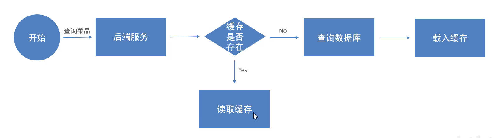
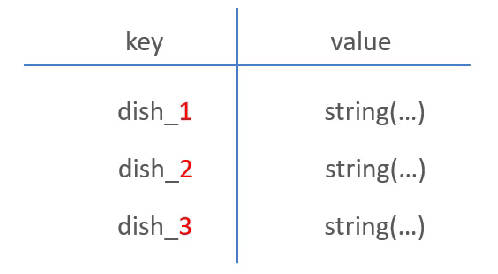

# 项目文档
## day03
### 1. 公共字段自动填充

- 使用Spring中的AOP技术实现公共字段的自动填充，包括执行Insert操作时填充create_user、create_time、update_user、update_time，执行update_user、update_time；
- 涉及到的知识点
  - 自定义注解：使用自定义注解来修饰哪些方法是连接点，即需要被增强的方法；
  - 枚举类；自定义注解中value的返回类型为枚举类型，用来表示该方法时update还是insert，从而确定需要填充的字段；
  - AOP的书写流程，切面表达式，@Before、@Around等等
  - 反射：使用反射获取注解中的value，即操作类型，以及方法的参数，即实体对象；使用反射调用相关set方法设置填充的字段；

### 2. 菜品图片上传

- 使用的是阿里云OSS服务，已经定义好了`AliOssUtil`工具类，调用其方法即可；
- 涉及到的知识点：
  - 配置第三方bean：在配置类（`@Configuration`）中，定义一个返回值为第三方bean类型的方法，使用`@Bean`修饰即可；
  - 为第三方bean注入资源：设置上述方法的形参；
### 3. 新增菜品

- 新增一个菜品，需要向菜品表中添加一条数据，向口味表中添加n条数据 
- Spring事务管理：添加菜品的功能涉及到向菜品表和口味表两张表的添加，需要事务管理
- 添加菜品，需要返回其dish表新增数据的id，使用`useGeneratedKeys="true" keyProperty="id"`进行配置
### 4. 菜品分页查询

- 菜品分页查询，除了需要用到菜品`dish`表，还需要将`dish`表和分类表`category`做一个外连接，从而获取到菜品的分类名称
### 5. 删除菜品

- 一次删除一个菜品和批量删除菜品使用的是同一个接口，传入的是id的集合，接收参数时需要加上`@RequestParam`
- 起售中的菜品不能删除（获取status判断即可）
- 被套餐关联的菜品不能删除（拿ids到`setmeal_dish`表中查）
- 删除菜品后，关联的口味数据也需要被删除（分别使用`dishMapper`和`dishFlavorMapper`）
## day05

### 1. Redis入门

- Redis是一种基于内存的key-value结构数据库
  - 基于内存存储，读写性能高
  - 适合存储热点数据（热点商品、资讯、新闻）

### 2. Redis数据类型

- 字符串（string）：普通字符串，Redis中最简单的数据类型；
- 哈希（hash）：也叫散列，类似于Java中的HashMap结构；
- 列表（list）：按照插入顺序排序，可以有重复元素，类似于Java中的LinkedList；
- 集合（set）：无序集合，没有重复元素，类似于Java中的HashSet；
- 有序集合（sorted set/zset）：集合中每一个元素关联一个分数（score），根据分数升序排列，没有重复元素

### 3. Redis常用命令

#### 3.1 Redis字符串类型常用命令

- `SET key value`：设置指定key的值；
- `GET key`：获取指定key的值；
- `SETEX key seconds value`：设置指定key的值，并将key的过期时间设为seconds秒；
- `SETNX key value`：只有在key不存在时设置key的值；

#### 3.2 哈希操作命令

- `HSET key field value`：将哈希表key中的字段field的值设为value
- `HGET key field`：获取存储在哈希表中指定字段的值
- `HDEL key field`：删除存储在哈希表中的指定字段
- `HKEYS key`：获取哈希表中的所有字段
- `HVALS key`：获取哈希表中所有值

#### 3.3 列表操作命令

- `LPUSH key value1 [value2]`：将一个或多个值插入到列表头部
- `LRANGE key start stop`：获取列表指定范围内的元素
- `RPOP key`：移除并获取列表最后一个元素
- `LLEN key`：获取列表长度

#### 3.4 集合操作命令

- `SADD key member1 [member2]`：向集合添加一个或多个成员
- `SMEMBERS key`：返回集合中的所有成员
- `SCARD key`：获取集合的成员数
- `SINTER key1 [key2]`：返回给定所有集合的交集
- `SUNION key1 [key2]`：返回所有给定集合的并集
- `SREM key member1 [member2]`：删除集合中一个或多个成员

#### 3.5 有序集合操作命令

Redis有序集合是string类型元素的集合，且不允许有重复成员。每个元素都会关联一个double类型的分数。常用命令：

- `ZADD key score1 member1 [score2 member2]`：向集合中添加一个或多个成员
- `ZRANGE key start stop [WITHSCORES]`：通过索引区间返回有序集合中指定区间内的成员
- `ZINCRBY key increment member`：有序集合中对指定成员的分数加上增量`increment`
- `ZREM key member [member...]`：移除有序集合中的一个或多个成员

#### 3.6 通用命令

Redis的通用命令是不分数据类型的，都可以使用的命令：

- `KEYS pattern`：查找所有符合给定模式（pattern）的key
- `EXISTS key`：检查给定key是否存在
- `TYPE key`：返回key所存储的值的类型
- `DEL key`：在key存在时删除key

#### 3.7 店铺营业状态设置

- 营业状态数据存储方式：基于Redis的字符串进行存储

  | key         | value |
  | ----------- | ----- |
  | SHOP_STATUS | 1     |

  1表示营业，0表示打烊

- user包下和admin包下均有`ShopController`类（分别用于管理端和用户端查看店铺状态），如果直接启动则会出现重名的bean。
  - 解决办法：`ShopController`的`RestController`注解上给bean命名

## day06

### 1. HttpClient

- 支持HTTP协议的客户端编程工具包（发送HTTP请求）
- 发送请求步骤
  - 创建HttpClient对象
  - 创建Http请求对象
  - 调用HttpClient的execute方法发送请求

- 核心API
  - HttpClient
  - HttpClients
  - CloseableHttpClient
  - HttpGet
  - HttpPost

### 2. 微信小程序登录功能

#### 2.1 登录流程时序

- 小程序端调用`wx.login()`，获得授权码`code`；
- 小程序发送请求`wx.request()`并携带授权码`code`至后端服务，后端服务使用`appid+appsecret+code`调用微信接口服务（使用`HttpClient`）；
- 微信接口服务返回`session_key`和`openid`，其中`openid`为微信用户的唯一标识；
- 返回自定义登录状态，即返回`token`；

## day07

### 1. 缓存菜品

- 用户端小程序展示的菜品数据是通过查询数据库获得，如果用户端访问量比较大，数据库访问压力随之增大；

  - 结果：系统响应慢，用户体验差

- 实现思路：通过Redis来缓存菜品数据，减少数据库查询操作；

  

- 缓存逻辑分析：

  - 每个分类下的菜品保存一份缓存数据；

  - 数据库中菜品数据有变更时清理缓存数据；

    

### 2. 缓存套餐

- Spring Cache：实现了基于注解的缓存功能，它提供了一层抽象，底层可以切换不同的缓存功能
  - EHCache
  - Caffeine
  - Redis

| 注解             | 说明                                                         |
| ---------------- | ------------------------------------------------------------ |
| `@EnableCaching` | 开启缓存注解功能，通常加在启动类上                           |
| `@Cacheable`     | 在方法执行前先查询缓存中是否有数据，如果有数据，则直接返回缓存数据 如果没有缓存数据，调用方法并将方法返回值放到缓存中 |
| `@CachePut`      | 将方法的返回值放到缓存当中                                   |
| `@CacheEvict`    | 将一条或多条数据从缓存中删除                                 |

### 3. 添加购物车

- 使用`shopping_cart`表存储购物车信息，其中有`dish_id`、`setmeal_id`、`number`、`user_id`等字段，一条记录表示购物车中的一条信息；
- 本质上还是一个对`shopping_cart`表的CRUD操作，关键搞清其中逻辑即可；
  - 如：向购物车中添加菜品时，第一次添加需要`insert`，后面添加相同菜品，需要`update number+1`；
