# JVM

## 基础概念

### JVM是什么？有什么好处？

**Java Virtual Machine**：Java程序的运行环境（Java二进制字节码的运行环境）

好处：

- 一次编写，到处运行
- 自动内存管理，垃圾回收机制

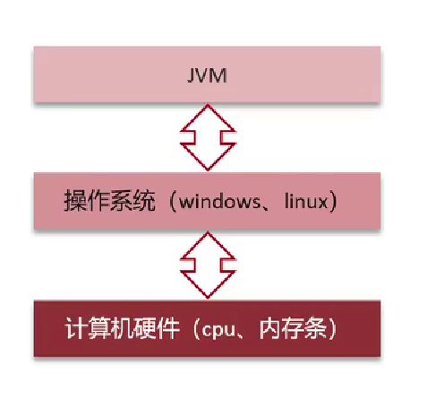

### JVM由哪几部分组成？运行流程是什么？

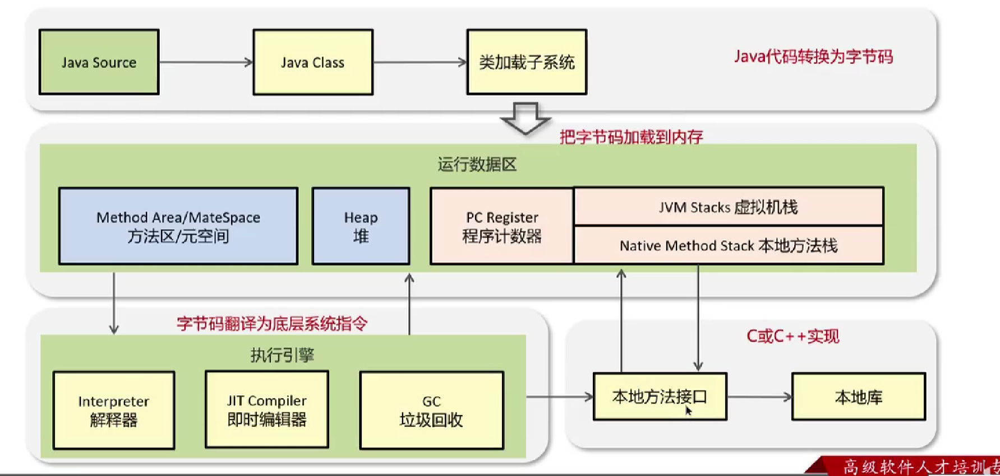

**类加载机制**：类的数据从Class文件加载到内存，并对数据进行校验、转换解析和初始化，最终形成可以被虚拟机直接使用的Java类型（《深入理解JVM》）

## 内存管理

### 什么是程序计数器？

- 程序计数器记录正在执行的字节码指令的地址。它是线程私有的，每个线程一份，内部保存字节码的行号；
- 唯一一个不会出现 `OutOfMemoryError` 的内存区域，它的生命周期随着线程的创建而创建，随着线程的结束而死亡。

### 使用PC寄存器存储字节码指令地址有什么用呢？（为什么使用PC寄存器记录当前线程地执行地址？）

因为CPU需要不停地切换各个线程，这时候切换回来以后，就得知道接着从哪开始继续执行。

JVM的字节码解释器就需要通过改变PC寄存器的值来明确下一条应该执行什么样的字节码指令。

### 什么是虚拟机栈？

虚拟机栈描述的是**Java方法执行的线程内存模型**。

### 栈帧中存储有什么？

- **局部变量表**（Local Varibales）
- **操作数栈**（Operand Stack）
- 动态链接（Dynamic Linking）（或指向运行时常量池的方法引用）
- 方法返回地址（Return Address）（或方法正常退出或者异常退出的定义）
- 一些附加信息

### 关于局部变量表

- 存放**方法参数**、定义在方法体内的**局部变量**；
- 局部变量表中存储空间的单位为**局部变量槽**（slot），局部变量表所需的内存空间在**编译期间完成分配**；
- 如果当前帧是构造方法或者实例方法创建的，那么index为0的slot处将存放该对象引用`this`；
- 局部变量表中的变量不存在系统初始化的过程。一旦定义了局部变量必须**人为初始化值**，否则无法使用。

### 虚拟机栈中可能出现的异常

Java虚拟机规范允许Java栈的大小时动态的或者时固定不变的

- 如果用**固定大小**的Java虚拟机栈，那每一个线程的Java虚拟机栈容量可以在线程创建的时候独立选定。如果线程请求分配的栈容量超过Java虚拟机栈允许的最大容量，Java虚拟机就会抛出一个**`StackOverflowError`**异常
- 如果Java虚拟机栈**可以动态扩展**，并且在尝试扩展的时候无法申请到足够的内存，或者在创建新的线程时没有足够的内存去创建对应的虚拟机栈，那Java虚拟机将会抛出一个**`OutofMemoryError`**异常

### 方法内的局部变量是否线程安全？

- 如果方法内局部变量没有逃离方法的作用范围，它是线程安全的；
- 如果局部变量引用了对象，并逃离方法的作用范围，需要考虑线程安全问题。

### ++i 和 i++

```java
int j = i++ + ++i;
```

- i++: 先从**局部变量表**中load到**操作数栈**中，再把局部变量表中的值加1；
- ++i: 先在局部变量表中将i加1，再load到操作数栈中。

### 为什么要把Java堆分代？

- 经研究，不同对象的生命周期不同，70%~99%的对象是临时对象；
- 分代的唯一理由是**优化GC性能**；
- 分代将新创建的对象放到某一地方，当GC的时候就会先把这部分“朝生夕死”的对象区域进行垃圾回收。

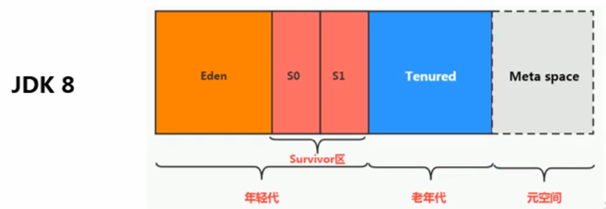

### 解释一下方法区？

- 方法区（Method Area）是各个线程共享的内存区域；
- 主要存储类的信息、运行时常量池（类型信息、常量、静态变量、即时编译器编译后的代码缓存等数据）；
- 虚拟机启动的时候创建，关闭虚拟机时释放；
- 如果方法区域中内存无法满足分配请求，则会抛出`OutOfMemoryError:Metaspace`

### JDK中方法区的演进

HotSpot虚拟机中方法区的演进：

| 时间           | 变化                                                         |
| :------------- | ------------------------------------------------------------ |
| `jdk1.6`及以前 | 有永久代（permanent generation），**静态变量存放在永久代上** |
| `jdk1.7`       | 有永久代，但已经逐步“去永久代”，**字符串常量池、静态变量**移除，保存在堆中 |
| `jdk1.8`及以后 | 无永久代，类型信息、字段、方法、常量保存在本地内存元空间中，但**字符串常量池、静态变量仍在堆** |

仅仅在HotSpot虚拟机上存在永久代，其他虚拟机不存在永久代的概念。

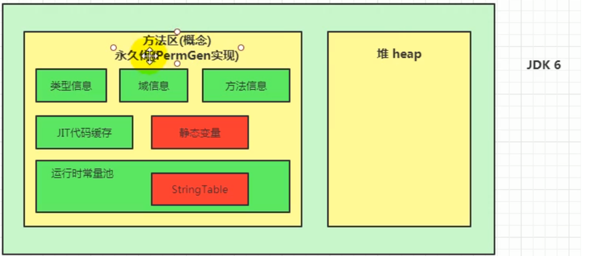

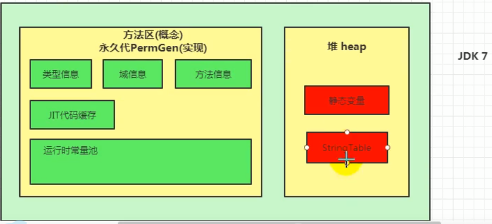

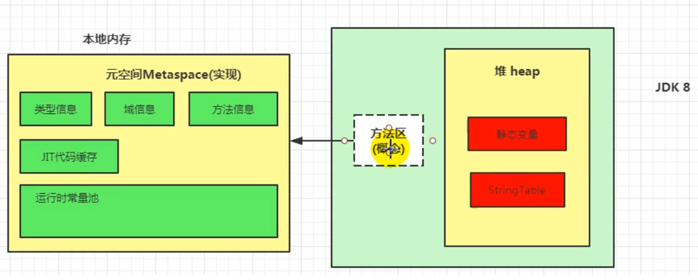

### 关于non-final的类变量和全局常量（static final）

- 全局常量在编译时候就会被分配（有ConstantValue属性）；
- non-final类变量被类的所有实例共享，即使没有类的实例也可以访问它；
- non-final类变量在类加载的准备阶段被设置初始值（jdk8及以后分配在堆中），在初始化阶段执行类构造器`<clinit>()`方法。

### 为什么要用元空间代替永久代？

- 整个永久代有一个JVM本身设置的固定大小上限，无法进行调整，而元空间使用的是本地内存，受本机可用内存的限制，虽然元空间仍旧可能溢出，但是比原来出现的几率会更小；

  > 当元空间溢出时会得到如下错误：`java.lang.OutOfMemoryError: MetaSpace`

- 元空间里面存放的是类的元数据，这样加载多少类的元数据就不由 `MaxPermSize` 控制了, 而由系统的实际可用空间来控制，这样能加载的类就更多了；

- 在 JDK8，合并 HotSpot 和 JRockit 的代码时, JRockit 从来没有一个叫永久代的东西，合并之后就没有必要额外的设置这么一个永久代的地方了。

### 介绍一下运行时常量池

- **常量池**：可以看作是一张表，虚拟机指令根据这张表找到要执行的类名、方法名、参数类型、字面量等信息（Class文件的资源仓库）；
- 当类被加载，它的常量池信息就会放入**运行时常量池**，并把里面的符号地址变为真实地址；
- 常量池中主要存放两大类常量：**字面量**和**符号引用**。


### 介绍Java类实例化的过程

1. **类加载检查**
   - 虚拟机遇到一条`new`指令时，首先将去检查这个指令的参数是否能在常量池中定位到这个类的符号引用，并且检查这个符号引用代表的类是否已被加载过、解析和初始化过。如果没有，那必须先执行相应的类加载过程；
2. **为对象分配内存**
   - 如果内存规整——指针碰撞（标记-复制、标记-整理算法）；
   - 如果内存不规整——虚拟机需要维护一个列表，空闲列表分配（标记-清除算法）；
3. **处理并发安全问题**
4. **初始化零值**
   - 所有属性**设置默认值**，保证对象实例字段在不赋值时可以直接使用；
5. **设置对象的对象头**
   - 将对象的所属类（即类的元数据信息）、对象的HashCode和对象的GC信息、锁信息等数据存储在对象的对象头中。这个过程的具体设置方式取决于JVM实现。
6. **执行`init`方法进行初始化**
   - 初始化成员变量，执行实例化代码块，调用类的构造方法，并把堆内对象的首地址赋值给引用变量。

### 对象在JVM中是怎么存储的？

**对象的内存布局**：对象头、实例数据、对齐填充

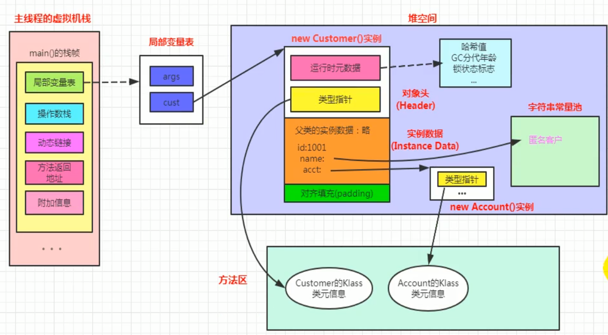

### Java对象头里有什么？

HotSpot虚拟机对象的对象头部分包含两类信息：

- 存储对象自身的运行时数据（**Mark Word**）：如哈希码、GC分代年龄、锁状态标志、线程持有的锁、偏向线程ID、偏向时间戳等；
- **类型指针**：对象指向它的类型元数据的指针，Java虚拟机通过这个指针来确定该对象是哪个类的实例。

### 对象的访问定位有哪两种方式？

- **句柄访问**

  

- **直接指针访问**（HotSpot默认）

  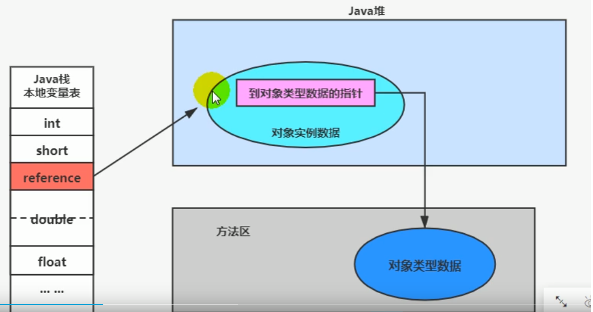

## String

### 字符串拼接操作

- 常量与常量的拼接结果在常量池，原理是**编译期优化**；常量池中不会存在相同内容的常量；
- 只要其中有一个是变量，结果就在堆中。变量拼接的原理是`StringBuilder`；
- 如果拼接的结果调用`intern()`方法，则主动将常量池中还没有的字符串对象放入池中，并返回此对象地址；

```java
public void test2() {
    String s1 = "javaEE";
    String s2 = "hadoop";

    String s3 = "javaEEhadoop";
    String s4 = "javaEE" + "hadoop"; // 编译期优化
    // 如果拼接符号的前后出现了变量，则相当于在堆空间中new String()
    String s5 = s1 + "hadoop";
    String s6 = "javaEE" + s2;
    String s7 = s1 + s2;

    System.out.println(s3 == s4); // true
    System.out.println(s3 == s5); // false
    System.out.println(s3 == s6); // false
    System.out.println(s3 == s7); // false
    System.out.println(s5 == s6); // false
    System.out.println(s5 == s7); // false
    System.out.println(s6 == s7); // false

    String s8 = s6.intern();
    System.out.println(s3 == s8); // true
}
```

## 垃圾回收

### 对象什么时候被垃圾回收？

如果一个或多个对象没有任何引用指向它了，那么这个对象现在就是垃圾。如果定位了垃圾，则有可能会被垃圾回收器回收。

定位垃圾的方式有两种：

- 引用计数法
- 可达性分析算法

### 引用计数法的优缺点

**优点**：实现简单，垃圾对象便于辨识；判定效率高，回收没有延迟性

**缺点**

- 需要单独的字段存储计数器，增加了存储空间开销
- 每次复制需要更新计数器，增加了时间开销
- **无法处理循环引用的情况**

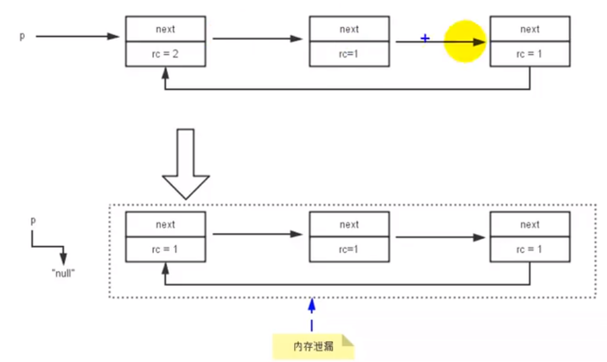

### STW(stop-the-world)机制

- 如果出现分析过程中对象引用关系还在不断变化，则分析结果的准确性无法保证（**为什么要有STW**）

- STW和采用哪款GC无关，G1也不能完全避免Stop-the-world；

### GC Roots有哪些？

- 虚拟机栈（栈帧中的本地变量表）中引用的对象
- 方法区中类静态属性引用的对象
  - 如Java类的引用类型静态变量
- 方法区中常量引用的对象
  - 如字符串常量池里的引用
- 本地方法栈中JNI引用的对象

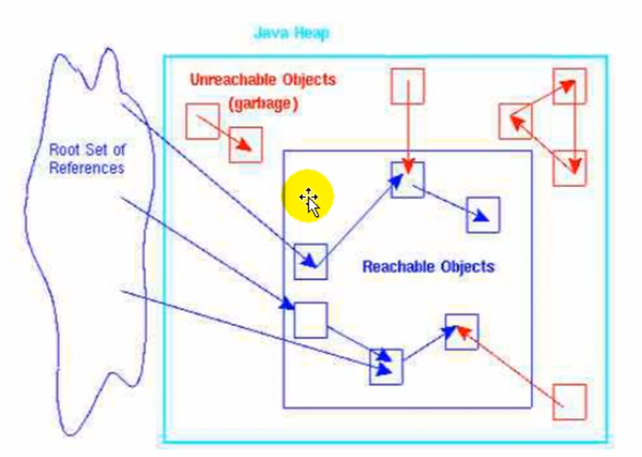

### 对象的finalization机制

`finalize()`方法是`Object`类提供的方法。在GC准备释放对象所占用的内存空间之前，它将首先调用`finalize()`方法（也可能不调用）

1. 如果对象`objA`到GC Roots没有引用链，则进行**第一次标记**；
2. 进行筛选，判断`objA`有无必要执行`finalize()`方法：
   - `objA`没有重写`finalize()`或`finalize()`已经被虚拟机调用过，则虚拟机视为“没有必要执行”；
   - 如果对象重写了`finalize()`方法且未被执行过，那么`objA`会被插入到`F-Queue`队列中，由一个虚拟机自动创建的、低优先级的`Finalizer`线程触发其`finalize()`方法执行；
   - 稍后GC会对F-Queue队列中的对象进行**第二次标记**，判断其是否进行回收（是否逃脱死亡成功，略）。`finalize()`不会被再次调用了。

### JVM垃圾回收算法有哪些？

- **标记-清除算法：**

  - **标记**：Collector从引用根节点开始遍历，标记所有被引用的对象。一般是在对象的Header中记录为可达对象；
  - **清除**：Collector对堆内存从头到尾进行线性的遍历，如果发现某个对象在其Header中没有标记为可达对象，则将其回收

  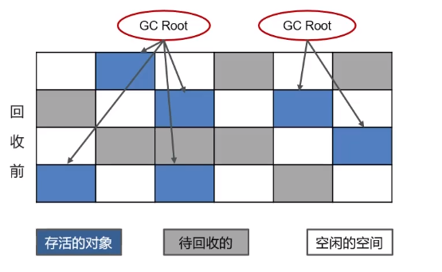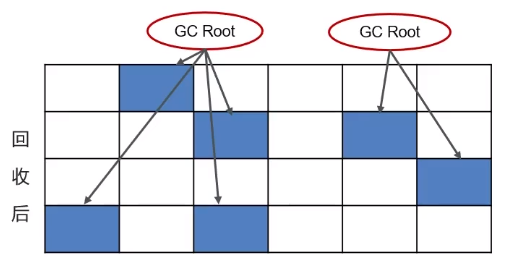

  - 缺点：
    - 效率不高
    - 需要停止整个应用程序（STW）
    - 产生内存碎片（需要维护一个空闲列表）

- **标记-整理算法**

  - **标记**：同标记-清除算法；
  - **整理**：将所有存活对象压缩到内存的一端，按顺序排放。然后清理边界外的所有空间；
  - 优点：
    - 消除了标记清除算法中内存区域分散的缺点
    - 消除了复制算法中内存减半的高额代价
  - 缺点：
    - 效率低于复制算法
    - STW

- **复制算法**

  - 将原有内存空间一分为二，每次只使用其中的一块；
  - 正在使用的对象复制到另一个内存空间中，然后将内存空间清空，交换两个内存的角色，完成垃圾回收；
  - 优点：
    - 运行高效
    - 不会出现碎片问题
  - 缺点：
    - 需要2倍内存空间

- **对比**

  |          | Mark-Sweep         | Mark-Compact     | Copying                               |
  | -------- | ------------------ | ---------------- | ------------------------------------- |
  | 速度     | 中等               | 最慢             | 最快                                  |
  | 空间开销 | 少（但会堆积碎片） | 少（不堆积碎片） | 通常需要或对象的2倍大小（不堆积碎片） |
  | 移动对象 | 否                 | 是               | 是                                    |

### 说一下JVM中的分代回收

#### 堆的区域划分

- 堆被分为了两份：新生代和老年代【1：2】
- 对于新生代，内部又被分为了三个区域：Eden区，Survivor区（分为from和to）【8：1：1】

#### 对象回收分代回收策略

1. 新创建的对象，都会先被分配到Eden区；
2. Eden区内存不足，标记Eden区和from区的存活对象；
3. 将存活对象采用复制算法复制到to区中，复制完毕后Eden区和from区得到释放；
4. 经过一段时间后Eden区内存又出现不足，标记Eden区和to区存活对象，复制到from区；
5. Survivor区熬过几次回收（最多15次），晋升到老年代（Survivor区内存不足或大对象会提前晋升）。

#### HotSpot虚拟机为什么要将堆空间分为新生代和老年代？

- 根据**对象存活周期**的不同，将 Java 堆分为新生代和老年代，这样我们就可以根据各个年代的特点选择合适的垃圾收集算法；
- 比如在新生代中，每次收集都会有大量对象死去，所以可以选择”标记-复制“算法，只需要付出少量对象的复制成本就可以完成每次垃圾收集；
- 老年代的对象存活几率是比较高的，而且没有额外的空间对它进行分配担保，所以我们必须选择“标记-清除”或“标记-整理”算法进行垃圾收集。

### Minor GC、Major GC、Full GC的区别？

GC按照**回收区域**分为两大种类型：**部分收集**（Partial GC）和**整堆收集**（Full GC）

部分收集

- **新生代收集**（Minor GC / Young GC）：新生代的垃圾回收
  - 年轻代中的Eden代满，会触发Minor GC；这里的年轻代满指的是Eden代满，Survivor满不会引发GC；
  - 由于Java对象大多都具备**朝生夕灭**的特性，故Minor GC回收速度快，较频繁；
  - Minor GC会引发**STW**，暂停其他用户线程；垃圾回收结束，用户线程恢复；
- **老年代收集**（Major GC / Old GC）：新生代和老年代部分区域的垃圾回收，G1收集器持有
  - 对象从老年代消失时，Major GC 发生；
  - Major GC通常会伴随至少一次的Minor GC（老年代空间不足时，先Minor GC。之后空间还不足，则Major GC）；
  - Major GC的速度一般比Minor GC慢十倍以上，STW时间更长；
  - Major GC后内存还不足，就OOM了；
- **Full GC**：新生代 + 老年代的完整垃圾回收，STW时间长，尽量避免

### 吞吐量和暂停时间

- 选择吞吐量优先，必然需要**降低内存回收的执行频率**，导致GC需要更长的暂停时间；
- 选择低延迟优先，只能频繁地执行内存回收，引起年轻代内存地所见和导致程序吞吐量的下降。

### 说一下JVM有哪些垃圾回收器？

#### Serial收集器——串行回收

- Serial收集器采用**复制算法**、**串行回收**和**Stop-the-World**机制方式执行内存回收
- Serial Old是Serial收集器的老年代版本，使用**标记-整理**算法；

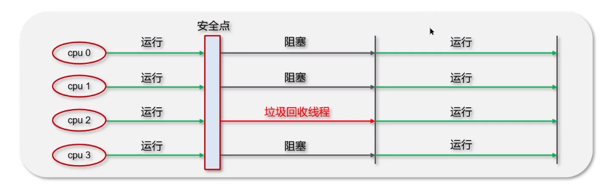

#### ParNew收集器——Serial回收器的多线程并行版本

- 除了采用**并行回收**方式执行内存回收外，和Serial收集器几乎没有任何区别；
- 在年轻代中采用**复制算法**、**STW**机制；

#### Parallel Scavenge收集器

- 和ParNew收集器一样，采用了复制算法、并行回收和STW机制；
- 不同之处：**吞吐量优先**的垃圾收集器（目标为达到一个可控制的吞吐量）；

- Parallel Old收集器是Parallel Scavenge的老年代版本，采用**标记-压缩算法**、**并行回收**、**STW机制**；

#### CMS收集器

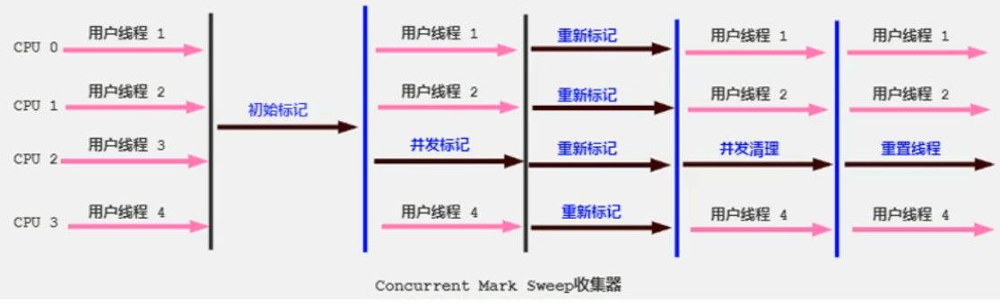

- 初始标记：标记GC Roots能关联到的对象，速度非常快；
- 并发标记：从GC Roots的直接关联对象开始遍历整个对象图的过程，这个过程耗时较长但不需要停顿用户线程。可以与垃圾收集线程一起并发运行；
- 重新标记：修正并发标记期间，因用户程序继续运作而导致标记产生变动的那一部分对象的标记记录；
- 并发清除：清理删除掉标记阶段判断死亡的对象，释放内存空间。

**注意**：只有**初始标记、重新标记**需要Stop-the-World。

#### G1收集器

见下

### G1收集器

#### G1回收器的特点

1. **并行与并发**

   并行：多个GC线程同时工作，此时用户线程STW

   并发：G1拥有与应用程序交替执行的能力，部分工作可以和应用程序同时执行。

2. **分代收集**

   - G1依然属于分代型垃圾回收器：区分年轻代和老年代，年轻代划分Eden区和Survivor区。但**不要求都是连续的，也不再坚持固定大小和固定数量**；
   - 将堆分为若干个**区域（Region）**

3. **空间整合**

   - Region之间是复制算法，整体可看作是标记-压缩算法

4. **可停顿的事件模型**

   - **每次根据允许的收集时间，优先回收价值最大的Region**，保证G1收集器在有限的时间内可以获得尽可能高的手机效率。

#### G1收集器的三个环节

- **年轻代GC**（Young GC）****：并行的独占式收集器，年轻代的Eden区用尽时触发；
- **老年代并发标记过程**（Concurrent Marking）：堆空间内存达到一定值（默认45%）时触发；
  - 如果发现Region中所有对象都是垃圾，那么这个区域会被立即回收；
- **混合回收**（Mixed GC）：标记完成后马上开始混合回收过程。**不需要整个老年代回收，扫描/回收一小部分老年代的Region **

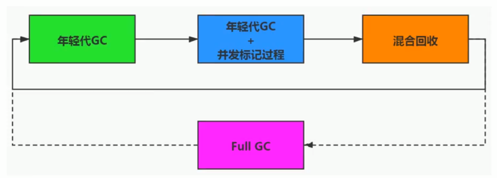

#### 

### Java的四种引用

#### 强引用（Strong Reference）——不回收

- 指在程序代码中普遍存在的引用赋值，如`Object obj = new Object();`
- 强引用所指向的对象在任何时候都不会被系统回收；系统宁愿抛出`OutOfMemory`异常，也不会回收强引用所指向的对象；
- 强引用可能导致内存泄漏。

#### 软引用（Soft Reference）——内存不足即回收

- 当内存足够时，不会回收软引用的可达对象；
- 当内存不足时，会回收软引用的可达对象；

#### 弱引用（Weak Reference）——发现即回收

- 只被弱引用关联的对象只能生存到下一次垃圾回收发生为止；

#### 虚引用（Phantom Reference）——对象回收跟踪

- 一个对象是否有虚引用的存在，完全不会决定对象的生命周期；一个对象仅持有虚引用，那么它和没有引用几乎是一样的；

## 类加载子系统

### Class文件结构总结

`.class`文件结构：

```
ClassFile {
    u4             magic; //Class 文件的标志
    u2             minor_version;//Class 的小版本号
    u2             major_version;//Class 的大版本号
    u2             constant_pool_count;//常量池的数量
    cp_info        constant_pool[constant_pool_count-1];//常量池
    u2             access_flags;//Class 的访问标记
    u2             this_class;//当前类
    u2             super_class;//父类
    u2             interfaces_count;//接口数量
    u2             interfaces[interfaces_count];//一个类可以实现多个接口
    u2             fields_count;//字段数量
    field_info     fields[fields_count];//一个类可以有多个字段
    u2             methods_count;//方法数量
    method_info    methods[methods_count];//一个类可以有个多个方法
    u2             attributes_count;//此类的属性表中的属性数
    attribute_info attributes[attributes_count];//属性表集合
}

```

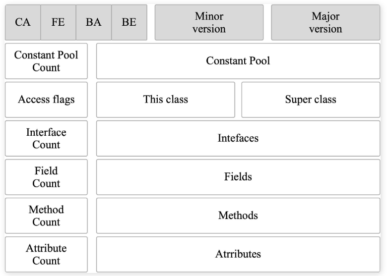

### 什么是类加载器，类加载器有哪些？

1. JVM只会运行二进制文件，类加载器的作用就是**将字节码文件加载到JVM中**，从而让Java程序能够启动起来；

2. 类加载器有哪些？
   - 启动类加载器（BootStrap ClassLoader）：
     - 使用C/C++语言实现，嵌套在JVM内部，是JVM的一部分；
     - 加载Java的核心库（`<JAVA_HOME>lib`目录）;
     - 不继承自`java.lang.ClassLoader`，没有父加载器；
     
   - 扩展类加载器（Extension ClassLoader）：
     - 加载`<JAVA_HOME>lib\ext`目录中的类库；
     - 派生于`ClassLoader`类，父加载器为启动类加载器；
     
   - 应用程序类加载器（AppClassLoader）：
     - 用于加载用户类路径（ClassPath）上所有的类库；
     - 是程序中默认的类加载器；
     - 父加载器为扩展类加载器，派生于`ClassLoader`类。
     
   - 自定义类加载器
   
     - 为什么要定义自定义类加载器？
       - 隔离加载类
       - 修改类的加载方式
       - 扩展加载源
       - 防止源码泄漏
   
   - 示例代码：
   
     ```java
     public class ClassLoaderTest {
         public static void main(String[] args) {
             // 获取系统类加载器
             ClassLoader systemClassLoader = ClassLoader.getSystemClassLoader();
             System.out.println(systemClassLoader); //sun.misc.Launcher$AppClassLoader@18b4aac2
     
             // 获取其上层: 扩展类加载器
             ClassLoader extClassLoader = systemClassLoader.getParent();
             System.out.println(extClassLoader); //sun.misc.Launcher$ExtClassLoader@677327b6
     
             // 获取不到引导类加载器
             ClassLoader bootstrapClassLoader = extClassLoader.getParent();
             System.out.println(bootstrapClassLoader); //null
     
             // 自定义类默认使用系统类加载器
             ClassLoader classLoader = ClassLoaderTest.class.getClassLoader();
             System.out.println(classLoader); //sun.misc.Launcher$AppClassLoader@18b4aac2
     
             // String类使用引导类加载器加载的
             ClassLoader stringClassLoader = String.class.getClassLoader();
             System.out.println(stringClassLoader); //null
         }
     }
     ```

### 什么是双亲委派模型？

- 在类加载的时候，系统会**首先判断当前类是否被加载过**。已经被加载的类会直接返回，否则才会尝试加载（每个父类加载器都会走一遍这个流程）；
- 如果一个类加载器收到了类加载的请求，它首先不会自己去尝试加载这个类，而是把**这个请求委派给父类加载器去完成**（调用父类的`loadClass()`方法）；
- 每一个层次的类加载器都是如此，因此所有的加载请求最终**都应该传送到顶层的启动类加载器中**；
- 只有当父加载器反馈自己无法完成这个加载请求（它的搜索范围中没有找到所需的类）时，子加载器才会尝试自己去加载。

```java
protected Class<?> loadClass(String name, boolean resolve)
    throws ClassNotFoundException
{
    synchronized (getClassLoadingLock(name)) {
        //首先，检查该类是否已经加载过
        Class c = findLoadedClass(name);
        if (c == null) {
            //如果 c 为 null，则说明该类没有被加载过
            long t0 = System.nanoTime();
            try {
                if (parent != null) {
                    //当父类的加载器不为空，则通过父类的loadClass来加载该类
                    c = parent.loadClass(name, false);
                } else {
                    //当父类的加载器为空，则调用启动类加载器来加载该类
                    c = findBootstrapClassOrNull(name);
                }
            } catch (ClassNotFoundException e) {
                //非空父类的类加载器无法找到相应的类，则抛出异常
            }

            if (c == null) {
                //当父类加载器无法加载时，则调用findClass方法来加载该类
                //用户可通过覆写该方法，来自定义类加载器
                long t1 = System.nanoTime();
                c = findClass(name);

                //用于统计类加载器相关的信息
                sun.misc.PerfCounter.getParentDelegationTime().addTime(t1 - t0);
                sun.misc.PerfCounter.getFindClassTime().addElapsedTimeFrom(t1);
                sun.misc.PerfCounter.getFindClasses().increment();
            }
        }
        if (resolve) {
            //对类进行link操作
            resolveClass(c);
        }
        return c;
    }
}

```

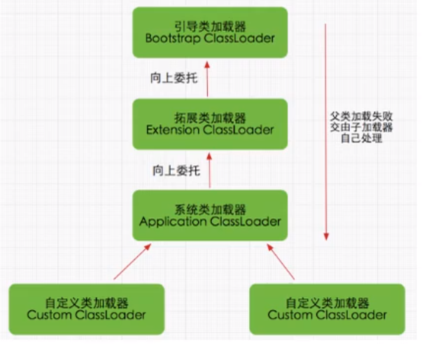

### JVM为什么采用双亲委派机制？

- 通过双亲委派机制可以**避免类的重复加载**。当父类已经加载后则无需重复加载，保证唯一性（比如自己定义一个`java.lang.Object`类，可以保证加载的是JRE里的`Object`类）；
- 保护程序安全，防止核心API被随意篡改。

### 说一下类装载的执行过程？


#### 加载

查找和导入class文件

- 通过一个类的全限定名来获取定义此类的二进制字节流（但没有指明要从哪获取，怎么获取）；
- 将这个字节流所代表的静态存储结构转化为方法区的运行时数据结构；
- 在内存中（堆）生成一个代表这个类的`java.lang.Class`对象，作为方法区这个类的各种数据的访问入口。
- （加载阶段结束后，Java虚拟机外部的二进制字节流就按照虚拟机所设定的格式存储在**方法区中**。类型数据妥善安置在方法区之后，在内存中实例化一个`java.lang.Class`类的对象（并没有明确规定是在Java堆中，对于HotSpot虚拟机而言，Class对象比较特殊，它虽然是对象，但是存放在方法区里面，作为程序访问方法区中类型数据的外部接口）

#### 验证

保证加载类的准确性

- 文件格式验证
- 元数据验证
- 字节码验证
- 符号引用验证

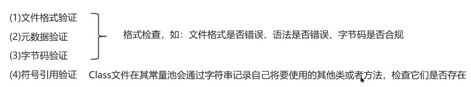

#### 准备

为类变量分配内存并设置类变量初始值

- 仅包括类变量，不包括实例变量；
- 在方法区中进行分配；
- `static`变量，分配空间在准备阶段完成（设置默认值），赋值在初始化阶段完成；
- `static`变量是`final`的基本类型，以及字符串常量，值以确定，赋值在准备阶段完成；
- `static`变量是`final`的引用类型，赋值在初始化阶段完成。

#### 解析

把类中的符号引用转换为直接引用

#### 初始化

- 初始化阶段就是执行类构造器`<clinit>()`方法的过程
- 对类的静态变量，静态代码块执行初始化操作
