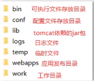

# JavaWeb

## 一、Tomcat

### 1.1 JavaWeb技术栈

- B/S架构：Browser/Server，浏览器/服务器架构模式，它的特点是：客户端只需要浏览器，应用程序的逻辑和数据都存储在服务器端。浏览器只需要请求服务器，获取Web资源。服务器把Web资源发送给浏览器即可；
  - 好处：易于维护升级；服务器端升级后，客户端无序任何部署就可以使用到新的版本；
- 静态资源：HTML、CSS、JavaScript、图片等，负责页面展现；
- 动态资源：Servlet、JSP等，负责逻辑处理；
- 数据库：负责存储数据；
- HTTP协议：定义通信规则；
- Web服务器：负责解析HTTP协议，解析请求数据，并发送响应数据；

### 1.2 Web服务器


常见的JavaWeb服务器：Tomcat、Jetty、JBoss、GlassFish、Resin、Weblogic、Websphere等

**Web服务器的作用**：

- 封装HTTP协议，简化开发
- 可以将web项目部署到服务器中，对外提供网上浏览服务


### 1.3 Tomcat服务器

#### 1.2.1 Tomcat基本使用

- 下载：官网下载
- 安装：绿色版，直接解压即可
- 卸载：直接删除目录即可
- 启动：双击bin\startup.bat
- 关闭：
  - 强制关闭：直接关掉运行窗口
  - 正常关闭：双击`bin\shutdown.bat`
  - 正常关闭：`Ctrl+C`



#### 1.2.2 Tomcat配置

- 修改启动端口号：`conf/server.xml`

  

- 启动可能出现的问题
  - 启动窗口一闪而过：检查`JAVA_HOME`环境变量是否正确配置；
  - 端口号冲突：关闭对应程序

#### 1.2.3 Tomcat部署项目

- 将项目放置到webapps目录下，即部署完成；

- 一般javaweb项目会被打成war包，然后将war包放到webapps目录下，tomcat会自动解压缩war文件；

  

### 1.4 IDEA中创建Maven Web项目

#### 1.4.1 Web项目结构

- Maven Web项目结构：开发中的项目

  

- 部署的JavaWeb项目结构：开发完成，可以部署的项目

  

- 编译后的java字节码文件和resources的资源文件，放到WEB-INF的classes目录下；

- pom.xml中依赖坐标对应的jar包，放入WEB-INF下的lib目录下；

#### 1.4.2 IDEA中创建Maven Web项目

- 使用骨架（需要补齐缺失的目录结构：java）
- 不使用骨架
  - 将打包方式修改为war
  - 补齐缺失的目录结构：webapp

### 1.5 IDEA中使用Tomcat

#### 1.5.1 IDEA集成本地Tomcat


#### 1.5.2 IDEA中使用Maven插件

- pom.xml中添加Tomcat插件

  ```xml
  <build>
      <plugins>
          <plugin>
              <groupId>org.apache.tomcat.maven</groupId>
              <artifactId>tomcat7-maven-plugin</artifactId>
              <version>2.2</version>
              <configuration>
                  <port>80</port>
                  <path>/</path>
              </configuration>
          </plugin>
      </plugins>
  </build>
  ```

- 快速启动项目

## 二、Servlet

### 2.1 Servlet简介 & 快速入门

- Servlet是Java提供的一门**动态**Web资源开发技术；

- Servlet是javaEE规范之一，其实就是一个接口，将来我们需要定义Servlet类实现Servlet接口，并由web服务器运行Servlet

- 快速入门案例

  - 创建**web项目**，导入Servlet依赖坐标；

    ```xml
    <dependencies>
        <dependency>
            <groupId>javax.servlet</groupId>
            <artifactId>javax.servlet-api</artifactId>
            <version>3.1.0</version>
            <scope>provided</scope> <!--Web服务器通常已经提供了Servlet API的实现-->
        </dependency>
    </dependencies>
    ```

  - 创建：定义一个类，实现Servlet接口，并重写接口中所有方法，并在service方法中输入一句话；

    

  - 配置：在类上使用`@WebServlet`注解，配置该Servlet的访问路径

    ```java
    @WebServlet("/demo1")
    public class ServletDemo1 implements Servlet 
    ```

  - 访问：启动Tomcat，浏览器输入URL访问该Servlet

    ```
    http://localhost:8080/web-demo/demo1
    ```

### 2.2 Servlet执行流程


**注意**

- **Servlet对象由web服务器创建，其中的方法由web服务器调用；**
- 自定义的Servlet必须实现Servlet接口并复写其方法，所以Servlet中一定会由service方法

### 2.3 Servlet生命周期

- 对象的生命周期指一个对象从创建到被销毁的整个过程；

- Servlet运行在Servlet容器（web服务器）中，其生命周期由容器来管理，分为4个阶段：

  - **加载和实例化**：默认情况下，当Servlet第一次被访问时，由容器创建Servlet对象；

    - ```java
      @WebServlet(urlPatterns="/demo",loadOnStartup=1)
      //负整数：第一次被访问时创建Servlet对象（默认）
      //0或正整数：服务器启动时创建Servlet对象，数字越小优先级越
      ```

  - **初始化**：在Servlet实例化时，容器将调用Servlet的`init()`初始化这个对象，完成一些如加载配置文件、创建连接等初始化的工作。该方法只**调用一次**；

  - **请求处理**：每次请求Servlet时，Servlet容器都会调用Servlet的`service()`方法对请求进行处理；

  - **服务终止**：当需要释放内存或者容器关闭时，容器就会调用Servlet实例的`destroy()`方法完成资源的释放。在destroy()方法调用之后，容器会释放这个Servlet实例，该实例随后被Java的来收集器回收。

### 2.4 Servlet方法介绍

- 初始化方法，在Servlet被创建时执行，只执行一次

  ```java
  void init(ServletConfig config)
  ```

- 提供服务方法，每次Servlet被访问，都会调用该方法

  ```java
  void service(ServletRequest req, ServletResponse res)
  ```

- 销毁方法，当Servlet被销毁时，调用该方法。在内存释放或服务器关闭时销毁Servlet

  ```java
  void destroy()
  ```

- 获取ServletConfig对象

  ```java
  ServletCfonig getServletConfig()
  ```

- 获取Servlet信息

  ```java
  String getServletInfo()
  ```

### 2.5 Servlet体系结构


- HttpServlet中为什么要根据请求方式的不同，调用不同的方法？
  - GET请求和POST请求的参数位置不同，一个在请求头中，一个在请求体中；
  
- 如何调用？
  - HttpServlet实现了Servlet接口，在其`service()`方法中，判断请求方式的不同，分别调用不同的`doXXX()`方法；
  
  - 我们重写其中的`doGet()`和`doPost()`方法，实际上是重写了其中的处理逻辑；
  
  - HttpServlet中`service()`源码：
  
    ```java
    protected void service(HttpServletRequest req, HttpServletResponse resp) throws ServletException, IOException {
            String method = req.getMethod();
            long lastModified;
            if (method.equals("GET")) {
                lastModified = this.getLastModified(req);
                if (lastModified == -1L) {
                    this.doGet(req, resp);
                } else {
                    long ifModifiedSince = req.getDateHeader("If-Modified-Since");
                    if (ifModifiedSince < lastModified) {
                        this.maybeSetLastModified(resp, lastModified);
                        this.doGet(req, resp);
                    } else {
                        resp.setStatus(304);
                    }
                }
            } else if (method.equals("HEAD")) {
                lastModified = this.getLastModified(req);
                this.maybeSetLastModified(resp, lastModified);
                this.doHead(req, resp);
            } else if (method.equals("POST")) {
                this.doPost(req, resp);
            } else if (method.equals("PUT")) {
                this.doPut(req, resp);
            } else if (method.equals("DELETE")) {
                this.doDelete(req, resp);
            } else if (method.equals("OPTIONS")) {
                this.doOptions(req, resp);
            } else if (method.equals("TRACE")) {
                this.doTrace(req, resp);
            } else {
                String errMsg = lStrings.getString("http.method_not_implemented");
                Object[] errArgs = new Object[]{method};
                errMsg = MessageFormat.format(errMsg, errArgs);
                resp.sendError(501, errMsg);
            }
    
        }
    ```

### 2.6 Servlet urlPattern配置

- 一个Servlet，可以配置多个urlPattern

  ```java
  @WebServlet(urlPatterns = {"/demo1", "/demo2"})
  ```

- urlPattern配置规则

  - 精确匹配

    ```java
    @WebServlet("/user/select")
    ```

  - 目录匹配

    ```java
    @WebServlet("/user/*")
    ```

  - 扩展名匹配

    ```java
    @WebServlet("*.do") //不能加/！！！
    ```

  - 任意匹配

    ```java
    @WebServlet("/")
    @WebServlet("/*")
    ```
### 2.7 XML配置方式编写Servlet

有空再学

## 三、Request & Response

### 3.1 介绍


- Request：**获取**请求数据
- Response：**设置**响应数据

### 3.2 Request继承体系


- Tomcat需要解析请求数据，封装为request对象，并且创建request对象传递到`service()`中；

  ```java
  @WebServlet("/demo2")
  public class ServletDemo2 extends HttpServlet {
      @Override
      protected void doGet(HttpServletRequest req, HttpServletResponse resp) throws ServletException, IOException {
          System.out.println(req);
          System.out.println(req.getClass());
      }
  }
  
  org.apache.catalina.connector.RequestFacade@2f6f835a
  class org.apache.catalina.connector.RequestFacade
  ```


### 3.3 Request获取请求数据

#### 3.3.1 请求行

```http
GET /request-demo/req1?username=zhangsan HTTP/1.1
```

- `String getMethod()`：获取请求方式

- `String getContextPath()`：获取虚拟目录（项目访问路径），/request-demo

- `StringBuffer getRequestURL()`：获取URL（统一资源定位符），http://localhost:8080/request-demo/req1

  

#### 3.3.4 通用方式获取请求参数（GET/POST均可）


- `Map<String, String[]> getParameterMap()`：获取所有参数Map集合

  ```java
  Map<String, String[]> map = req.getParameterMap();
  for (String key : map.keySet()) {
      System.out.print(key + ": ");
      String[] values = map.get(key);
      for (String value : values) {
          System.out.print(value + " ");
      }
      System.out.println();
  }
  ```

- `String[] getParameterValues(String name)`：根据名称获取参数值（数组）

  ```java
  String[] hobbies = req.getParameterValues("hobby");
  for (String hobby : hobbies) {
      System.out.println(hobby);
  }
  ```

- `String getParameter(String name)`：根据名称获取参数值

  ```java
  String username = req.getParameter("username");
  System.out.println(username);
  ```


#### 3.3.5 解决中文乱码

- 请求参数中如果存在中文数据，则会乱码

- 解决方案：

  - POST请求：设置输入流的编码

    ```java
    req.setCharacterEncoding("UTF-8");
    ```

  - GET请求：

    - 乱码原因：

### 3.4 Request请求转发

- 请求转发（forward）：一种在服务器内部的资源跳转方式

  

  ```java
  req.getRequestDispatcher("/req6").forward(req, resp);
  ```

- 请求转发资源间共享数据：使用Request对象

  - `void setAttribute(String name, Object o)`：存储数据到request域中
  - `Object getattribute(String name)`：根据key，获取值
  - `void removeAttribute(String name)`：根据key，删除该键值对

```java
@WebServlet("/req5")
public class RequestDemo5 extends HttpServlet {
    @Override
    protected void doGet(HttpServletRequest req, HttpServletResponse resp) throws ServletException, IOException {
        req.setAttribute("username" ,"Ivo10");
        req.getRequestDispatcher("/req6").forward(req, resp);
        System.out.println("demo5");
    }

    @Override
    protected void doPost(HttpServletRequest req, HttpServletResponse resp) throws ServletException, IOException {
        this.doGet(req, resp);
    }
}
```

```java
@WebServlet("/req6")
public class RequestDemo6 extends HttpServlet {
    @Override
    protected void doGet(HttpServletRequest req, HttpServletResponse resp) throws ServletException, IOException {
        String username = (String) req.getAttribute("username");
        System.out.println("username: " + username);
        System.out.println("demo6");
    }

    @Override
    protected void doPost(HttpServletRequest req, HttpServletResponse resp) throws ServletException, IOException {
        this.doGet(req, resp);
    }
}
```

## 四、Mybatis

### 4.1 Mybatis简介

- MyBatis是一款优秀的**持久层框架**，用于简化JDBC开发
- **持久层**
  - 负责将数据保存到数据库的那一层diamagnetic
  - JavaEE三层架构：表现层，业务层，持久层
- **框架**
  - 框架就是一个半成品软件，是一套可重用的、通用的、软件基础代码模型
  - 在框架的基础之上构建软件编写更加高效、规范、通用、可扩展

### 4.2 快速入门

#### 4.2.1 创建user表，添加数据

```mysql
CREATE DATABASE mybatis;

use mybatis;

create table tb_user(
	id INT primary key auto_increment,
	username VARCHAR(20),
	password VARCHAR(20),
	gender char(1),
	addr varchar(30)
);

INSERT INTO tb_user values(1, 'zhangsan', '123','男','北京');
INSERT INTO tb_user values(2, '李四', '234','女','天津');
INSERT INTO tb_user values(3, '王五', '11','男','西安');
```

#### 4.2.2 创建模块，导入坐标

```xml
<dependency>
    <groupId>org.mybatis</groupId>
    <artifactId>mybatis</artifactId>
    <version>3.5.5</version>
</dependency>

<dependency>
    <groupId>mysql</groupId>
    <artifactId>mysql-connector-java</artifactId>
    <version>5.1.46</version>
</dependency>
```

#### 4.2.3 编写MyBatis核心配置文件

替换连接信息，解决硬编码问题——**官网CV，手动改**

```xml
<?xml version="1.0" encoding="UTF-8" ?>
<!DOCTYPE configuration
        PUBLIC "-//mybatis.org//DTD Config 3.0//EN"
        "https://mybatis.org/dtd/mybatis-3-config.dtd">
<configuration>
    <environments default="development">
        <environment id="development">
            <transactionManager type="JDBC"/>
            <dataSource type="POOLED">
                <property name="driver" value="com.mysql.jdbc.Driver"/>
                <property name="url" value="jdbc:mysql:///mybatis?useSSL=false"/>
                <property name="username" value="root"/>
                <property name="password" value="xw20000826"/>
            </dataSource>
        </environment>
    </environments>
    <mappers>
        <mapper resource="UserMapper.xml"/>
    </mappers>
</configuration>
```

#### 4.2.4 编写SQL映射文件

官网CV

```xml
<?xml version="1.0" encoding="UTF-8" ?>
<!DOCTYPE mapper
        PUBLIC "-//mybatis.org//DTD Mapper 3.0//EN"
        "https://mybatis.org/dtd/mybatis-3-mapper.dtd">
<mapper namespace="test">
    <select id="selectAll" resultType="com.buaa.pojo.User">
        select * from tb_user;
    </select>
</mapper>
```

#### 4.2.5 编码

1. 定义POJO类

   代码略

2. 加载核心配置文件，获取SqlSessionFactory对象

3. 获取SqlSession对象，执行SQL语句

4. 释放资源

   ```java
   String resource = "mybatis-config.xml";
   InputStream inputStream = Resources.getResourceAsStream(resource);
   SqlSessionFactory sqlSessionFactory = new SqlSessionFactoryBuilder().build(inputStream);
   
   SqlSession sqlSession = sqlSessionFactory.openSession();
   List<User> users = sqlSession.selectList("test.selectAll");
   
   System.out.println(users);
   
   sqlSession.close();
   ```

### 4.3 Mapper代理开发

- 定义与映射文件同名的Mapper接口，并且将Mapper接口和SQL映射文件放置在同一目录下；

  - resources目录下创建多层目录结构，要用'/'作为分割；

- 设置SQL映射文件的namespace属性位Mapper接口全限定名；

- 在Mapper接口中定义方法，方法名就是SQL映射文件中sql语句的id，并保持参数类型和返回值类型一致；

  ```xml
  <mapper namespace="com.buaa.mapper.UserMapper">
      <select id="selectAll" resultType="com.buaa.pojo.User">
          select * from tb_user;
      </select>
  </mapper>
  ```

- 编码

  - 通过SqlSession的`getMapper()`获取Mapper接口的代理对象

  - 调用对应方法完成sql的执行

    ```java
    String resource = "mybatis-config.xml";
    InputStream inputStream = Resources.getResourceAsStream(resource);
    SqlSessionFactory sqlSessionFactory = new SqlSessionFactoryBuilder().build(inputStream);
    
    SqlSession sqlSession = sqlSessionFactory.openSession();
    
    UserMapper userMapper = sqlSession.getMapper(UserMapper.class);
    List<User> userList = userMapper.selectAll();
    System.out.println(userList);
    ```

### 4.4 
