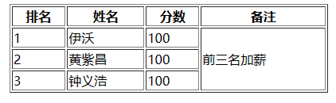
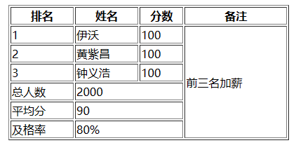
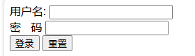
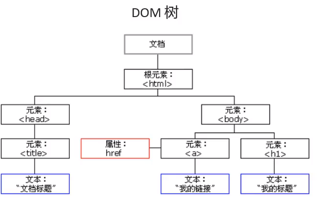
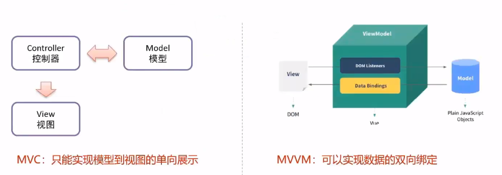
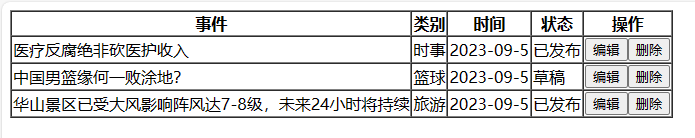
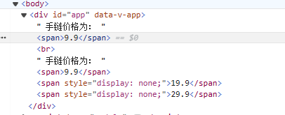
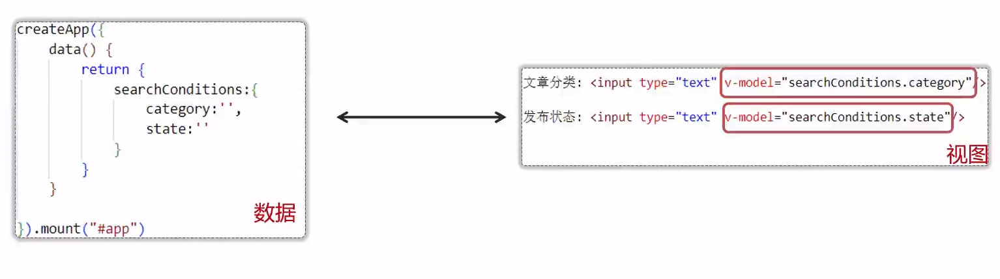

# JavaWeb

## 一、HTML

### 1.1 HTML入门

- HTML：HyperText Markup Language的缩写

- 超文本的含义：本身是文本，但是呈现出来的最终效果超越了文本

- 标记语言：区别于Java等编程语言，由一系列的标签组成

  - 双标签

    ```html
    <p>HTML is a very popular fore-end technology</p>
    ```

  - 单标签

    ```html
    <input type="text" name="username" />
    ```

  - 属性

    ```html
    <a href="http://www.xxx.com">show detail</a>
    ```

### 1.2 HTML基础结构

```html
<!DOCTYPE html>
<html lang="en">
<head>
    <meta charset="UTF-8">
    <meta name="viewport" content="width=device-width, initial-scale=1.0">
    <title>Document</title>
</head>
<body>
    
</body>
</html>
```

- 文档声明：用来告诉浏览器当前HTML文档的基本信息，其中最重要的就是当前HTML文档遵循的语法标准。如HTML5的文档类型声明为`<!DOCTYPE html>`；
- 根标签：所有其他的标签都必须放到`<html>`标签里面
- 头部元素：定义文档头部，其他头部元素都放在head标签里。头部元素包括title标签、script标签、style标签、link标签、meta标签等；
- 主体元素：body标签定义网页的主体内容，在浏览器窗口内显示的内容都定义到body标签内；

### 1.3 HTML的语法规则

- 跟标签有且只能有一个；
- 无论是双标签还是单标签都需要正确关闭；
- 标签可以嵌套但不能交叉嵌套；
- 注释语法为`<!-- -->`，注意不能嵌套；
- 属性必须有值，值必须加引号，H5中属性名和值相同时可以省略属性值；

- HTML中不严格区分字符串使用单双引号；
- HTML标签不严格区分大小写，但是不能大小写混用；
- HTML中不允许自定义标签名，强行自定义则无效。

### 1.4 HTML常见标签

#### 1.4.1 标题标签

```html
<body>
    <h1>一级标题</h1>
    <h2>二级标题</h2>
    <h3>三级标题</h3>
    <h4>四级标题</h4>
    <h5>五级标题</h5>
    <h6>六级标题</h6>
</body>
```

#### 1.4.2 段落标签

```html
<p></p>
```

#### 1.4.3 列表标签

- 有序列表：分条列项展示数据的标签，其每一项前面的符号带有顺序特征

  ```html
  <ol>
      <li>JAVA</li>
      <li>前端</li>
      <li>大数据</li>
  </ol>
  ```

- 无序列表：粉条列项展示数据的标签，其每一项前面的符号不带有顺序特征

  ```html
  <ul>
      <li>JAVA</li>
      <li>Python</li>
      <li>C++</li>
  </ul>
  ```

#### 1.4.4 超链接标签

- 点击后带有链接跳转的标签，也叫作a标签
  - href属性：定义链接
    - 可以使用绝对路径，也可以使用相对路径
    - 也可以定义完整的URL
  - target属性：定义打开方式
    - `_blank`：新窗口打开
    - `_self`：当前窗口打开

```html
<a href="/day01-htm1/01html的基本结构.html" target="_self">绝对路径本地资源连接</a> 
<a href="http://www.atguigu.com” target="_blank“>外部资源链接</a> <br>
<a href="http://www.atguigu.com” target="_blank“>外部资源链接</a> <br>
```

#### 1.4.5 多媒体标签

- **图片标签**：``

  - src：定义图片的连接
  - title：定义鼠标悬停时显示的文字
  - alt：定义图片加载失败时的提示文字

  ```html
  
  ```

#### 1.4.6 表格标签（重点）

- table标签：代表表格
- thead标签：代表表头，可以省略不写
- tbody标签：代表表体，可以省略不写
- tfoot标签：代表表尾，可以省略不写
- tr标签：代表一行
- td标签：代表行内的一格
- th标签：自带加粗和居中效果的td

```html
<table border="1px" style="width: 400px; margin: 0px auto;">
    <tr>
        <th>排名</th>
        <th>姓名</th>
        <th>分数</th>
    </tr>
    <tr>
        <td>1</td>
        <td>伊沃</td>
        <th>100</th>
    </tr>
    <tr>
        <td>2</td>
        <td>黄紫昌</td>
        <th>100</th>
    </tr>
    <tr>
        <td>3</td>
        <td>钟义浩</td>
        <th>100</th>
    </tr>
</table>
```

效果图：


- 通过td的rowspan属性实现上下的跨行

  ```html
  <table border="1px" style="width: 400px; margin: 0px auto;">
      <tr>
          <th>排名</th>
          <th>姓名</th>
          <th>分数</th>
          <th>备注</th>
      </tr>
      <tr>
          <td>1</td>
          <td>伊沃</td>
          <td>100</td>
          <td rowspan="3">前三名加薪</td>
      </tr>
      <tr>
          <td>2</td>
          <td>黄紫昌</td>
          <td>100</td>
      </tr>
      <tr>
          <td>3</td>
          <td>钟义浩</td>
          <td>100</td>
      </tr>
  </table>
  ```

  

- 通过td的colspan属性实现单元格的左右跨列

  ```html
  <table border="1px" style="width: 400px; margin: 0px auto;">
      <tr>
          <th>排名</th>
          <th>姓名</th>
          <th>分数</th>
          <th>备注</th>
      </tr>
      <tr>
          <td>1</td>
          <td>伊沃</td>
          <td>100</td>
          <td rowspan="6">前三名加薪</td>
      </tr>
      <tr>
          <td>2</td>
          <td>黄紫昌</td>
          <td>100</td>
      </tr>
      <tr>
          <td>3</td>
          <td>钟义浩</td>
          <td>100</td>
      </tr>
      <tr>
          <td>总人数</td>
          <td colspan="2">2000</td>
      </tr>
      <tr>
          <td>平均分</td>
          <td colspan="2">90</td>
      </tr>
      <tr>
          <td>及格率</td>
          <td colspan="2">80%</td>
      </tr>
  </table>
  ```

  

#### 1.4.7 表单标签（重点）

- 表单标签：可以让用户在界面上输入各种信息并提交的一种标签，是向服务器发送数据的主要方式之一
- form标签
  - action：定义信息提交的服务器地址
  - method：定义信息的提交方式
    - get方式：数据会缀到url后，以?作为参数开始的标识，多个参数用&隔开；
    - post方式：数据会通过请求体发送，不会再缀到url后
- input标签：定义表单项
  - type：定义表单项类型
    - text：文本框
    - password：密码框
    - submit：提交按钮
    - reset：重置按钮
    - radio：单选框
      - 多个单选框使用相同的name属性值，才会有互斥的效果
    - checkbox：复选框，多个选项选多个
  - name：定义提交的参数名，提交表单时作为key
  - value：提交表单时作为value

```html
<form action="http://www.atuguigu.com" method="get">
    用户名: <input type="text" name="username" /><br>
    密&nbsp;&nbsp;&nbsp;码 <input type="password" name="password" /><br>
    <input type="submit" value="登录" />
    <input type="reset" value="重置" />
</form>
```

效果：



- GET方式：
  - 参数会以键值对的形式放在url后提交 `url?key=value&key=value&key=value`
  - 数据直接暴露再地址栏上，相对不安全
  - 地址栏长度有限制，所以提交的数据量不大
  - 地址栏上，只能是字符，不能提交文件
  - 相比于POST效率高一些
- POST方式
  - 参数默认不放到url后
  - 数据不会直接暴露在地址栏上，相对安全
  - 数据是单独打包通过请求体发送，提交的数据量比较大
  - 请求体中，可以是字符，可以是字节数据，可以提交文件
  - 相比于GET效率略低一些

#### 1.4.8 布局相关标签

- div标签：俗称块，主要用于划分页面结构，做页面布局
- span标签：俗称层，主要用于划分元素范围，配合CSS做页面元素样式的修饰

## 二、CSS

### 2.1 CSS引入方式

## 三、JavaScript

### 3.1 JavaScript引入方式

#### 3.1.1 内部脚本：将JS代码定义在HTML页面中

在HTML中，JavaScript代码必须位于`<script>`与`</script>`标签之间

```html
<script>
    alert("hello JS~");
</script>
```

**注意**

- 在HTML文档中可以在任意地方，防止任意数量的`<script>`；
- 一般把脚本置于`<body>`元素的底部，可改善显示速度，因为脚本执行会拖慢显示

#### 3.1.2 外部脚本：将JS代码定义在外部JS文件中，然后引入到HTML页面中

- 外部文件：demo.js

  ```javascript
  alert("Hello JS~");
  ```

- 引入外部.js文件

  ```html
  <script src="./demo.js"></script>
  ```

**注意**

- 外部脚本不能包含`<script>`标签；
- `<script>`标签不能自闭合；

### 3.2 JavaScript基础语法

#### 3.2.1 书写语法

- 区分大小写
- 分号可有可无
- 单行注释、多行注释与Java相同
- 大括号标识代码块

#### 3.2.2 输出语句

```javascript
window.alert("hello JS~"); //弹出警告框
document.write("hello JS~"); //写入HTML
console.log("hello JS~");//写入控制台
```

#### 3.2.3 变量

- 使用var关键字声明变量

- JavaScript是一门弱类型语言，变量**可以存放不同类型的值**

  ```javascript
  var test = 20;
  test = "Ivo10";
  ```

- ECMAScript新增了`let`关键字来定义变量。它的用法类似于`var`，但是所声明的变量，只在let关键字**所在的代码块内有效，且不允许重复声明；**

- ECMAScript新增了`const`关键字，用来声明一个只读的常量。一旦声明，常量的值就不能改变；

  ```javascript
  const PI = 3.14;
  PI = 1; //error
  ```

#### 3.2.4 数据类型

5种原始类型

- number：数字（整数、小数、NaN）
- string：字符、字符串，单双引号皆可
- boolean：布尔
- null：对象为空
- undefined：当声明的变量没有初始化时，该变量的默认值是undefined

使用typeof运算符可以获取数据类型

```javascript
alert(typeof age);
```

#### 3.2.5 运算符

`==`和`===`

- `==`：判断类型是否一样，如果不一样，先**进行类型转换**，再判断其值；
- `===`：判断类型是否一样，如果不一样直接返回`false`，一样则比较其值；

类型转换

- 其他类型转为number

  - string：按照字符串的字面值，转为数字；如果字面值不是数字，则转为NaN；使用`parseInt()`方法进行转换

    ```javascript
    var str = "20";
    alert(parseInt(str) + 1); //21
    ```

  - boolean：true转为1，false转为0

- 其他类型转为boolean

  - number：0和NaN转为false，其他的数字转为true
  - string：空字符串转为false，其他的字符串转为true
  - null：转为false
  - undefined：转为false

#### 3.2.6 流程控制语句

略

### 3.3 JavaScript对象

#### 3.3.1 Array对象

- 定义

  ```javascript
  var arr = new Array(1, 2, 3);
  var arr = [1, 2, 3];
  ```

- 访问

  ```javascript
  arr[0] = 1;
  ```

- 注意：JS数组类似于Java集合，长度、类型均可变；

  ```javascript
  var arr = [1, 2, 3];
  arr[10] = 10;
  arr[6] = "hello";
  ```

- length属性：代表数组中元素的个数

  ```javascript
  var arr = [1, 2, 3];
  for (let i = 0; i < arr.length; i++) {
      alert(arr[i]);
  }
  ```

- `push()`添加元素，`splice()`删除元素

#### 3.3.2 String对象

- 定义

  ```javascript
  var str = new String("hello");
  var str = "hello";
  var str = 'hello';
  ```

- 属性：

  - `length`：字符串长度

- 方法：

  - `charAt()`：返回指定位置的字符
  - `indexOf()`：检索字符串

#### 3.3.3 自定义对象

- 格式

  ```javascript
  var person = {
      name: "zhangsan",
      age: 23,
      eat: function () {
          alert("干饭");
      }
  }
  ```

### 3.4 BOM

- Browser Object Model：浏览器对象模型
- JavaScript将浏览器的各个组成部分封装成对象

#### Window

- **浏览器窗口对象**

- 获取：直接使用window，其中`window.`可以省略

  ```javascript
  window.aerlt("abc");
  ```

- 宠用方法

  | 方法名                         | 作用                                                         |
  | ------------------------------ | ------------------------------------------------------------ |
  | `alert()`                      | 显示带有一段消息和一个确认按钮的警告框                       |
  | `confirm()`                    | 显示带有一段消息以及确认按钮和取消按钮的对话框，有返回值表示点击了确认（true）还是取消（false） |
  | `setTimeout(function, 毫秒值)` | 在指定的毫秒数后调用函数或计算表达式                         |
  | `setInterval()`                | 按照指定的**周期**（单位：毫秒）来调用函数或计算表达式       |

  ```javascript
  var flag = confirm("确认删除？");
  if (flag) {
      alert("已删除");
  } else {
      alert("没删除");
  }
  ```

  ```javascript
  setTimeout(function() {
      alert("hehe")
  }, 3000);
  ```

  ```javascript
  setInterval(function() {
      alert("hehe")
  }, 3000);
  ```

#### History

- 历史记录
- 获取：使用window.history获取，其中`window.`可以省略
- 方法：
  - `back()`：加载history列表中的前一个URL
  - `forward()`：加载history列表中的后一个URL

#### Location

- 地址栏对象

- 获取：使用window.location获取，其中`window.`可以省略

- 属性：

  - `href`：设置或返回完整的URL

  ```javascript
  //3s后跳转到百度
  setTimeout(() => {
      location.href = "http://www.baidu.com"
  }, 3000);
  ```

### 3.5 DOM

#### 3.5.1 概述

- Document Object Model，文档对象模型

- W3C DOM标准被分为3个不同的部分

  - 核心DOM：针对任何结构化文档的标准模型
    - Document：整个文档对象
    - Element：元素对象
    - Attribute：属性对象
    - Text：文本对象
    - Comment：注释对象
  - XML DOM
  - HTML DOM：针对HTML文档的标准模型
    - Image：``
    - Button：`<input type='button'>`

  

- JavaScript通过DOM，就能够对HTML进行操作了

  - 改变HTML元素的内容
  - 改变HTML元素的样式
  - 对HTML DOM事件作出反应
  - 添加和删除HTML元素

#### 3.5.2 获取Element对象

- Element：元素对象

  - `getElementById`：根据id获取
  - `getElementsByTagName`：根据标签名获取
  - `getElementsByName`：根据name属性获取
  - `getElementsByClassName`：根据class属性获取

  ```javascript
  var img = document.getElementById("light");
  alert(img);
  
  var divs = document.getElementsByTagName("div");
  alert(divs.length);
  for (let i = 0; i < divs.length; i++) {
      alert(divs[i]);
  }
  
  var hobbies = document.getElementsByName("hobby");
  for (let i = 0; i < hobbies.length; i++) {
      alert(hobbies[i]);
  }
  
  var clss = document.getElementsByClassName("cls");
  for (let i = 0; i < clss.length; i++) {
      alert(clss[i]);
  }
  ```

#### 3.5.3 常见HTML Element对象的使用

查阅文档

### 3.6 事件监听

- 事件绑定的两种方式

  - 通过DOM元素属性绑定

    ```html
    <body>
        <input type="button" id="btn">
        <script>
            document.getElementById("btn").onclick = function() {
                alert("我尼玛，点我干啥");
            }
        </script>
    </body>
    ```

  - 通过HTML标签中的事件属性进行绑定

    ```html
    <body>
        <input type="button" onclick="on()">
        <script>
            function on() {
                alert("我尼玛，点我干啥");
            }
        </script>
    </body>
    ```

### 3.7 JavaScript导入导出

- JS提供的导入导出机制，可以实现按需导入

  `showMessage.js`

  ```javascript
  export function simpleMessage(msg) {
      console.log(msg);
  }
  
  export function complexMessage(msg) {
      console.log(new Date() + ": " + msg);
  }
  ```

  `message.html`

  ```html
  <body>
      <div id="app">
          <button id="btn">点我展示信息</button>
      </div>
  
      <script type="module">
          import { complexMessage } from './showMessage.js';
          document.getElementById("btn").onclick = function() {
              complexMessage('我尼玛点我干啥');
          }
      </script>
  </body>
  ```

- 导入和导出时，可以使用`as`重命名

  ```javascript
  function simpleMessage(msg) {
      console.log(msg);
  }
  
  function complexMessage(msg) {
      console.log(new Date() + ": " + msg);
  }
  
  // 批量导出
  export {complexMessage as cm, simpleMessage}
  ```

- 默认导出

  ```javascript
  function simpleMessage(msg) {
      console.log(msg);
  }
  
  function complexMessage(msg) {
      console.log(new Date() + ": " + msg);
  }
  
  // 默认
  export default {simpleMessage, complexMessage}
  ```

  ```html
  <body>
      <div id="app">
          <button id="btn">点我展示信息</button>
      </div>
      <script type="module">
          // messageMethods表示所有被导入的方法
          import messageMethods from './showMessage.js';
          document.getElementById("btn").onclick = function() {
              messageMethods.complexMessage('我尼玛点我干啥');
          }
      </script>
  </body>
  ```

## 四、Vue3

### 4.1 概述

- Vue是一套**构建用户界面**的**渐进式**的前端框架，免除原生JavaScript中的DOM操作，简化书写；
- 基于MVVM（Model-View-ViewModel）思想，实现数据的双向绑定，将编程的关注点放在数据上



### 4.2 vue指令

#### 4.2.1 v-for指令

- 作用：基于数据循环，多次渲染整个元素

- 语法：`v-for = "(item, index) in items"`

  - 参数说明
    - items为遍历的数组
    - item为遍历出来的元素
    - index为索引/下标，从0开始；可以省略，省略index语法为：`v-for = "item in items"`

- 案例：

  ```html
  <!DOCTYPE html>
  <html lang="en">
  
  <head>
      <meta charset="UTF-8">
      <meta name="viewport" content="width=device-width, initial-scale=1.0">
      <title>Document</title>
  </head>
  
  <body>
      <div id="app">
          <table border="1 solid" colspa="0" cellspacing="0">
              <tr>
                  <th>事件</th>
                  <th>类别</th>
                  <th>时间</th>
                  <th>状态</th>
                  <th>操作</th>
              </tr>
              <tr v-for="(article,index) in articleList">
                  <td>{{article.title}}</td>
                  <td>{{article.category}}</td>
                  <td>{{article.time}}</td>
                  <td>{{article.state}}</td>
                  <td>
                      <button>编辑</button>
                      <button>删除</button>
                  </td>
              </tr>
          </table>
      </div>
      <script type="module">
          import { createApp } from 'https://unpkg.com/vue@3/dist/vue.esm-browser.js';
  
          createApp({
              data() {
                  return {
                      articleList: [
                          {
                              title: "医疗反腐绝非砍医护收入",
                              category: "时事",
                              time: "2023-09-5",
                              state: "已发布"
                          },
                          {
                              title: "中国男篮缘何一败涂地？",
                              category: "篮球",
                              time: "2023-09-5",
                              state: "草稿"
                          },
                          {
                              title: "华山景区已受大风影响阵风达7-8级，未来24小时将持续",
                              category: "旅游",
                              time: "2023-09-5",
                              state: "已发布"
                          }
                      ]
                  }
              }
          }).mount("#app");
      </script>
  </body>
  
  </html>
  ```

  

#### 4.2.2 v-bind

- 作用：动态为HTML标签**绑定属性值**，如设置href、src、style样式等
- 语法：`v-bind:属性名="属性值"`，简化：`:属性名=“属性值”`

- 案例：

  ```html
  <!DOCTYPE html>
  <html lang="en">
  
  <head>
      <meta charset="UTF-8">
      <meta name="viewport" content="width=device-width, initial-scale=1.0">
      <title>Document</title>
  </head>
  
  <body>
      <div id="app">
          <a v-bind:href="url">百度官网</a>
          <a :href="url">百度官网</a>
      </div>
  
      <script type="module">
          import { createApp } from 'https://unpkg.com/vue@3/dist/vue.esm-browser.js';
  
          createApp({
              data() {
                  return {
                      url: 'https://www.baidu.com'
                  }
              }
          }).mount("#app");
      </script>
  </body>
  
  </html>
  ```

#### 4.2.3 v-if & v-show

- 作用：用来控制元素的显示与隐藏

- `v-if`

  - 语法`v-if="表达式"`，表达式为true，显示；false，隐藏；
  - 可以配合v-else-if/v-else进行链式调用条件判断
  - **原理：基于条件判断，来控制创建或移除元素节点（条件渲染）**
  - 场景：要么显示，要么不显示，**不频繁切换的场景**

- v-show

  - 语法v-show=“表达式”，表达式为true，显示；false，隐藏；
  - **原理：基于CSS样式display来控制显示与隐藏**
  - 场景：**频繁切换显示隐藏的场景**

  ```html
  <!DOCTYPE html>
  <html lang="en">
  
  <head>
      <meta charset="UTF-8">
      <meta name="viewport" content="width=device-width, initial-scale=1.0">
      <title>Document</title>
  </head>
  
  <body>
      <div id="app">
          手链价格为：
          <span v-if="customer.level>=0 && customer.level<=1">9.9</span> 
          <span v-else-if="customer.level>=2 && customer.level<=4">19.9</span> 
          <span v-else>29.9</span>
  
          <br>
  
          手链价格为：
          <span v-show="customer.level>=0 && customer.level<=1">9.9</span> 
          <span v-show="customer.level>=2 && customer.level<=4">19.9</span> 
          <span v-show="customer.level>=4">29.9</span>
      </div>
  
      <script type="module">
          import { createApp } from 'https://unpkg.com/vue@3/dist/vue.esm-browser.js';
  
          createApp({
              data() {
                  return {
                      customer: {
                          name: '张三',
                          level: 1
                      }
                  }
              }
          }).mount("#app");
      </script>
  </body>
  
  </html>
  ```

  原理不同

  

#### 4.2.4 v-on

- 作用：为html标签绑定事件

- 语法

  - `v-on:事件名=“函数名”`

  - `@事件名=“函数名”`

  - **函数需要定义在methods选项内部**

    ```javascript
    createApp({
    	data() {
    		//需要用到的数据
    	},
    	methods:{
    		//需要用到的方法
    	}
    })
    ```

- 示例：

  ```html
  <!DOCTYPE html>
  <html lang="en">
  
  <head>
      <meta charset="UTF-8">
      <meta name="viewport" content="width=device-width, initial-scale=1.0">
      <title>Document</title>
  </head>
  
  <body>
      <div id="app">
          <button v-on:click="money">点我有惊喜</button> &nbsp;
          <button @click="love">再点更惊喜</button>
      </div>
  
      <script type="module">
          import { createApp } from 'https://unpkg.com/vue@3/dist/vue.esm-browser.js';
  
          createApp({
              data() {
                  return {
                      //定义数据
                  }
              },
              methods: {
                  money: function() {
                      alert("送你钱100");
                  },
                  love: function() {
                      alert("爱你一万年");
                  }
              }
          }).mount("#app");
      </script>
  </body>
  
  </html>
  ```

#### 4.2.5 v-model

- 作用：在表单元素上使用，双向数据绑定。可以方便地获取或设置表单项数据

- 语法：v-model="变量名"

- **v-model中绑定的变量，必须在data中定义**

  

- 示例：

  ```html
  <!DOCTYPE html>
  <html lang="en">
  
  <head>
      <meta charset="UTF-8">
      <meta name="viewport" content="width=device-width, initial-scale=1.0">
      <title>Document</title>
  </head>
  
  <body>
      <div id="app">
  
          文章分类: <input type="text" v-model="searchConditions.category">
          <span>{{searchConditions.category}}</span>
  
          发布状态: <input type="text" v-model="searchConditions.state">
          <span>{{searchConditions.state}}</span>
  
          <button>搜索</button>
          <button v-on:click="clear">重置</button>
  
          <br>
          <br>
          <table border="1 solid" colspa="0" cellspacing="0">
              <tr>
                  <th>文章标题</th>
                  <th>分类</th>
                  <th>发表时间</th>
                  <th>状态</th>
                  <th>操作</th>
              </tr>
              <tr v-for="(article,index) in articleList">
                  <td>{{article.title}}</td>
                  <td>{{article.category}}</td>
                  <td>{{article.time}}</td>
                  <td>{{article.state}}</td>
                  <td>
                      <button>编辑</button>
                      <button>删除</button>
                  </td>
              </tr>
          </table>
      </div>
      <script type="module">
          //导入vue模块
          import { createApp } from 'https://unpkg.com/vue@3/dist/vue.esm-browser.js';
          //创建vue应用实例
          createApp({
              data() {
                  return {
                      //定义数据
                      searchConditions: {
                          category: '',
                          state: ''
                      },
                      articleList: [{
                          title: "医疗反腐绝非砍医护收入",
                          category: "时事",
                          time: "2023-09-5",
                          state: "已发布"
                      },
                      {
                          title: "中国男篮缘何一败涂地？",
                          category: "篮球",
                          time: "2023-09-5",
                          state: "草稿"
                      },
                      {
                          title: "华山景区已受大风影响阵风达7-8级，未来24小时将持续",
                          category: "旅游",
                          time: "2023-09-5",
                          state: "已发布"
                      }]
                  }
              },
              methods: {
                  // 清空category以及state的数据
                  clear: function () {
                      // 在methods对应的方法里面，使用this代表的是vue示例，可以使用this获取vue实例中准备的数据
                      this.searchConditions.category = '';
                      this.searchConditions.state = '';
                  }
              }
  
          }).mount("#app")//控制html元素
      </script>
  </body>
  
  </html>
  ```

  ### 4.3 vue生命周期

  - 生命周期：值一个对象从创建到销毁的整个过程

  - 生命周期的八个阶段：每个阶段会自动执行一个生命周期方法（钩子），让开发者有机会在特定的阶段执行自己的代码

    | 状态            | 阶段周期     |
    | --------------- | ------------ |
    | `beforeCreate`  | 创建前       |
    | `created`       | 创建后       |
    | `beforeMount`   | 载入前       |
    | **`mounted`**   | **挂载完成** |
    | `beforeUpdate`  | 数据更新前   |
    | `updated`       | 数据更新后   |
    | `beforeUnmount` | 组件销毁前   |
    | `unmounted`     | 组件销毁后   |

  - 典型应用场景

    - 在页面加载完毕时，发起异步请求，加载数据，渲染页面
