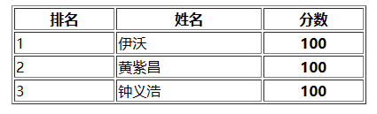

# JavaWeb

## 一、HTML

### 1.1 HTML入门

- HTML：HyperText Markup Language的缩写

- 超文本的含义：本身是文本，但是呈现出来的最终效果超越了文本

- 标记语言：区别于Java等编程语言，由一系列的标签组成

  - 双标签

    ```html
    <p>HTML is a very popular fore-end technology</p>
    ```

  - 单标签

    ```html
    <input type="text" name="username" />
    ```

  - 属性

    ```html
    <a href="http://www.xxx.com">show detail</a>
    ```

### 1.2 HTML基础结构

```html
<!DOCTYPE html>
<html lang="en">
<head>
    <meta charset="UTF-8">
    <meta name="viewport" content="width=device-width, initial-scale=1.0">
    <title>Document</title>
</head>
<body>
    
</body>
</html>
```

- 文档声明：用来告诉浏览器当前HTML文档的基本信息，其中最重要的就是当前HTML文档遵循的语法标准。如HTML5的文档类型声明为`<!DOCTYPE html>`；
- 根标签：所有其他的标签都必须放到`<html>`标签里面
- 头部元素：定义文档头部，其他头部元素都放在head标签里。头部元素包括title标签、script标签、style标签、link标签、meta标签等；
- 主体元素：body标签定义网页的主体内容，在浏览器窗口内显示的内容都定义到body标签内；

### 1.3 HTML的语法规则

- 跟标签有且只能有一个；
- 无论是双标签还是单标签都需要正确关闭；
- 标签可以嵌套但不能交叉嵌套；
- 注释语法为`<!-- -->`，注意不能嵌套；
- 属性必须有值，值必须加引号，H5中属性名和值相同时可以省略属性值；

- HTML中不严格区分字符串使用单双引号；
- HTML标签不严格区分大小写，但是不能大小写混用；
- HTML中不允许自定义标签名，强行自定义则无效。

### 1.4 HTML常见标签

#### 1.4.1 标题标签

```html
<body>
    <h1>一级标题</h1>
    <h2>二级标题</h2>
    <h3>三级标题</h3>
    <h4>四级标题</h4>
    <h5>五级标题</h5>
    <h6>六级标题</h6>
</body>
```

#### 1.4.2 段落标签

```html
<p></p>
```

#### 1.4.3 列表标签

- 有序列表：分条列项展示数据的标签，其每一项前面的符号带有顺序特征

  ```html
  <ol>
      <li>JAVA</li>
      <li>前端</li>
      <li>大数据</li>
  </ol>
  ```

- 无序列表：粉条列项展示数据的标签，其每一项前面的符号不带有顺序特征

  ```html
  <ul>
      <li>JAVA</li>
      <li>Python</li>
      <li>C++</li>
  </ul>
  ```

#### 1.4.4 超链接标签

- 点击后带有链接跳转的标签，也叫作a标签
  - href属性：定义链接
    - 可以使用绝对路径，也可以使用相对路径
    - 也可以定义完整的URL
  - target属性：定义打开方式
    - `_blank`：新窗口打开
    - `_self`：当前窗口打开

```html
<a href="/day01-htm1/01html的基本结构.html" target="_self">绝对路径本地资源连接</a> 
<a href="http://www.atguigu.com” target="_blank“>外部资源链接</a> <br>
<a href="http://www.atguigu.com” target="_blank“>外部资源链接</a> <br>
```

#### 1.4.5 多媒体标签

- **图片标签**：``

  - src：定义图片的连接
  - title：定义鼠标悬停时显示的文字
  - alt：定义图片加载失败时的提示文字

  ```html
  
  ```

#### 1.4.6 表格标签（重点）

- table标签：代表表格
- thead标签：代表表头，可以省略不写
- tbody标签：代表表体，可以省略不写
- tfoot标签：代表表尾，可以省略不写
- tr标签：代表一行
- td标签：代表行内的一格
- th标签：自带加粗和居中效果的td

```html
<table border="1px" style="width: 400px; margin: 0px auto;">
    <tr>
        <th>排名</th>
        <th>姓名</th>
        <th>分数</th>
    </tr>
    <tr>
        <td>1</td>
        <td>伊沃</td>
        <th>100</th>
    </tr>
    <tr>
        <td>2</td>
        <td>黄紫昌</td>
        <th>100</th>
    </tr>
    <tr>
        <td>3</td>
        <td>钟义浩</td>
        <th>100</th>
    </tr>
</table>
```

效果图：



- 通过td的rowspan属性实现上下的跨行

  ```html
  <table border="1px" style="width: 400px; margin: 0px auto;">
      <tr>
          <th>排名</th>
          <th>姓名</th>
          <th>分数</th>
          <th>备注</th>
      </tr>
      <tr>
          <td>1</td>
          <td>伊沃</td>
          <td>100</td>
          <td rowspan="3">前三名加薪</td>
      </tr>
      <tr>
          <td>2</td>
          <td>黄紫昌</td>
          <td>100</td>
      </tr>
      <tr>
          <td>3</td>
          <td>钟义浩</td>
          <td>100</td>
      </tr>
  </table>
  ```

  

- 通过td的colspan属性实现单元格的左右跨列

  ```html
  <table border="1px" style="width: 400px; margin: 0px auto;">
      <tr>
          <th>排名</th>
          <th>姓名</th>
          <th>分数</th>
          <th>备注</th>
      </tr>
      <tr>
          <td>1</td>
          <td>伊沃</td>
          <td>100</td>
          <td rowspan="6">前三名加薪</td>
      </tr>
      <tr>
          <td>2</td>
          <td>黄紫昌</td>
          <td>100</td>
      </tr>
      <tr>
          <td>3</td>
          <td>钟义浩</td>
          <td>100</td>
      </tr>
      <tr>
          <td>总人数</td>
          <td colspan="2">2000</td>
      </tr>
      <tr>
          <td>平均分</td>
          <td colspan="2">90</td>
      </tr>
      <tr>
          <td>及格率</td>
          <td colspan="2">80%</td>
      </tr>
  </table>
  ```

  

#### 1.4.7 表单标签（重点）

- 表单标签：可以让用户在界面上输入各种信息并提交的一种标签，是向服务器发送数据的主要方式之一
- form标签
  - action：定义信息提交的服务器地址
  - method：定义信息的提交方式
    - get方式：数据会缀到url后，以?作为参数开始的标识，多个参数用&隔开；
    - post方式：数据会通过请求体发送，不会再缀到url后
- input标签：定义表单项
  - type：定义表单项类型
    - text：文本框
    - password：密码框
    - submit：提交按钮
    - reset：重置按钮
    - radio：单选框
      - 多个单选框使用相同的name属性值，才会有互斥的效果
    - checkbox：复选框，多个选项选多个
  - name：定义提交的参数名，提交表单时作为key
  - value：提交表单时作为value

```html
<form action="http://www.atuguigu.com" method="get">
    用户名: <input type="text" name="username" /><br>
    密&nbsp;&nbsp;&nbsp;码 <input type="password" name="password" /><br>
    <input type="submit" value="登录" />
    <input type="reset" value="重置" />
</form>
```

效果：


- GET方式：
  - 参数会以键值对的形式放在url后提交 `url?key=value&key=value&key=value`
  - 数据直接暴露再地址栏上，相对不安全
  - 地址栏长度有限制，所以提交的数据量不大
  - 地址栏上，只能是字符，不能提交文件
  - 相比于POST效率高一些
- POST方式
  - 参数默认不放到url后
  - 数据不会直接暴露在地址栏上，相对安全
  - 数据是单独打包通过请求体发送，提交的数据量比较大
  - 请求体中，可以是字符，可以是字节数据，可以提交文件
  - 相比于GET效率略低一些

#### 1.4.8 布局相关标签

- div标签：俗称块，主要用于划分页面结构，做页面布局
- span标签：俗称层，主要用于划分元素范围，配合CSS做页面元素样式的修饰

## 二、CSS

### 2.1 CSS引入方式

## 三、JavaScript

### 3.1 JavaScript引入方式

#### 3.1.1 内部脚本：将JS代码定义在HTML页面中

在HTML中，JavaScript代码必须位于`<script>`与`</script>`标签之间

```html
<script>
    alert("hello JS~");
</script>
```

**注意**

- 在HTML文档中可以在任意地方，防止任意数量的`<script>`；
- 一般把脚本置于`<body>`元素的底部，可改善显示速度，因为脚本执行会拖慢显示

#### 3.1.2 外部脚本：将JS代码定义在外部JS文件中，然后引入到HTML页面中

- 外部文件：demo.js

  ```javascript
  alert("Hello JS~");
  ```

- 引入外部.js文件

  ```html
  <script src="./demo.js"></script>
  ```

**注意**

- 外部脚本不能包含`<script>`标签；
- `<script>`标签不能自闭合；

### 3.2 JavaScript基础语法

#### 3.2.1 书写语法

- 区分大小写
- 分号可有可无
- 单行注释、多行注释与Java相同
- 大括号标识代码块

#### 3.2.2 输出语句

```javascript
window.alert("hello JS~"); //弹出警告框
document.write("hello JS~"); //写入HTML
console.log("hello JS~");//写入控制台
```

#### 3.2.3 变量

- 使用var关键字声明变量

- JavaScript是一门弱类型语言，变量**可以存放不同类型的值**

  ```javascript
  var test = 20;
  test = "Ivo10";
  ```

- ECMAScript新增了let关键字来定义变量。它的用法类似于var，但是所声明的变量，只在let关键字**所在的代码块内有效，且不允许重复声明；**

- ECMAScript新增了const关键字，用来声明一个只读的常量。一旦声明，常量的值就不能改变；

  ```javascript
  const PI = 3.14;
  PI = 1; //error
  ```

#### 3.2.4 数据类型

5种原始类型

- number：数字（整数、小数、NaN）
- string：字符、字符串，单双引号皆可
- boolean：布尔
- null：对象为空
- undefined：当声明的变量没有初始化时，该变量的默认值是undefined

使用typeof运算符可以获取数据类型

```javascript
alert(typeof age);
```

#### 3.2.5 运算符

`==`和`===`

- `==`：判断类型是否一样，如果不一样，先**进行类型转换**，再判断其值；
- `===`：判断类型是否一样，如果不一样直接返回`false`，一样则比较其值；

类型转换

- 其他类型转为number

  - string：按照字符串的字面值，转为数字；如果字面值不是数字，则转为NaN；使用`parseInt()`方法进行转换

    ```javascript
    var str = "20";
    alert(parseInt(str) + 1); //21
    ```

  - boolean：true转为1，false转为0

- 其他类型转为boolean

  - number：0和NaN转为false，其他的数字转为true
  - string：空字符串转为false，其他的字符串转为true
  - null：转为false
  - undefined：转为false

#### 3.2.6 流程控制语句

略

### 3.3 JavaScript对象

#### 3.3.1 Array对象

- 定义

  ```javascript
  var arr = new Array(1, 2, 3);
  var arr = [1, 2, 3];
  ```

- 访问

  ```javascript
  arr[0] = 1;
  ```

- 注意：JS数组类似于Java集合，长度、类型均可变；

  ```javascript
  var arr = [1, 2, 3];
  arr[10] = 10;
  arr[6] = "hello";
  ```

- length属性：代表数组中元素的个数

  ```javascript
  var arr = [1, 2, 3];
  for (let i = 0; i < arr.length; i++) {
      alert(arr[i]);
  }
  ```

- `push()`添加元素，`splice()`删除元素

#### 3.3.2 String对象

- 定义

  ```javascript
  var str = new String("hello");
  var str = "hello";
  var str = 'hello';
  ```

- 属性：

  - length：字符串长度

- 方法：

  - `charAt()`：返回指定位置的字符
  - `indexOf()`：检索字符串

#### 3.3.3 自定义对象

- 格式

  ```javascript
  var person = {
      name: "zhangsan",
      age: 23,
      eat: function () {
          alert("干饭");
      }
  }
  ```

#### 3.3.4 BOM


## 五、Vue

### 5.1 概述

- Vue是一套前端框架，免除原生JavaScript中的DOM操作，简化书写；
- 基于MVVM（Model-View-ViewModel）思想，实现数据的双向绑定，将编程的关注点放在数据上


### 5.2 快速入门

1. 
