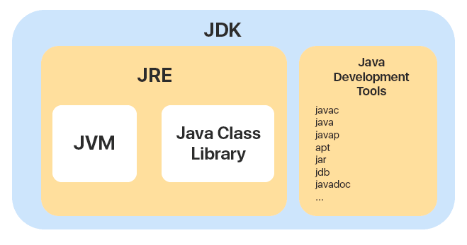
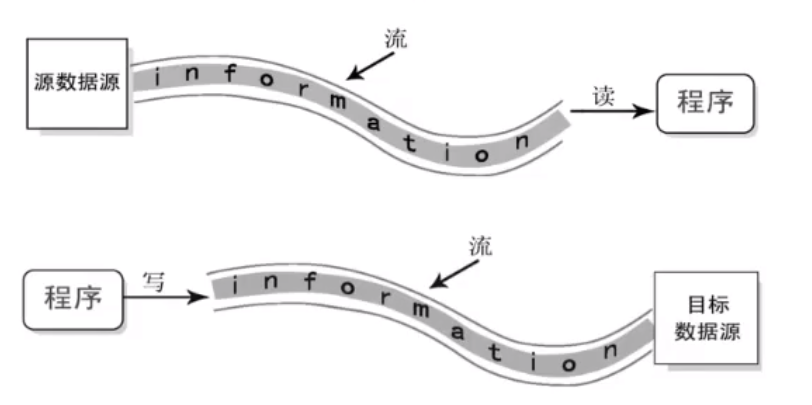
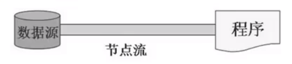
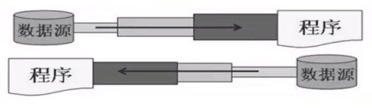
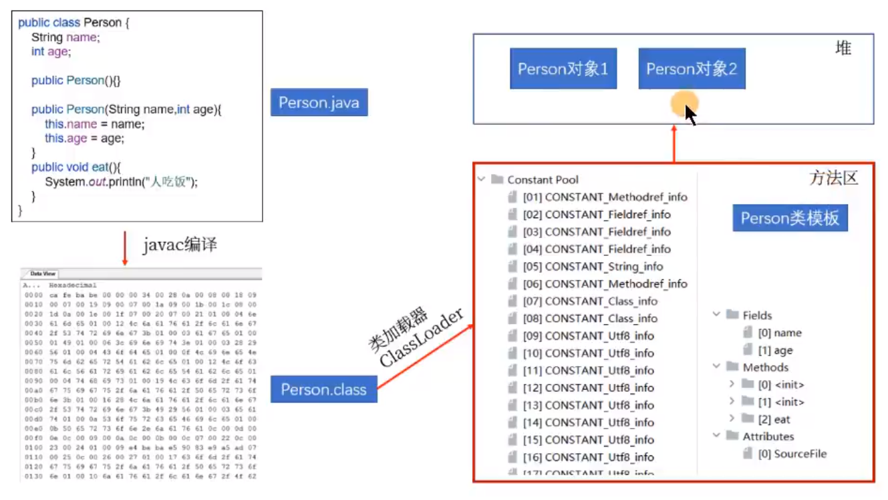
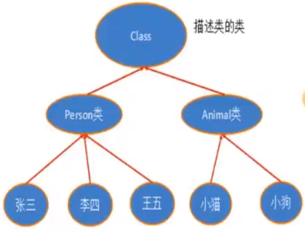

# Java基础

## 基础

### JDK VS JRE VS JVM

- **JDK（Java Development Kit）**
  - 提供给开发者使用的，能够创建和编译 Java 程序。**JDK是用于支持Java程序开发的最小环境；**
  - 包含了JRE，同时还包含了编译 java 源码的编译器 javac 以及一些其他工具，如 javadoc（文档注释工具）、jdb（调试器）、jconsole（基于 JMX 的可视化监控⼯具）、javap（反编译工具）等等；
- **JRE（Java Runtime Environment） **
  - **支持Java程序运行的标准环境**
  - 仅包含 Java 应用程序的运行时环境和必要的类库
- **JVM（Java Virtual Machine）**
  - Java虚拟机，用于运行Java程序（Java跨平台的工作原理，编译的Java程序可以运行在不同平台的JVM虚拟机中



### 整型数据类型

| 类型    | 存储需求 | 取值范围                                             |
| ------- | -------- | ---------------------------------------------------- |
| `byte`  | 1字节    | -128~127                                             |
| `short` | 2字节    | -32768~32767                                         |
| `int`   | 4字节    | -2 147 483 648~2 147 483 647（刚刚超过20亿）         |
| `long`  | 8字节    | -9 223 372 036 854 775 808~9 223 372 036 854 775 807 |

**注意**

- Java 的每种基本类型所占存储空间的大小不会像其他大多数语言那样随机器硬件架构的变化而变化。这种所占存储空间大小的不变性是 Java 程序比用其他大多数语言编写的程序更具可移植性的原因之一；
- Java**没有任何无符号（`unsigned`）形式**的byte、short、int、long

### 方法重载

1. **两同一不同**：同一个类、相同的方法，参数列表不同（参数个数不同、参数类型不同）

   **注意**：方法重载与参数的名、权限修饰符、返回类型都没有关系

2. **如何判断两个方法是相同的呢（编译器如何确定调用的某个具体的方法呢？）**

   先通过方法名确定了一波重载的方法，进而通过不同的形参列表，确定具体的某一个方法。

3. **方法重载——编译时多态**：在编译时确定调用的具体是哪个方法（`.class`字节码中就确定好调用哪个方法了）

### 可变个数形参（jdk5.0）

1. **使用场景**：在用方法时，出现方法形参的类型是确定的，但参数的个数不确定。此时就可以使用可变个数形参的方法。

2. **说明**：

   - 可变个数形参的方法与同一个类中，同名的多个方法之间可以构成重载，**优先匹配固定参数的方法**

     - 特例：

       ```java
       public void print(int...nums) {
           
       }
       
       // error:不构成重载
       public void print(int[] nums) {
           
       }
       ```

   - 可变个数的形参必须声明在形参列表的最后（Vararg parameter must be the last in the list）

   - 可变个数的形参在一个方法的形参列表中最多只有一个

   - **Java 的可变参数编译后实际会被转换成一个数组**

### 包装类

#### Integer的缓存机制

```java
Integer a = 100;
Integer b = 100;
System.out.println(a == b);  //true
System.out.println(a.equals(b)); //false
```

原因：Integer用到了享元模式的设计，它针对与**[-128, 127]**的数字做了缓存。使用`Integer a = 100`进行赋值操作时，它默认使用`valueOf`进行自动装箱，从而触发了缓存机制，使得`a`和`b`指向了相同的内存地址。


#### Integer和int的区别

1. 作为成员变量，Integer类型的初始值是null，int类型的初始值为0；
2. Integer存储在堆内存中，而int类型存储在栈空间；
3. Integer是对象类型，它封装了很多的方法和属性，我们在使用时候更加灵活。

## 面向对象

### final关键字的使用

1. **final修饰类**：表示此类不能被继承，如`String`、`StringBuffer`、`StringBuilder`；

2. **final修饰方法**：表示此方法不能被重写，如`Object`类中的`getClass()`；

3. **final修饰变量**：

   - **final修饰成员变量**：必须进行赋值（不会被默认初始化）
     - 显式赋值
     - 代码块中赋值
     - 构造器中赋值
   - **final修饰局部变量**：一旦赋值就不能修改
     - 方法内声明的局部变量，在调用局部变量时，一定需要赋值。而且一旦赋值，就不可更改；
     - 方法的形参，在调用此方法时，给形参进行赋值。而且一旦赋值，就不可更改；

4. **final和static搭配**：修饰成员变量时，此成员变量称为**全局常量**

   如`Math`中的`PI`

### 接口

1. 可以声明：

   - **属性**：必须使用`public static final`修饰（可以省略）
   - **方法**：
     - `jdk8`之前，声明抽象方法，修饰为`public abstract`（可以省略）
     - `jdk8`：声明**静态方法**、**默认方法**
     - `jdk9`：声明**私有方法**

   不可以声明：构造器、代码块等，**接口没有继承Object类**
   
2. **接口中声明静态方法**：接口中声明的静态方法只能被接口来调用，不能被其实现类进行调用

   ```java
   public interface CompareA {
       public static void method1() {
           System.out.println("CompareA...");
       }
   }
   
   class SubClass implements CompareA {
       public static void main(String[] args) {
           CompareA.method1();
           SubClass.method1(); //error
       }
   }
   ```

3. **默认方法**：接口中声明的默认方法可以被实现类继承。实现类在没有重写此方法的情况下，默认调用接口中声明的默认方法；重写了即调用自己重写的方法。

   ```java
   public interface CompareA {
       public default void method2() {
           System.out.println("CompareA::method2");
       }
   }
   
   class SubClass implements CompareA {
       public static void main(String[] args) {
           CompareA.method1();
           SubClass subClass = new SubClass();
           subClass.method2();
       }
   }
   ```

4. **接口冲突**：类实现了两个接口，而两个接口中定义了**同名同参数的默认方法**（不是默认方法就不会报错），如果实现类没有重写该默认方法则报错。要求**必须重写该默认方法**。****

   ```java
   public class Test implements A, B{ //error
   }
   
   interface A {
       public default void method1() {
   
       }
   }
   
   interface B {
       public default void method1() {
   
       }
   }
   ```

5. **类优先原则**：子类继承了父类并实现了接口，父类和接口中声明了同名同参数的方法（接口中是默认方法）。子类如果没有重写此方法，调用的是父类中的方法。

   ```java
   public class Test extends SuperClass implements A {
       public static void main(String[] args) {
           Test test = new Test();
           test.method1(); //SuperClass:method1
       }
   }
   
   interface A {
       public default void method1() {
           System.out.println("A:method1");
       }
   }
   
   class SuperClass {
       public void method1() {
           System.out.println("SuperClass:method1");
       }
   }
   ```

   补充：如果接口A中的method1方法不是默认方法，那么也不会报错。因为继承自SuperClass 的method1方法可以当作对接口A中抽象方法的重写。

6. **在实现类中调用接口中的默认方法**：

   ```java
   public class Test implements A, B {
       @Override
       public void method1() {
           System.out.println("A:method1");
       }
   
       public void method() {
           method1();
           A.super.method1();
           B.super.method1();
       }
   
       public static void main(String[] args) {
           Test test = new Test();
           test.method();
       }
   }
   
   interface A {
       default void method1() {
           System.out.println("A:method1");
       }
   }
   
   interface B {
       default void method1() {
           System.out.println("B:method1");
       }
   }
   ```

7. **私有方法**：private子类不可见

### static方法可以被继承吗

1. 在Java中，静态方法可以被继承，但不能被重写(override)。
   当子类继承父类时，会继承父类中的**所有静态方法和静态变量**。子类可以通过类名直接调用父类的静态方法，也可以通过子类名直接调用子类的静态方法。
2. 然而，静态方法不具有多态性，因此不能被子类重写(`override`)。在子类中声明一个与父类中静态方法名称、参数列表和返回类型相同的静态方法，不会覆盖父类的静态方法。在子类中可以重新实现同名的静态方法，但此时父类中的静态方法仍然可以通过父类名调用。
3. 总之，静态方法是属于类的，不是属于实例的，因此它们不需要通过实例化对象来调用，子类可以继承父类中的所有静态方法，但不能重写(override)它们。

### 对象的内存分析

分析以下代码的内存存放结构：

```java
public class TestChinese {
    public static void main(String[] args) {
        Chinese.country = "中国";
        
        Chinese c1 = new Chinese();
        c1.name = "谷哥";
        c1.age = 32;
        
        Chinese c2 = new Chinese();
        c2.name = "谷姐";
        c2.age = 32;
    }
}
```


### String类

#### 为什么JDK9要将String的底层实现由char[]改为byte[]?

- 节省内存空间：byte占一个字节，char占用两个字节；
- 如果一个字符串只包含英文字符或者ASCII字符，那么只用一个字节就可以表示所有字符；
- 将`char[]`改为`byte[] + encoding flag field`

### 枚举类

#### 1. 概述

- 枚举类型本质上也是一种类，只不过是**这个类的对象是有限的、固定的几个，不能让用户随意创建**

#### 2. 枚举类的定义

##### jdk5.0之前

- 私有化类的构造器
- 对象的实例变量在类中使用`private final`声明，并在构造器中初始化
- 类内部创建枚举类的示例，声明为`public static final`，对外暴露这些常量对象

```java
public class Season {
    private final String seasonName;
    private final String seasonDesc;

    private Season(String seasonName, String seasonDesc) {
        this.seasonName = seasonName;
        this.seasonDesc = seasonDesc;
    }

    public static final Season SPRING = new Season("春天", "春暖花开");
    public static final Season SUMMER = new Season("夏天", "夏日炎炎");
    public static final Season AUTUMN = new Season("秋天", "秋高气爽");
    public static final Season WINTER = new Season("冬天", "白雪皑皑");

    @Override
    public String toString() {
        return "Season{" +
                "seasonName='" + seasonName + '\'' +
                ", seasonDesc='" + seasonDesc + '\'' +
                '}';
    }
}
```

##### jdk5之后

- 列出的实例系统会自动添加`public static final`修饰；
- 枚举类默认继承的是`java.lang.Enum`类，因此不能再继承其他的类型。

```java
public enum Season {
    SPRING("春天", "春风又绿江南岸"),
    SUMMER("夏天", "映日荷花别样红"),
    AUTUMN("秋天", "秋水共长天一色"),
    WINTER("冬天", "窗含西岭千秋雪");
    private final String seasonName;
    private final String seasonDesc;

    private Season(String seasonName, String seasonDesc) {
        this.seasonName = seasonName;
        this.seasonDesc = seasonDesc;
    }

    public String getSeasonName() {
        return seasonName;
    }

    public String getSeasonDesc() {
        return seasonDesc;
    }
}
```

### 注解

#### 1. 自定义注解

以`@SuppressWarnings`为参照，进行定义即可，如

```java
public @interface MyAnnotation {
    String[] value() default "hello";
}
```

- 如果定义的注解含有抽象方法，那么使用时必须指定返回值，除非它有默认值。格式 是“方法名 = 返回值”，如果只有一个抽象方法需要赋值，且方法名为 value，可以省 略“value=”，所以如果注解只有一个抽象方法成员，建议使用方法名value。

  ```java
  public @interface Column {
      String columnName();
      String columnType();
  }
  ```

#### 2. 元注解

对现有的注解进行解释说明的注解

##### @Target

- 用于描述注解的适用范围
- 可以通过枚举类型ElementType的10个常量对象来指定
- TYPE、METHOD、CONSTRUCTOR、PACKAGE

##### @Retention

- 用于描述注解的生命周期
- 可以通过枚举类型RententionPolicy的三个常量对象来指定
- SOURCE、CLASS、RUNTIME
- 唯有RUNTIME阶段才能被反射读取到

##### @Documented

- 表示这个注解应该被javadoc工具记录

##### @Inherited

- 允许子类继承父类中的注解

## 异常体系

### 1. 异常的体系结构

- `java.lang.Throwable`：异常体系的根父类

  - `java.lang.Error`：**错误**，Java虚拟机无法解决的严重问题。如：JVM系统内部错误、资源耗尽等严重情况，一般不编写针对性的代码进行处理。如：**`StackOverflowError`**、**`OutofMemoryError`**
  - `java.lang.Exception`：**异常**，我们可以编写针对性的代码进行处理
    - 编译时异常（**受检异常**）：在执行`javac.exe`命令时，出现的异常（编译时异常并不代表所有在编译时出现的错误或异常，而是指在Java中**需要明确捕获或抛出的异常类型**）
    - 运行时异常（**非受检异常**）：在执行`java.exe`命令时，出现的异常（`RunTimeException`及其所有子类）
      - `ArrayIndexOutofBoundsException`、`NullPointerException`、`ClassCastException`、`NumberFormatException`、`InputMismatchException`、`ArithmeticException`

  

- **面试题：说一说开发中都遇到过哪些异常**

  **运行时异常**

  ```java
  String str = null;
  System.out.println(str.toString()); //java.lang.NullPointerException
  int[] arr = null;
  System.out.println(arr[0]); //java.lang.NullPointerException
  ```

  ```java
  String s = new String();
  Date date = (Date) s; //ClassCastException
  ```

  ```java
  String s = "123a";
  int i = Integer.parseInt(s);
  System.out.println(i); //java.lang.NumberFormatException
  ```

  ```JAVA
  Scanner scanner = new Scanner(System.in);
  int num = scanner.nextInt(); //输入abc: java.util.InputMismatchException
  ```

  ```java
  int num = 1 / 0; //java.lang.ArithmeticException: / by zero
  ```

  **编译时异常**

  ```java
  Class clz = Class.forName("java.lang.String"); //java.lang.ClassNotFoundException
  ```

  ```java
  File file = new File("hello.txt");
  FileInputStream fis = new FileInputStream(file); //java.io.FileNotFoundException
  
  int data = fis.read(); //java.io.IOException
  while (data != -1) {
      System.out.print((char) data);
      data = fis.read();
  }
  fis.close(); //java.io.IOException
  ```

### 2. 异常处理方式

#### 2.1 异常处理方式1：`try-catch-finally`

- 抛：程序在执行的过程当中，一旦出现异常，就会在出现异常的代码处，**生成对应异常类的对象，并将此对象抛出**。一旦抛出，此程序就不执行其后的代码了；
- 针对于“抓”中抛出的异常对象，进行捕获处理。此捕获处理过程，就成为抓。一旦将异常进行了处理，代码就可以继续执行。

```java
try {
    // 可能产生异常的代码
} catch(e1) {
    
} catch(e2) {
    
} finally {
    
}
```

**注意**：

- 如果声明了多个catch结构，且多个异常类型满足**子父类的关系**。则必须**将子类异常声明在父类结构的上面**，否则报错
- catch中的异常处理方式：
  - `printStackTrace()`：打印异常的详细信息
  - `getMessage()`：获取发生异常的原因
- try中声明的变量，出了try结构之后，就不可以进行调用了；

#### 2.2 finally的使用说明

- `finally`中声明**一定要被执行的代码**

- 即，**无论try-catch中是否存在仍未被处理的异常，以及return语句，finally中的语句一定会被执行**

- `finally`块里的语句在`try`或者`catch`里的任何`return`前执行。

- **面试题**

  ```java
  try {
      int i = Integer.parseInt("12a");
      System.out.println(i);
  } catch (NumberFormatException e) {
      e.printStackTrace();
      System.out.println(1 / 0);
  } finally {
      System.out.println("程序结束"); // catch块中又抛了一个异常，但finally中的“程序结束”依然会被打印
  }
  ```

  ```java
  public static int test(String str) {
      try {
          Integer.parseInt(str);
          return 1;
      } catch (NumberFormatException e) {
          return -1;
      } finally {
          System.out.println("test结束");
      }
  }
  
  public static void main(String[] args) {
      int result = test("12a"); //test结束    -1
      int result = test("12"); //test结束  1
      System.out.println(result);
  }
  ```

  ```java
  public static int test(int num) {
      try {
          return num;
      } catch (NumberFormatException e) {
          return num--;
      } finally {
          System.out.println("test结束");
          ++num;
      }
  }
  
  public static void main(String[] args) {
      int result = test(10);
      System.out.println(result); // 10
  }
  ```

  参考博客：[try-catch-finally的深入理解](https://blog.csdn.net/weixin_47382783/article/details/125241849)

#### 2.3 异常处理方式2：`throws`

- 从编译是否能通过讲，看成是给出了异常万一要是出现时候的解决方案。此方案就是继续向上抛出（`throws`）；

- 但是此`throws`的方式，仅仅是将可能出现的异常抛给了此方法的调用者，**调用者仍然需要考虑如何处理相关异常**。因此，throws方式不算是真正意义上处理了异常；

- **子类重写的方法**抛出的异常类型，可以和父类被重写的方法抛出的异常类型**相同**，或者是父类被重写方法抛出异常的**子类**（如果父类方法没有抛异常，子类方法只能`try-catch`了）

  ```java
  public static void main(String[] args) {
      Father father = new Son();
      try {
          father.method1();
      } catch (IOException e) {
          e.printStackTrace(); //无法捕获
      }
  }
  
  class Father {
      public void method1() throws IOException {
  
      }
  }
  
  class Son extends Father{
      @Override
      public void method1() throws Exception { // 报错！
  
      }
  }
  // 编译时father看成是Father的引用，但子类Son抛出的异常比父类还大，那就无法catch住了
  ```

- 开发中如何选择？
  - 程序中涉及到资源的调用（流、数据库连接、网络连接），使用`try-catch-finally`处理；
  - 父类没有`throws`异常，那么子类重写的方法如果出现异常，只能使用`try-catch-finally`处理；
  - 方法`a`依次调用了方法`b`、`c`、`d`，方法`b`、`c`、`d`之间是递进关系。如果方法`b`、`c`、`d`中有异常，通常选择使用`throws`，方法a中使用`try-catch-finally`。

### 3. 手动抛出异常对象：`throw`

- **手动抛**：程序在执行的过程当中，不满足指定条件的情况下，使用`throw + 异常类对象`方式抛出异常；
- `throw`后的代码不能被执行，编译不通过；
- `throw`出来的异常也有两种处理方式：`try-catch-finally`或`throws`
- **面试题**：`throws`和`throw`的区别

### 4. 自定义异常类

**如何自定义异常类？**

1. **继承于现有的异常体系**，通常继承于`RuntimeException` \ `Exception`；
2. 通常**提供几个重载的构造器；**
3. **提供一个全局常量**，声明为`static final long serialVersionUID`

**如何使用自定义异常类？**

- 具体代码中，满足指定的条件下，需要手动地使用`throw + 自定义异常类对象`的方式，将异常对象抛出；
- 如果自定义异常类是非运行时异常类，必须考虑如何处理此异常类的对象（`try-catch-finally`或`throws`）

**为什么要自定义异常类？**

- 我们更关心的是，通过异常的名称就能直接判断此异常出现的原因；
- 既然如此，我们就有必要再实际开发场景中，不满足我们指定的条件时，指明我们自己特有的异常类；
- 通过此异常类的名称，就能判断出具体出现的问题。

## Java比较器

### 1. 自然排序

**实现步骤**：

1. 具体的类A实现`Comparable`接口；
2. 重写`Comparable`接口中的`compareTo(Object obj)`方法，在此方法中指明比较类A的对象的大小的标准；
3. 创建类A的多个实例，进行大小的比较或排序。

**示例**：

```java
public class EmployeeSortTest {
    public static void main(String[] args) {
        Employee[] staff = new Employee[3];
        staff[0] = new Employee("Ivo10",2000);
        staff[1] = new Employee("Huang Zichang",1000);
        staff[2] = new Employee("Zhong Yihao",3000);

        Arrays.sort(staff);
        System.out.println(Arrays.toString(staff));
    }
}

class Employee implements Comparable<Employee>{
    private String name;
    private double salary;

    public Employee(String name, double salary) {
        this.name = name;
        this.salary = salary;
    }

    public String getName() {
        return name;
    }

    public void setName(String name) {
        this.name = name;
    }

    public double getSalary() {
        return salary;
    }

    public void setSalary(double salary) {
        this.salary = salary;
    }

    @Override
    public String toString() {
        return "Employee{" +
                "name='" + name + '\'' +
                ", salary=" + salary +
                '}';
    }


    @Override
    public int compareTo(Employee o) {
        return Double.compare(salary, o.salary);
    }
}
```

### 2. 定制排序

**实现步骤**

1. 创建一个实现了`Comparator`接口的实现类A；
2. 实现类A要求重写`Comparator`接口的抽象方法`compare(Object o1, Object o2)`，在此方法中指明要比较大小的对象的比较规则（如`String`类，`Product`类）；
3. 创建此实现类A的对象，并将此对象传入到相关方法的参数位置即可（如`Arrays.sort(..., 类A的实例)`）

**示例**

```java
public class LengthComparatorTest {
    public static void main(String[] args) {
        String[] players = new String[]{"HuangZichang", "Ivo", "Covic"};
        Arrays.sort(players, new LengthComparator());
        System.out.println(Arrays.toString(players));
    }
}

class LengthComparator implements Comparator<String> {

    @Override
    public int compare(String o1, String o2) {
        return o1.length() - o2.length();
    }
}
```

### 3. 二者对比

1. **角度一**
   - 自然排序：单一的，唯一的
   - 定制排序：灵活的，多样的
2. **角度二**
   - 自然排序：一劳永逸的
   - 定制排序：临时的
3. **细节**
   - 自然排序：对应的接口是`Comparable`，对应的抽象方法是`compareTo(Object obj)`
   - 定制排序：对应的接口是`Comparator`，对应的抽象方法是`compare(Object obj1, Object obj2)`

## 日期时间API

### 1. jdk8之前的API

#### 1.1 System类中的`currentTimeMillis()`

- 获取当前时间对应的毫秒数，long类型，时间戳（1970年1月1日0是0分0秒的毫秒数）
- 开发中常用来计算时间差（方法的执行时间）

#### 1.2 两个Date类：远古时代的API

##### 1.2.1 早期`java.util.Date`

两个构造器：

```java
Date date1 = new Date(); //创建一个基于当前系统时间的Date实例
```

```java
Date date2 = new Date(System.currentTimeMillis()); //创建一个基于指定时间戳的Date实例
```

两个方法：

```java
long milliTimes = date1.getTime(); //获取毫秒数
```

```java
System.out.println(date2.toString()); // 获取时间：Wed Oct 25 20:16:52 CST 2023
```

##### 1.2.2 `java.sql.Date`

- 继承于`java.util.Date`

- 构造器：

  ```java
  java.sql.Date date1 = new java.sql.Date(System.currentTimeMillis());
  System.out.println(date1); //2023-10-25
  ```

#### 1.3 `java.text.SimpleDateFormat`：日期时间的格式化和解析

- **用于日期时间的格式化和解析**

- 格式化：日期`Date`$\rightarrow$字符串，调用`format()`方法；

- 解析：字符串$\rightarrow$日期`Date`，调用`parse()`方法；

- 举例：

  ```java
  SimpleDateFormat sdf = new SimpleDateFormat("yyyy-MM-dd HH:mm:ss"); //构造器传入指定的格式
  String strDate = sdf.format(new Date()); //2023-10-25 20:36:30
  System.out.println(strDate);
  
  Date date2 = sdf.parse("2023-10-25 20:32:14");
  System.out.println(date2);
  
  Date date3 = sdf.parse("2021年5月20日 20:32:14");
  System.out.println(date3); //解析失败
  ```

#### 1.4 `java.util.Calendar`（日历类）：试图解决Date的问题

- **实例化**：由于`Calendar`是一个抽象类，所以需要创建其子类的实例。这里我们通过`Calendar`的静态方法`getInstance()`即可获取；

- **常用方法**：`get (int field)`、`set(int filed, xx)`、`add(int field, xx)` 、`getTime()`、`setTime(Date)`

  ```java
  Calendar calendar = Calendar.getInstance();
  System.out.println(calendar.getClass());
  
  System.out.println(calendar.get(Calendar.DAY_OF_MONTH));
  System.out.println(calendar.get(Calendar.DAY_OF_WEEK));
  System.out.println(calendar.get(Calendar.DAY_OF_MONTH));
  
  calendar.set(Calendar.DAY_OF_MONTH, 1);
  
  calendar.add(Calendar.DAY_OF_MONTH, 3);
  System.out.println(calendar.get(Calendar.DAY_OF_MONTH));
  ```

### 2. jdk8新增的API

jdk8之前日期时间API**存在的问题**

- **可变性**：像日期和时间这样的类应该是不可变的；
- **偏移性**：`Date`中的年龄是从1900开始的，而月份都是从0开始的；
- **格式化**：格式化（`SimpleDateFormat`）只对`Date`有用，而`Calendar`则不行；
- 此外，它们也不是线程安全的；不能处理闰秒等。

#### 2.1 本地日期时间：LocalDate、LocalTime、LocalDateTime

| 方法                                               | 描述                           |
| -------------------------------------------------- | ------------------------------ |
| `now()`                                            | 获取当前日期和时间的对象       |
| `of()`                                             | 获取指定的日期、时间对应的实例 |
| 其他（`getXXX`、`withXXX`、`plusXXX`、`minusXXX`） | 自己查                         |

#### 2.2 瞬时：Instant

#### 2.3 DateTimeFormatter：类似于SimpledateFormat

用于格式化和解析`LocalDate`、`LocalTime`、`LocalDateTime`

```java
DateTimeFormatter dtf = DateTimeFormatter.ofPattern("yyyy-MM-dd");
String strDate = dtf.format(LocalDate.now());
System.out.println(strDate);

TemporalAccessor temporalAccessor = dtf.parse(strDate);
LocalDate date = LocalDate.from(temporalAccessor);
System.out.println(date);
```

## File类与IO流

### 1. File类的理解

#### 1.1 File类的理解

- File类位于java.io包下，File类的一个对象，对应于操作系统下的一个文件或一个文件目录；

#### 1.2 绝对路径与相对路径

- 绝对路径：以Windows操作系统为例，包括盘符在内的文件或文件目录的完整路径；
- 相对路径：相对于某一个文件目录的相对位置
  - 在IDEA中，如果使用单元测试方法：相对于当前的module
  - 如果使用main()方法，相对于当前的project来讲；

#### 1.3 内部API使用

- **构造器**：

  ```java
  public File(String pathname);
  public File(String parent, String child); //parent一定是一个文件目录，child可以是文件也可以是文件目录。下面同理
  public File(File parent, String child);
  ```

- **常用方法**

  ```java
  public String getName(); //获取名称
  public String getPath(); //获取路径
  public String getAbsolutePath(); //获取绝对路径
  public File getAbsoluteFile(); //获取绝对路径表示的文件
  public String getParent(); //获取上层文件目录路径，若无（相对路径表示），返回null
  public long length(); //获取文件长度
  public long lastModified(); //获取最后一次修改时间
  
  public String[] list(); //该File目录中的所有子文件或目录名
  public File[] listFiles(); //显示的是绝对路径
  ```

### 2. IO流原理及流的分类

#### 2.1 Java IO原理



#### 2.2 流的分类

- 按数据的流向分：**输入流**、**输出流**

- 按操作数据单位的不同分：字节流和字符流

  - **字节流**（8bit）：以字节为单位读写数据，以InputStream、OutputStream结尾
  - **字符流**（16bit）：以字符为单位读写数据，以Reader、Writer结尾

- 按IO流的角色不同分：节点流和处理流

  - **节点流**：直接从数据源或目的地读写数据：

    

  - **处理流**：不直接连接到数据源或目的地，而是“连接”在已存在的流（节点流或处理流）之上：

    

#### 2.3 流的API

- 4个抽象基类（都是节点流）：

  |        | 输入流      | 输出流       |
  | ------ | ----------- | ------------ |
  | 字节流 | InputStream | OutputStream |
  | 字符流 | Reader      | Writer       |

- **常用的节点流**
  - 文件流：`FileInputStream`、`FileOutputStream`、`FileReader`、`FileWriter`
  - 

### 3. FileReader/FileWriter的使用

#### 3.1 执行步骤

1. 创建读取或写出的`File`类的对象；
2. 创建输入流或输出流
3. 具体的读入或写出的过程
   - 读入：`read(char[] cbuffer)`
   - 写出：`write(String str)` / `writer(char[] cbuffer, 0, len)`
4. 关闭流资源，避免内存泄漏

```java
// throws处理异常
@Test
public void test1() throws IOException {
    File file = new File("D:/hello.txt");
    FileReader fr = new FileReader(file);
    int data;
    while ((data = fr.read()) != -1) {
        System.out.print((char) data);
    }
    fr.close();
}

// try-catch-finally实现流的关闭
@Test
public void test2() {
    FileReader fr = null;
    try {
        File file = new File("D:/hello.txt");
        fr = new FileReader(file);
        int data;
        while ((data = fr.read()) != -1) { //而每次都要进行磁盘IO，浪费时间
            System.out.println((char) data);
        }
    } catch (IOException e) {
        throw new RuntimeException(e);
    } finally {
        try {
            if (fr != null) {
                fr.close();
            }
        } catch (IOException e) {
            e.printStackTrace();
        }

    }
}

// 对test2进行优化，每次读取多个字符存放到字符数组中，减少了与磁盘交互的次数，提升效率
@Test
public void test3() {
    FileReader fr = null;
    try {
        File file = new File("d:/hello.txt");
        fr = new FileReader(file);
        char[] cbuffer = new char[5];
        int len;
        while ((len = fr.read(cbuffer)) != -1) { //每次读取五个或少于五个字符到cbuffer中，减少IO
            for (int i = 0; i < len; i++) {
                System.out.print(cbuffer[i]);
            }
        }
    } catch (IOException e) {
        e.printStackTrace();
    } finally {
        try {
            fr.close();
        } catch (IOException e) {
            e.printStackTrace();
        }
    }
}

//使用字符流写入文件，使用FileWriter
@Test
public void test4() {
    FileWriter fw = null;
    try {
        File file = new File("info.txt");
        fw = new FileWriter(file, true);
        fw.write("I love you!\n");
    } catch (IOException e) {
        e.printStackTrace();
    } finally {
        try {
            fw.close();
        } catch (IOException e) {
            e.printStackTrace();
        }
    }
}
```

#### 3.2 注意点

- 因为涉及到流资源的关闭操作，所以出现异常的话，需要使用`try-catch-finally`的方式处理异常
- 对于输入流来讲，要求`File`类的对象对应的物理磁盘上的我呢见必须存在。否则会报`FileNotFoundException`
- 对于输出流来讲，`File`类的对象对应的物理磁盘上的文件可以不存在
  - 如果此文件不存在，则在输出过程中自动创建此文件，并将数据写入到此文件中；
  - 如果此文件存在，使用`FileWriter(File file)`或`FileWriter(File file, false)`输出数据过程中，会新建同名的文件对现有的文件进行覆盖。

### 4. FileInputStream \ FileOutputStream的使用

#### 4.1 执行步骤

与`FileWriter`、`FileReader`类似，但读入为`read(byte[] buffer)`，写出`write(byte[] buffer, 0, len)`，使用的为`byte[]`

#### 4.2 注意点

- 对于字符流，只能用来操作文本文件，不能用来操作非文本文件；
- 对于字节流，通常是用来处理非文本文件。但是，如果涉及到文本文件的复制操作，也可以使用字节流（如果涉及写入，就可能产生乱码了）；
- 文本文件：.txt、.c、.cpp、.py、.java等；
- 非文本文件：.doc、.xls、.jpg等；

### 5. 缓冲流的使用

#### 5.1 基础的IO流框架

| 抽象基类       | 4个节点流（也成为文件流） | 4个缓冲流（处理流的一种） |
| -------------- | ------------------------- | ------------------------- |
| `InputStream`  | `FileInputStream`         | `BufferedInputStream`     |
| `OutputStream` | `FileOuputStream`         | `BufferedOutputStream`    |
| `Reader`       | `FileReader`              | `BufferedReader`          |
| `Writer`       | `FileWrter`               | `BufferedWriter`          |

#### 5.2 缓冲流的作用

提升文件读写的效率

#### 5.3 实现步骤

1. 创建`File`的对象、流的对象（包括文件流、缓冲流）；
2. 使用缓冲流实现读取数据或写出数据的过程
   - 读取：`int read(char[] cbuf/byte[] buffer)`
   - 写出：
     - `void write(String str) `/ `write(char[] cbuf)`
     - `void write(byte[] buffer)`
3. 关闭资源

```java
// 使用BufferedInputStream、BufferedOuputStream复制一个图片
@Test
public void test1() throws IOException{ //此操作还是应该使用try-catch-finally处理
    File srcFile = new File("C:\\Users\\Xiong Wei\\Pictures\\Saved Pictures\\sun.jpg");
    File destFile = new File("sun.jpg");

    FileInputStream fis = new FileInputStream(srcFile);
    FileOutputStream fos  = new FileOutputStream(destFile);

    BufferedInputStream bis = new BufferedInputStream(fis);
    BufferedOutputStream bos = new BufferedOutputStream(fos);

    byte[] buffer = new byte[1024];
    int len;
    while ((len = bis.read(buffer))!=-1){
        bos.write(buffer,0,len);
    }
    System.out.println("copy success!");

    //外层流的关闭也会自动地对内层流进行关闭，
    bos.close();
    bis.close();
}
```

**验证缓冲流提升文件读写效率**

```java
@Test
public void testSpendTime() {
    long start = System.currentTimeMillis();

    String src = "C:\\Users\\Xiong Wei\\Videos\\7c11bad9f270e07209ae80ae1c83eeee.mp4";
    String dest = "pina.mp4";
    //        copyFileWithFileStream(src, dest); //2584
    copyFileWithBufferedStream(src, dest); //22

    long end = System.currentTimeMillis();
    System.out.println("花费的时间为" + (end - start));
}

//使用FileInputStream + FileOutputStream复制文件
public void copyFileWithFileStream(String src, String dest) {
    FileInputStream fis = null;
    FileOutputStream fos = null;
    try {
        File srcFile = new File(src);
        File destFile = new File(dest);
        fis = new FileInputStream(srcFile);
        fos = new FileOutputStream(destFile);
        int len;
        byte[] buffer = new byte[50];
        while ((len = fis.read(buffer)) != -1) {
            fos.write(buffer, 0, len);
        }
    } catch (IOException e) {
        e.printStackTrace();
    } finally {
        try {
            if (fis != null) {
                fis.close();
            }
            if (fos != null) {
                fos.close();
            }
        } catch (IOException e) {
            e.printStackTrace();
        }
    }
}

public void copyFileWithBufferedStream(String str, String dest) {
    BufferedInputStream bis = null;
    BufferedOutputStream bos = null;
    try {
        File srcFile = new File("C:\\Users\\Xiong Wei\\Pictures\\Saved Pictures\\sun.jpg");
        File destFile = new File("sun.jpg");

        FileInputStream fis = new FileInputStream(srcFile);
        FileOutputStream fos = new FileOutputStream(destFile);

        bis = new BufferedInputStream(fis);
        bos = new BufferedOutputStream(fos);

        byte[] buffer = new byte[50];
        int len;
        while ((len = bis.read(buffer)) != -1) {
            bos.write(buffer, 0, len);
        }
        System.out.println("copy success!");
    } catch (IOException e) {
        throw new RuntimeException(e);
    } finally {
        //外层流的关闭也会自动地对内层流进行关闭，
        try {
            if (bos != null) {
                bos.close();
            }
            if (bis != null) {
                bis.close();
            }
        } catch (IOException e) {
            e.printStackTrace();
        }
    }
}
```

### 6. 转换流

### 7. 对象流

#### 7.1 数据流及其作用（了解）

- `DataOutputstream`：可以将内存中基本数据类型、String型的变量写到具体的文件中；
- `DataInputstream`：将文件中保存的数据还原为内存中的基本数据类型、String型变量

#### 7.2 对象流及其作用

- 可以读取基本数据类型的变量、引用数据类型的变量
- `ObjectInputStream`、`ObjectOutputStream`

#### 7.3 对象的序列化机制（面试题）

- 对象序列化机制允许把内存中的Java对象转换成平台无关的二进制流，从而允许把这种二进制流持久地保存在磁盘上，或通过网络将沼泽中二进制流传输到另一个网络节点；
- 当其他程序获取了这种二进制流，就可以恢复成原来的Java对象；
- **序列化过程**：**将数据结构或对象转换成二进制字节流**，使用`ObjectOutputStream`流实现，将内存中的Java对象保存在文件中或通过网络传输出去；
- **反序列化过程**：**将在序列化过程中所生成的二进制字节流转换成数据结构或者对象**，使用`ObjectInputStream`流实现，将文件中或网络传输过来的数据还原为内存中的Java对象；

- **举例**：

  ```java
  //序列化过程
  @Test
  public void test1() throws IOException {
      File file = new File("object.txt");
      ObjectOutputStream objectOutputStream =
          new ObjectOutputStream(new FileOutputStream(file));
      objectOutputStream.writeUTF("北国风光，千里冰封，万里雪飘");
      objectOutputStream.flush();
      objectOutputStream.writeObject("世上无难事，只要肯登攀");
      objectOutputStream.close();
  }
  
  //反序列化过程
  @Test
  public void test2() throws IOException, ClassNotFoundException {
      File file = new File("object.txt");
      ObjectInputStream objectInputStream =
          new ObjectInputStream(new FileInputStream(file));
      String str1 = objectInputStream.readUTF();
      System.out.println(str1);
      String str2 = (String)objectInputStream.readObject();
      System.out.println(str2);
      objectInputStream.close();
  }
  //补充：上述例子中知道了写入文件的序列化对象的个数，如果不知道的话，可以利用捕获EOFException的方式，自动结束反序列化
  ```

#### 7.4 自定义类实现序列化

- 自定义类需要实现接口`Serializable`；

- 要求自定义类声明一个全局常量：`static final long serialVersionUID`，权限随意（起到版本控制的作用）；

- 要求自定义类的各个属性也必须是可序列化的：
  - 基本数据类型的属性：默认就是可序列化的；
  - 应用数据类型的属性：要求实现`Serializable`接口；
  
- **注意点**
  
  - 如果不声明全局常量`serialVersionUID`，系统会自动生成一个针对于当前类的`serialVersionUID`；如果修改此类，会导致`serialVersionUID`变化，进而导致反序列化时，会出现`java.io.InvalidClassException`
  - **类中的属性如果声明为`transient`或`static`，则不会实现序列化（该属性不会保存在文件中，反序列化的时候就读不到了）**
  
- 例子：

  ```java
  public class Student implements Serializable { //Serializable: 标识接口
      private final static long serialVersionUID = 4242424242L;
      private transient String name;
      private static int age;
      private int id;
  
      public int getId() {
          return id;
      }
  
      public void setId(int id) {
          this.id = id;
      }
  
      @Override
      public String toString() {
          return "Student{" +
                  "name='" + name + '\'' +
                  ", age=" + age +
                  ", id=" + id +
                  '}';
      }
  
      public Student(String name, int age, int id) {
          this.name = name;
          this.age = age;
          this.id = id;
      }
  
      public Student(String name, int age) {
          this.name = name;
          this.age = age;
      }
  
      public Student() {
      }
  
      public String getName() {
          return name;
      }
  
      public void setName(String name) {
          this.name = name;
      }
  
      public int getAge() {
          return age;
      }
  
      public void setAge(int age) {
          this.age = age;
      }
  }
  ```

### 8. 其他流的使用

#### 8.1 标准输入、输出流

- `System.in`：标准的输入流，默认从键盘输入

- `System.out`：标准的输出流，默认从显示器输出

- 通过调用如下的方法，修改输入流和输出流的位置：
  - `setIn(InputStream is)`
  - `setOut(PrintStream ps)`

## 反射

### 1. 反射的概念



- 反射相关的主要API
  - java.lang.Class
  - java.lang.reflect.Method
  - java.lang.reflect.Field
  - java.lang.reflect.Constructor
  - ......
- 反射的优缺点


### 2. Class类及其获取

#### 2.1 Class类的理解——反射的源头

- 针对于编写好的`.java`源文件进行编译（`javac.exe`），会生成一个或多个`.class`字节码文件；
- 接着我们使用`java.exe`命令对指定的`.class`文件进行解释运行；
- 这个解释运行过程当中，我们需要将`.class`字节码文件加载到内存，加载到内存中的`.class`文件对应的结构即为`Class`的一个实例;



#### 2.2 获取Java类的几种方式

```java
//① 使用类.class
Class<Person> clazz1 = Person.class;

//② 使用实例.getClass()
Person person = new Person();
Class<? extends Person> clazz2 = person.getClass();
System.out.println(clazz1 == clazz2);

//③ 使用全类名
String className = "reflection.Person";
Class<?> clazz3 = Class.forName(className);
System.out.println(clazz1 == clazz3);

//④ 使用类加载器
Class<?> clazz4 = ClassLoader.getSystemClassLoader().loadClass(className);
System.out.println(clazz1 == clazz4);
```

#### 2.3 Class实例可以指向的结构——所有Java类型

- class：外部类，成员（成员内部类、静态内部类），局部内部类，匿名内部类
- interface：接口
- []：数组

- enum：枚举
- annotation：注解
- primitive type：基本数据类型
- void

**注意**：

```java
int[] arr1 = new int[10];
int[] arr2 = new int[100];
Class<? extends int[]> arr1Class = arr1.getClass();
Class<? extends int[]> arr2Class = arr2.getClass();
System.out.println(arr1Class == arr2Class); //只要元素类型和维度一样，就是一个Class
```

### 3. 反射应用1：创建运行时类的对象

- 通过`Class`实例调用`newInstance()`即可

- 创建对象需要**满足的条件**：

  - 要求运行时类中必须提供一个空参构造器，没有的话抛InstantiationException；

  - 要求提供的空参构造器的权限要足够，不够的话抛IllegalAccessException；

- 回忆：JavaBean要求给当前类提供一个空参的构造器
  - 场景1：子类对象在实例化时，子类的构造器首行默认调用父类空参的构造器；
  - 场景2：在反射中，经常用来创建运行时类的对象。那么我们要求各个运行时类都提供一个空参构造器，便于编写创建运行时类的代码；
- jdk9中表示为过时，替换为：通过Constructor类调用newInstance

### 4. 反射应用2：获取运行时类的内部结构

- 获取运行时类的内部结构1：所有属性、所有方法、所有构造器
- 

## jdk8新特性

### 1. lambda表达式

#### 1.1 lambda表达式的格式举例

- -> ：lambda操作符或箭头操作符
- ->左边：lambda形参列表，对应着要重写的接口中的抽象方法的形参列表
- ->右边：lambda体，对应着接口的实现类要重写的方法的方法体

#### 1.2 lambda表达式的本质

- 一方面，lambda表达式作为**接口的实现类的对象**；
- 另一方面，lambda表达式是一个**匿名函数**；

#### 1.3 函数式接口

- 函数式接口：接口中**只声明有一个抽象方法**，则此接口就称为函数式接口
- 只有给函数式提供实现类对象时，才可以使用lambda表达式；

- API中函数式接口所在的包：`java.util.function`包下

**4个基本的函数式接口**：

| 函数式接口       | 称谓       | 参数类型 | 用途                                                         |
| ---------------- | ---------- | -------- | ------------------------------------------------------------ |
| `Consumer<T>`    | 消费型接口 | `T`      | 对类型为T的对象应用操作，包含方法：`void accept(T t)`        |
| `Supplier<T>`    | 供给型接口 | 无       | 返回类型为T的对象，包含方法：`T get()`                       |
| `Function<T, R>` | 函数型接口 | `T`      | 对类型为T的对象应用操作，并返回结果。结果是R类型的对象。包含方法：`R apply(T t)` |
| `Predicate<T>`   | 判断型接口 | `T`      | 确定类型为T的对象是否满足某约束，并返回`boolean`值。包含方法：`boolean test(T t)` |

#### 1.4 具体使用情况说明

```java
//语法格式1：无参，无返回值
@Test
public void test() {
    Runnable r1 = new Runnable() {
        @Override
        public void run() {
            System.out.println("我爱北京天安门");
        }
    };
    r1.run();

    Runnable r2 = () -> {
        System.out.println("我爱北京天安门");
    };
    r2.run();
}

//语法格式二：Lambda需要一个参数，但是没有返回值
@Test
public void test2() {
    Consumer<String> con = new Consumer<String>() {
        @Override
        public void accept(String s) {
            System.out.println(s);
        }
    };
    con.accept("hahaha");

    Consumer<String> con1 = (String s) -> {
        System.out.println(s);
    };
    con1.accept("666");
}

//语法格式三：数据类型可以省略，因为可由编译器推断得出，称为“类型推断”
//语法格式四：Lambda表达式若只需要一个参数时，参数的小括号可以省略
public void test3() {
    Consumer<String> con1 = s -> {
        System.out.println(s);
    };
    con1.accept("666");
}

//语法格式五：Lambda表达式需要两个或两个以上参数，多条执行语句，并且可以有返回值
@Test
public void test4() {
    Comparator<Integer> com1 = new Comparator<Integer>() {
        @Override
        public int compare(Integer o1, Integer o2) {
            System.out.println(o1);
            System.out.println(o2);
            return o1.compareTo(o2);
        }
    };
    System.out.println(com1.compare(12, 23));

    Comparator<Integer> com2 = (o1, o2) -> {
        System.out.println(o1);
        System.out.println(o2);
        return o1.compareTo(o2);
    };
    System.out.println(com2.compare(12, 23));
}

//语法格式六：当Lambda体只有一条语句时，return与大括号若有，都可以省略
@Test
public void test5() {
    Comparator<Integer> com = (o1, o2) -> o1.compareTo(o2);
    System.out.println(com.compare(1, 2));
}
```

### 2. 方法引用和构造器引用

#### 2.1 方法引用的理解

- 方法引用，可以看作是基于lambda表达式的进一步刻画；
- 当需要提供一个函数式接口的实例时，我们可以使用lambda表达式提供此实例；
  - 当满足一定的条件下，我们还可以使用方法引用或构造器引用替换lambda表达式；

#### 2.2 方法引用的本质

- 方法引用作为函数式接口的实例
- 格式：`类(对象)::方法名`
  - 情况1：`对象::实例方法名`
  - 情况2：`类::静态方法`
  - 情况3：`类::实例方法`

#### 2.3 具体使用情况说明

- `对象::实例方法`

  - 要求函数式接口中的抽象方法a与其内部实现时调用的**某个对象的方法b**的**形参列表和返回值都相同**。此时，可以考虑使用方法b实现对方法a的替换、覆盖；此替换或覆盖即为方法引用；
  - **注意**：此方法b是非**静态的方法，需要对象调用**；

  ```java
  Consumer<String> consumer1 = new Consumer<String>() {
      @Override
      public void accept(String s) {
          System.out.println(s);
      }
  };
  Consumer<String> consumer2 = s -> System.out.println(s);
  Consumer<String> consumer3 = System.out::println;
  ```

  ```java
  Employee emp = new Employee(1001, "Huang zichang", 25, 6000.38);
  Supplier<String> supplier = new Supplier<String>() {
      @Override
      public String get() {
          return emp.getName();
      }
  };
  
  Supplier<String> supplier2 = () -> emp.getName();
  
  Supplier<String> supplier3 = emp::getName;
  ```

- `类::静态方法`

  - 要求函数式接口中的抽象方法a与其内部实现时调用的**某个类的方法b**的**形参列表和返回值都相同**。此时，可以考虑使用方法b实现对方法a的替换、覆盖；此替换或覆盖即为方法引用；
  - **注意**：此方法b是**静态的方法，需要类调用**；

  ```java
  Comparator<Integer> com1 = new Comparator<Integer>() {
      @Override
      public int compare(Integer o1, Integer o2) {
          return Integer.compare(o1, o2);
      }
  };
  
  Comparator<Integer> com2 = (o1, o2) -> Integer.compare(o1, o2);
  
  Comparator<Integer> com3 = Integer::compare;
  ```

  ```java
  Function<Double, Long> fun1 = new Function<Double, Long>() {
      @Override
      public Long apply(Double aDouble) {
          return Math.round(aDouble);
      }
  };
  
  Function<Double, Long> func2 = aDouble -> Math.round(aDouble);
  
  Function<Double, Long> func3 = Math::round;
  ```

- `类::实例方法`

  - 函数式接口的抽象方法a与其内部实现时调用的对象的某个方法b的返回值类型相同；
  - 同时，方法a中有$n$个参数，方法b中有$n-1$个参数，且方法a的第一个参数作为b的调用者，且a的后$n-1$个参数与方法b的$n$个参数的类型相同；
  - **注意**：此方法b非静态的方法，需要对象调用。但形式上写出对象a所属的类；

  ```java
  Comparator<String> com1 = new Comparator<String>() {
      @Override
      public int compare(String o1, String o2) {
          return o1.compareTo(o2);
      }
  };
  
  Comparator<String> com2 = (o1, o2) -> o1.compareTo(o2);
  
  Comparator<String> com3 = String::compareTo;
  ```

  ```java
  BiPredicate<String, String> bipre1 = new BiPredicate<String, String>() {
      @Override
      public boolean test(String s, String s2) {
          return s.equals(s2);
      }
  };
  
  BiPredicate<String, String> bipre2 = (s1, s2) -> s1.equals(s2);
  
  BiPredicate<String, String> bipre3 = String::equals;
  ```

  ```java
  Employee emp = new Employee(1001, "Huang Zichang", 25, 6000.38);
  Function<Employee, String> fun1 = new Function<Employee, String>() {
      @Override
      public String apply(Employee employee) {
          return employee.getName();
      }
  };
  
  Function<Employee, String> fun2 = e -> e.getName();
  
  Function<Employee, String> fun3 = Employee::getName;
  ```

#### 2.4 构造器引用

- 调用了类名对应的类中某一个确定的构造器
- **具体调用的是类中的哪一个构造器呢？取决于函数式接口的抽象方法的形参列表**

```java
Function<Integer, Employee> func1 = new Function<Integer, Employee>() {
    @Override
    public Employee apply(Integer id) {
        return new Employee(id);
    }
};

Function<Integer, Employee> func2 = Employee::new;
```

```java
BiFunction<Integer,String,Employee> func1 = new BiFunction<Integer, String, Employee>() {
    @Override
    public Employee apply(Integer id, String name) {
        return new Employee(id, name);
    }
};

BiFunction<Integer, String, Employee> func2 = Employee::new;
```

### 3. Java8新特性：Stream API

#### 3.1 Stream API vs 集合框架

- Stream API关注的是多个数据的计算（排序、查找、过滤、映射、遍历等），面向CPU的；集合关注的数据的存储，面向内存的；
- Stream API之于集合，类似于SQL之于数据表的查询；

#### 3.2 Stream执行流程

1. Stream实例化

   三种实例化Stream的方式：

   ```java
   public List<Student> getList() {
       List<Student> list = new ArrayList<>();
       list.add(new Student("Ivo", 23));
       list.add(new Student("Huang Zichang", 26));
       list.add(new Student("Zhong Yihao", 27));
       list.add(new Student("Tudi", 24));
       list.add(new Student("Covic", 33));
       return list;
   }
   
   //方式1：通过集合
   @Test
   public void test1() {
       List<Student> list = getList();
       Stream<Student> stream1 = list.stream();
       Stream<Student> stream2 = list.parallelStream();
   }
   
   //方式2：通过数组
   @Test
   public void test2() {
       Integer[] arr = new Integer[]{1, 2, 3, 4, 5};
       Stream<Integer> stream = Arrays.stream(arr);
   
       int[] arr1 = new int[]{1, 2, 3, 4, 5};
       IntStream stream1 = Arrays.stream(arr1);
   }
   
   //方式3：通过Stream的of()
   @Test
   public void test3() {
       Stream<String> stream = Stream.of("AA", "BB", "CC", "SS");
   }
   ```

2. 一系列的中间操作

   - 每次处理都会返回一个持有结果的新的Stream，即中间操作的方法返回值仍然是Stream类型的对象，因此中间操作可以是个**操作链**，可对数据源的数据进行n次处理；

3. 执行终止操作

#### 3.3 使用说明


