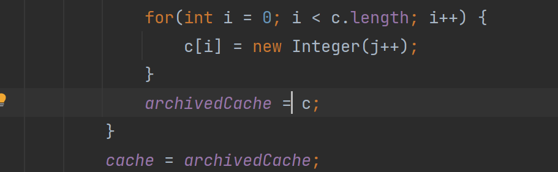
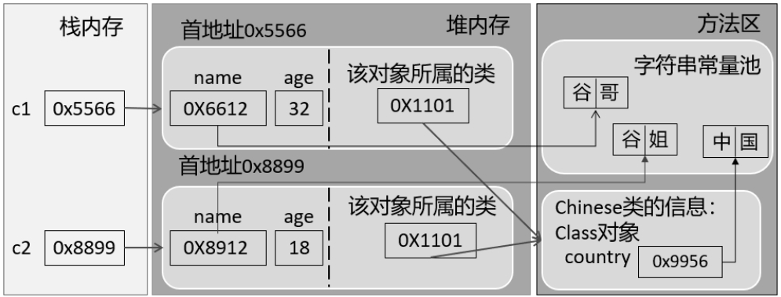

# Java基础

## 基础

### 方法重载

1. **两同一不同**：同一个类、相同的方法，参数列表不同（参数个数不同、参数类型不同）

   **注意**：方法重载与参数的名、权限修饰符、返回类型都没有关系

2. **如何判断两个方法是相同的呢（编译器如何确定调用的某个具体的方法呢？）**

   先通过方法名确定了一波重载的方法，进而通过不同的形参列表，确定具体的某一个方法。

3. **方法重载——编译时多态**：在编译时确定调用的具体是哪个方法（`.class`字节码中就确定好调用哪个方法了）

### 可变个数形参（jdk5.0）

1. **使用场景**：在用方法时，出现方法形参的类型是确定的，但参数的个数不确定。此时就可以使用可变个数形参的方法。

2. **说明**：

   - 可变个数形参的方法与同一个类中，同名的多个方法之间可以构成重载，**优先匹配固定参数的方法**

     - 特例：

       ```java
       public void print(int...nums) {
           
       }
       
       // error:不构成重载
       public void print(int[] nums) {
           
       }
       ```

   - 可变个数的形参必须声明在形参列表的最后（Vararg parameter must be the last in the list）

   - 可变个数的形参在一个方法的形参列表中最多只有一个

   - **Java 的可变参数编译后实际会被转换成一个数组**

### 包装类

#### Integer的享元机制

```java
Integer a = 100;
Integer b = 100;
System.out.println(a == b);  //true
System.out.println(a.equals(b)); //false
```

原因：Integer用到了享元模式的设计，它针对与**[-128, 127]**的数字做了缓存。使用`Integer a = 100`进行赋值操作时，它默认使用`valueOf`进行自动装箱，从而触发了缓存机制，使得`a`和`b`指向了相同的内存地址。




#### Integer和int的区别

1. 作为成员变量，Integer类型的初始值是null，int类型的初始值为0；
2. Integer存储在堆内存中，而int类型存储在栈空间；
3. Integer是对象类型，它封装了很多的方法和属性，我们在使用时候更加灵活。

## 面向对象

### final关键字的使用

1. **final修饰类**：表示此类不能被继承，如`String`、`StringBuffer`、`StringBuilder`；

2. **final修饰方法**：表示此方法不能被重写，如`Object`类中的`getClass()`；

3. **final修饰变量**：

   - **final修饰成员变量**：必须进行赋值（不会被默认初始化）
     - 显式赋值
     - 代码块中赋值
     - 构造器中赋值
   - **final修饰局部变量**：一旦赋值就不能修改
     - 方法内声明的局部变量，在调用局部变量时，一定需要赋值。而且一旦赋值，就不可更改；
     - 方法的形参，在调用此方法时，给形参进行赋值。而且一旦赋值，就不可更改；

4. **final和static搭配**：修饰成员变量时，此成员变量称为**全局常量**

   如`Math`中的`PI`

### 接口

1. 可以声明：

   - **属性**：必须使用`public static final`修饰（可以省略）
   - **方法**：
     - `jdk8`之前，声明抽象方法，修饰为`public abstract`（可以省略）
     - `jdk8`：声明**静态方法**、**默认方法**
     - `jdk9`：声明**私有方法**

   不可以声明：构造器、代码块等
   
2. **接口中声明静态方法**：接口中声明的静态方法只能被接口来调用，不能被其实现类进行调用

   ```java
   public interface CompareA {
       public static void method1() {
           System.out.println("CompareA...");
       }
   }
   
   class SubClass implements CompareA {
       public static void main(String[] args) {
           CompareA.method1();
           SubClass.method1(); //error
       }
   }
   ```

3. **默认方法**：接口中声明的默认方法可以被实现类继承。实现类在没有重写此方法的情况下，默认调用接口中声明的默认方法；重写了即调用自己重写的方法。

   ```java
   public interface CompareA {
       public default void method2() {
           System.out.println("CompareA::method2");
       }
   }
   
   class SubClass implements CompareA {
       public static void main(String[] args) {
           CompareA.method1();
           SubClass subClass = new SubClass();
           subClass.method2();
       }
   }
   ```

4. **接口冲突**：类实现了两个接口，而两个接口中定义了**同名同参数的默认方法**（不是默认方法就不会报错），如果实现类没有重写该默认方法则报错。要求**必须重写该默认方法**。****

   ```java
   public class Test implements A, B{ //error
   }
   
   interface A {
       public default void method1() {
   
       }
   }
   
   interface B {
       public default void method1() {
   
       }
   }
   ```

5. **类优先原则**：子类继承了父类并实现了接口，父类和接口中声明了同名同参数的方法（接口中是默认方法）。子类如果没有重写此方法，调用的是父类中的方法。

   ```java
   public class Test extends SuperClass implements A {
       public static void main(String[] args) {
           Test test = new Test();
           test.method1(); //SuperClass:method1
       }
   }
   
   interface A {
       public default void method1() {
           System.out.println("A:method1");
       }
   }
   
   class SuperClass {
       public void method1() {
           System.out.println("SuperClass:method1");
       }
   }
   ```

   补充：如果接口A中的method1方法不是默认方法，那么也不会报错。因为继承自SuperClass 的method1方法可以当作对接口A中抽象方法的重写。

6. **在实现类中调用接口中的默认方法**：

   ```java
   public class Test implements A, B {
       @Override
       public void method1() {
           System.out.println("A:method1");
       }
   
       public void method() {
           method1();
           A.super.method1();
           B.super.method1();
       }
   
       public static void main(String[] args) {
           Test test = new Test();
           test.method();
       }
   }
   
   interface A {
       default void method1() {
           System.out.println("A:method1");
       }
   }
   
   interface B {
       default void method1() {
           System.out.println("B:method1");
       }
   }
   ```

7. **私有方法**：private子类不可见

### static方法可以被继承吗

1. 在Java中，静态方法可以被继承，但不能被重写(override)。
   当子类继承父类时，会继承父类中的**所有静态方法和静态变量**。子类可以通过类名直接调用父类的静态方法，也可以通过子类名直接调用子类的静态方法。
2. 然而，静态方法不具有多态性，因此不能被子类重写(`override`)。在子类中声明一个与父类中静态方法名称、参数列表和返回类型相同的静态方法，不会覆盖父类的静态方法。在子类中可以重新实现同名的静态方法，但此时父类中的静态方法仍然可以通过父类名调用。
3. 总之，静态方法是属于类的，不是属于实例的，因此它们不需要通过实例化对象来调用，子类可以继承父类中的所有静态方法，但不能重写(override)它们。

### 对象的内存分析

分析以下代码的内存存放结构：

```java
public class TestChinese {
    public static void main(String[] args) {
        Chinese.country = "中国";
        
        Chinese c1 = new Chinese();
        c1.name = "谷哥";
        c1.age = 32;
        
        Chinese c2 = new Chinese();
        c2.name = "谷姐";
        c2.age = 32;
    }
}
```



### String类

#### 为什么JDK9要将String的底层实现由char[]改为byte[]?

- 节省内存空间：byte占一个字节，char占用两个字节；
- 如果一个字符串只包含英文字符或者ASCII字符，那么只用一个字节就可以表示所有字符；
- 将`char[]`改为`byte[] + encoding flag field`

## 异常体系

### 1. 异常的体系结构

- `java.lang.Throwable`：异常体系的根父类

  - `java.lang.Error`：错误，Java虚拟机无法解决的严重问题。如：JVM系统内部错误、资源耗尽等严重情况，一般不编写针对性的代码进行处理。如：`StackOverflowError`、`OutofMemoryError`
  - `java.lang.Exception`：异常，我们可以编写针对性的代码进行处理
    - 编译时异常（受检异常）：在执行`javac.exe`命令时，出现的异常（编译时异常并不代表所有在编译时出现的错误或异常，而是指在Java中需要明确捕获或抛出的异常类型）
    - 运行时异常（非受检异常）：在执行`java.exe`命令时，出现的异常
      - `ArrayIndexOutofBoundsException`、`NullPointerException`、`ClassCastException`、`NumberFormatException`、`InputMismatchException`、`ArithmeticException`

- **面试题：说一说开发中都遇到过哪些异常**

  **运行时异常**

  ```java
  String str = null;
  System.out.println(str.toString()); //java.lang.NullPointerException
  int[] arr = null;
  System.out.println(arr[0]); //java.lang.NullPointerException
  ```

  ```java
  String s = new String();
  Date date = (Date) s; //ClassCastException
  ```

  ```java
  String s = "123a";
  int i = Integer.parseInt(s);
  System.out.println(i); //java.lang.NumberFormatException
  ```

  ```JAVA
  Scanner scanner = new Scanner(System.in);
  int num = scanner.nextInt(); //输入abc: java.util.InputMismatchException
  ```

  ```java
  int num = 1 / 0; //java.lang.ArithmeticException: / by zero
  ```

  **编译时异常**

  ```java
  Class clz = Class.forName("java.lang.String"); //java.lang.ClassNotFoundException
  ```

  ```java
  File file = new File("hello.txt");
  FileInputStream fis = new FileInputStream(file); //java.io.FileNotFoundException
  
  int data = fis.read(); //java.io.IOException
  while (data != -1) {
      System.out.print((char) data);
      data = fis.read();
  }
  fis.close(); //java.io.IOException
  ```

### 2. 异常处理方式

#### 2.1 异常处理方式1：try-catch-finally

- 抛：程序在执行的过程当中，一旦出现异常，就会在出现异常的代码处，**生成对应异常类的对象，并将此对象抛出**。一旦抛出，此程序就不执行其后的代码了；
- 针对于“抓”中抛出的异常对象，进行捕获处理。此捕获处理过程，就成为抓。一旦将异常进行了处理，代码就可以继续执行。

```java
try {
    // 可能产生异常的代码
} catch(e1) {
    
} catch(e2) {
    
} finally {
    
}
```

**注意**：

- 如果声明了多个catch结构，且多个异常类型满足**子父类的关系**。则必须将子类声明在父类结构的上面，否则报错
- catch中的异常处理方式：
  - `printStackTrace()`：打印异常的详细信息
  - `getMessage()`：获取发生异常的原因

#### 2.2 finally的使用说明

- `finally`中声明**一定要被执行的代码**

- 即，**无论try-catch中是否存在仍未被处理的异常，以及return语句，finally中的语句一定会被执行**

- `finally`块里的语句在`try`或者`catch`里的任何`return`前执行。

- **面试题**

  ```java
  try {
      int i = Integer.parseInt("12a");
      System.out.println(i);
  } catch (NumberFormatException e) {
      e.printStackTrace();
      System.out.println(1 / 0);
  } finally {
      System.out.println("程序结束"); // catch块中又抛了一个异常，但finnally中的“程序结束”依然会被打印
  }
  ```

  ```java
  public static int test(String str) {
      try {
          Integer.parseInt(str);
          return 1;
      } catch (NumberFormatException e) {
          return -1;
      } finally {
          System.out.println("test结束");
      }
  }
  
  public static void main(String[] args) {
      int result = test("12a"); //test结束    -1
      int result = test("12"); //test结束  1
      System.out.println(result);
  }
  ```

  ```java
  public static int test(int num) {
      try {
          return num;
      } catch (NumberFormatException e) {
          return num--;
      } finally {
          System.out.println("test结束");
          ++num;
      }
  }
  
  public static void main(String[] args) {
      int result = test(10);
      System.out.println(result); // 10
  }
  ```

  参考博客：[try-catch-finally的深入理解](https://blog.csdn.net/weixin_47382783/article/details/125241849)

#### 2.3 异常处理方式2：throws

- 从编译是否能通过讲，看成是给出了异常万一要是出现时候的解决方案。此方案就是继续向上抛出（`throws`）；

- 但是此`throws`的方式，仅仅是将可能出现的异常抛给了此方法的调用者，**调用者仍然需要考虑如何处理相关异常**。因此，throws方式不算是真正意义上处理了异常；

- **子类重写的方法**抛出的异常类型，可以和父类被重写的方法抛出的异常类型**相同**，或者是父类被重写方法抛出异常的**子类**（如果父类方法没有抛异常，子类方法只能`try-catch`了）

  ```java
  public static void main(String[] args) {
      Father father = new Son();
      try {
          father.method1();
      } catch (IOException e) {
          e.printStackTrace(); //无法捕获
      }
  }
  
  class Father {
      public void method1() throws IOException {
  
      }
  }
  
  class Son extends Father{
      @Override
      public void method1() throws Exception { // 报错！
  
      }
  }
  // 编译时father看成是Father的引用，但子类Son抛出的异常比父类还大，那就无法catch住了
  ```

- 开发中如何选择？
  - 程序中涉及到资源的调用（流、数据库连接、网络连接），使用`try-catch-finally`处理；
  - 父类没有`throws`异常，那么子类重写的方法如果出现异常，只能使用`try-catch-finally`处理；
  - 方法a依次调用了方法b、c、d，方法b、c、d之间是递进关系。如果方法b、c、d中有异常，通常选择使用`throws`，方法a中使用`try-catch-finally`。

### 3. 手动抛出异常对象：throw

- **手动抛**：程序在执行的过程当中，不满足指定条件的情况下，使用`throw + 异常类对象`方式抛出异常；
- `throw`后的代码不能被执行，编译不通过；
- `throw`出来的异常也有两种处理方式：`try-catch-finally`或`throws`
- **面试题**：`throws`和`throw`的区别

### 4. 自定义异常类

**如何自定义异常类？**

1. 继承于现有的异常体系，通常继承于`RuntimeException` \ `Exception`；
2. 通常提供几个重载的构造器；
3. 提供一个全局常量，声明为`static final long serialVersionUID`

**如何使用自定义异常类？**

- 具体代码中，满足指定的条件下，需要手动地使用`throw + 自定义异常类对象`的方式，将异常对象抛出；
- 如果自定义异常类是非运行时异常类，必须考虑如何处理此异常类的对象（`try-catch-finally`或`throws`）

**为什么要自定义异常类？**

- 我们更关心的是，通过异常的名称就能直接判断此异常出现的原因；
- 既然如此，我们就有必要再实际开发场景中，不满足我们指定的条件时，指明我们自己特有的异常类；
- 通过此异常类的名称，就能判断出具体出现的问题。

## 日期时间API

### 1. jdk8之前的API

#### 1.1 System类中的`currentTimeMillis()`

- 获取当前时间对应的毫秒数，long类型，时间戳（1970年1月1日0是0分0秒的毫秒数）
- 开发中常用来计算时间差（方法的执行时间）

#### 1.2 两个Date类：远古时代的API

##### 1.2.1 早期`java.util.Date`

两个构造器：

```java
Date date1 = new Date(); //创建一个基于当前系统时间的Date实例
```

```java
Date date2 = new Date(System.currentTimeMillis()); //创建一个基于指定时间戳的Date实例
```

两个方法：

```java
long milliTimes = date1.getTime(); //获取毫秒数
```

```java
System.out.println(date2.toString()); // 获取时间：Wed Oct 25 20:16:52 CST 2023
```

##### 1.2.2 `java.sql.Date`

- 继承于`java.util.Date`

- 构造器：

  ```java
  java.sql.Date date1 = new java.sql.Date(System.currentTimeMillis());
  System.out.println(date1); //2023-10-25
  ```

#### 1.3 `java.text.SimpleDateFormat`：日期时间的格式化和解析

- **用于日期时间的格式化和解析**

- 格式化：日期Date$\rightarrow$字符串，调用`format()`方法；

- 解析：字符串$\rightarrow$日期Date，调用`parse()`方法；

- 举例：

  ```java
  SimpleDateFormat sdf = new SimpleDateFormat("yyyy-MM-dd HH:mm:ss"); //构造器传入指定的格式
  String strDate = sdf.format(new Date()); //2023-10-25 20:36:30
  System.out.println(strDate);
  
  Date date2 = sdf.parse("2023-10-25 20:32:14");
  System.out.println(date2);
  
  Date date3 = sdf.parse("2021年5月20日 20:32:14");
  System.out.println(date3); //解析失败
  ```

#### 1.4 `java.util.Calendar`（日历类）：试图解决Date的问题

- **实例化**：由于`Calendar`是一个抽象类，所以需要创建其子类的实例。这里我们通过`Calendar`的静态方法`getInstance()`即可获取；

- **常用方法**：`get (int field)`、`set(int filed, xx)`、`add(int field, xx)` 、`getTime()`、`setTime(Date)`

  ```java
  Calendar calendar = Calendar.getInstance();
  System.out.println(calendar.getClass());
  
  System.out.println(calendar.get(Calendar.DAY_OF_MONTH));
  System.out.println(calendar.get(Calendar.DAY_OF_WEEK));
  System.out.println(calendar.get(Calendar.DAY_OF_MONTH));
  
  calendar.set(Calendar.DAY_OF_MONTH, 1);
  
  calendar.add(Calendar.DAY_OF_MONTH, 3);
  System.out.println(calendar.get(Calendar.DAY_OF_MONTH));
  ```

### 2. jdk8新增的API

jdk8之前日期时间API**存在的问题**

- 可变性：像日期和时间这样的类应该是不可变的；
- 偏移性：`Date`中的年龄是从1900开始的，而月份都是从0开始的；
- 格式化：格式化（`SimpleDateFormat`）只对`Date`有用，而`Calendar`则不行；
- 此外，它们也不是线程安全的；不能处理闰秒等。

#### 2.1 本地日期时间：LocalDate、LocalTime、LocalDateTime

| 方法                                         | 描述                           |
| -------------------------------------------- | ------------------------------ |
| `now()`                                      | 获取当前日期和时间的对象       |
| `of()`                                       | 获取指定的日期、时间对应的实例 |
| 其他（getXXX、withXXX、plusXXX、minusXXX）略 | 自己查                         |

#### 2.2 瞬时：Instant


## 反射

### 谈一谈对Class类的理解

- 针对于编写好的`.java`源文件进行编译（`javac.exe`），会生成一个或多个`.class`字节码文件；
- 接着，我们使用`java.exe`命令对指定的`.class`文件进行解释运行，在解释运行过程中，我们需要将`.class`字节码文件**加载**到内存中。加载到内存中的`.class`文件对应的结构即为`Class`的一个实例（类的加载过程见JVM篇）。

### 获取Class实例的四种方式

1. ```java
   Class<String> stringClass = String.class;
   ```

2. ```java
   Class<?> stringClass = Class.forName("java.lang.String");
   ```

3. ```java
   String s = "hello";
   Class<? extends String> stringClass3 = s.getClass();
   ```

4. ```java
   Class<?> testClass = ClassLoader.getSystemClassLoader().loadClass("jvm.Test"); // s
   ```

