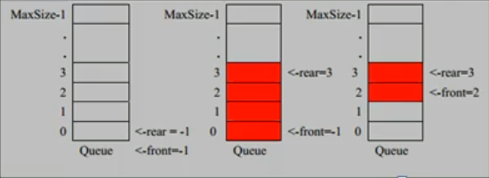

# Java数据结构与算法

## 一、稀疏数组和队列

### 1.1 线性结构

- 线性结构作为最常用的数据结构，其特点是**数据元素之间存在一对一的线性关系**
- 线性结构有两种不同的存储结构，即**顺序存储结构**和**链式存储结构**。顺序存储的线性表成为顺序表，顺序表中的存储元素是连续的；
- 链式存储的线性表称为链表，链表中的春初元素不一定是连续的，元素节点中存放元素以及相邻元素的地址信息；
- 线性结构常见的有：数组、队列、链表和栈。

### 1.2 非线性结构

- 非线性结构包括：二维数组，多维数组，广义表，树结构，图结构

### 1.3 稀疏数组

当一个数组中大部分元素为0，或者为同一个值的数组时，可以使用稀疏数组来保存该数组。

稀疏数组的处理方法是：

- 记录数组一共有几行几列，有多少个不同的值；
- 把具有不同值的元素的行列及值记录在一个小规模的数组中，从而缩小程序的规模。

**案列**
$$
\left(
\begin{array}{l}
0 & 0 & 0 & 22 & 0 & 0 & 15\\
0 & 11 & 0 & 0 & 0 & 17 & 0\\
0 & 0 & 0 & -6 & 0 & 0 & 0\\
0 & 0 & 0 & 0 & 0 & 39 & 0\\
91 & 0 & 0 & 0 & 0 & 0 & 0\\
0 & 0 & 28 & 0 & 0 & 0 & 0\\
\end{array}
\right)
$$

|      | 行   | 列   | 值   |
| ---- | ---- | ---- | ---- |
| [0]  | 6    | 7    | 8    |
| [1]  | 0    | 3    | 22   |
| [2]  | 0    | 6    | 15   |
| [3]  | 1    | 1    | 11   |
| [4]  | 1    | 5    | 17   |
| [5]  | 2    | 3    | -6   |
| [6]  | 3    | 5    | 39   |
| [7]  | 4    | 0    | 91   |
| [8]  | 5    | 2    | 28   |

**二维数组$\rightarrow$稀疏数组**

- 遍历原始二维数组，得到有效数据个数`sum`
- 根据sum创建稀疏数组`sparseArray = new int[sum+1][3]`
- 将二维数组的有效数据存入到稀疏数组

**稀疏数组$\rightarrow$二维数组**

- 读取稀疏数组的第一行，根据第一行的数据创建原始的二维数组；
- 再读取稀疏数组的后几行数据，并赋给原始的二维数组即可；

### 1.4 队列

#### 1.4.1 队列介绍

- 队列是一个有序列表，可以用数组或是链表来实现；
- 遵循**先入先出**的原则。即：先存入队列的数据，要先取出；后存入的要后取出；

#### 1.4.2 数组模拟队列

- 使用变量`maxSize`记录队列的最大容量，即数组的`length`；
- 因为队列的输出、输入分别从前后端来处理，因此需要**两个变量`front`和`rear`**分别记录队列前后端的下表，front会随着数据输出而改变，而rear则是随着数据输入而改变；
- **队列为空**时，`front == rear`。其中，初始化时`front = rear = -1`；**队列满**时，`rear == maxSize - 1`；
- 存入数据时，需要判断队列是否满；取出数据时，需要判断队列是否为空。

- 问题分析并优化：
  - 目前数组使用一次就不能用，没有达到复用的效果；
  - 将这个数组使用算法，改进成一个环形的队列（取模：%）。
