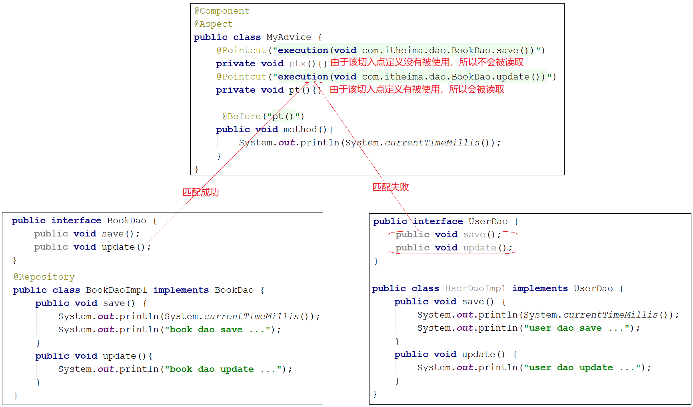
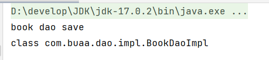
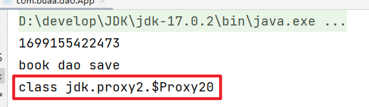
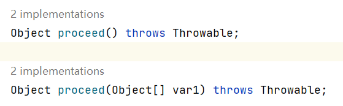

# AOP

## 一、AOP简介

### 1.1 什么是AOP

- **AOP（Aspect Oriented Programming）**：面向切面编程；
- **AOP是在不改原有代码的前提下对其进行增强**；

### 1.2 核心概念

#### 1.2.1 连接点

- 连接点是程序中那些可以“钩入”额外行为的具体点。

#### 1.2.2 切入点

- 需要增强的方法；

#### 1.2.3 通知

- 存放共性功能的方法，即在切入点需要执行的操作；

#### 1.2.4 切面

- 对于通知和切入点之间的关系描述，即哪个切入点需要添加哪个通知；

#### 1.2.5 通知类

- 通知需要写在通知类中；

**示例**：


## 二、入门案例

### 2.1 相关注解

#### 2.1.1 @EnableAspectJAutoProxy  

| 名称 | @EnableAspectJAutoProxy |
| ---- | ----------------------- |
| 类型 | 配置类注解              |
| 位置 | 配置类定义上方          |
| 作用 | 开启注解格式AOP功能     |

#### 2.1.2 @Aspect

| 名称 | @Aspect               |
| ---- | --------------------- |
| 类型 | 类注解                |
| 位置 | 切面类定义上方        |
| 作用 | 设置当前类为AOP切面类 |

#### 2.1.3 @Pointcut   

| 名称 | @Pointcut                   |
| ---- | --------------------------- |
| 类型 | 方法注解                    |
| 位置 | 切入点方法定义上方          |
| 作用 | 设置切入点方法              |
| 属性 | value（默认）：切入点表达式 |

#### 2.1.4 @Before

| 名称 | @Before                                                      |
| ---- | ------------------------------------------------------------ |
| 类型 | 方法注解                                                     |
| 位置 | 通知方法定义上方                                             |
| 作用 | 设置当前通知方法与切入点之间的绑定关系，当前通知方法在原始切入点方法前运行 |

### 2.2 实现步骤

#### 2.2.1 添加依赖

```xml
<dependency>
    <groupId>org.aspectj</groupId>
    <artifactId>aspectjweaver</artifactId>
    <version>1.9.4</version>
</dependency>
```

#### 2.2.2 定义通知类

```java
@Component
@Aspect
public class MyAdvice {
    @Pointcut("execution(void com.buaa.dao.BookDao.*())")
    private void pt(){}

    @Before("pt()")
    public void method() {
        System.out.println(System.currentTimeMillis());
    }
}
```

- @Component注解将通知类交给容器管理；
- @Aspect注解将容器标识为切面类；
- 切入点定义依托一个不具有实际意义的方法进行，即无参数、无返回值、方法体无实际逻辑；

#### 2.2.3 开启AOP功能

```java
@Configuration
@ComponentScan("com.itheima")
@EnableAspectJAutoProxy
public class SpringConfig {
}
```

- 配置类`SpringConfig`上加@EnableAspectJAutoProxy注解

## 三、AOP工作流程

### 3.1 AOP工作流程

#### 3.1.1 Spring容器启动

- Spring容器启动，加载需要的bean，如：
  - 需要被增强的类，如BookServiceImpl
  - 通知类，如MyAdVice
- 注意：**此时bean对象还没有被创建成功**

#### 3.1.2 读取所有切面配置中的切入点

#### 3.1.3 初始化bean

- 要对实例化bean对象的类中的方法和切入点进行匹配；
- **匹配成功：创建原始对象的代理对象**
  - 最终运行的是代理对象的方法，在该方法中对原始方法进行功能增强
- 匹配失败，创建原始i对象；
  - 匹配失败，说明不需要增强，直接调用原始对象的方法即可



#### 3.1.4 获取bean的执行方法

- 获取的bean是原始对象时，调用方法并执行，完成操作
- 获取的bean是代理对象时，根据代理对象的运行模式运行原始方法与增强的内容，完成操作

### 3.2 验证容器中是否为代理对象

**结论**：

- 如果目标对象中的方法会被增强，那么容器中将存入的是**目标对象的代理对象**；
- 如果目标对象中的方法不被增强，那么容器中将存入的是**目标对象本身**。

**验证**：

```java
public class App {
    public static void main(String[] args) {
        ApplicationContext ctx = new AnnotationConfigApplicationContext(SpringConfig.class);
        BookDao bookDao = ctx.getBean(BookDao.class);
        bookDao.save();
        System.out.println(bookDao.getClass());
    }
}
```

匹配失败：



匹配成功：



## 四、AOP配置管理

### 4.1 AOP切入点表达式

#### 4.1.1 语法格式

有两种描述方式，描述接口的抽象方法和描述实现类的重写方法：

- ```java
  execution(void com.buaa.dao.BookDao.update())
  ```

- ```java
  execution(void com.buaa.dao.impl.BookDaoImpl.update())
  ```

语法格式：

- execution：动作关键字，描述切入点的行为动作，例如execution表示执行到指定切入点
- public：访问修饰符,还可以是public，private等，可以省略
- User：返回值，写返回值类型
- com.buaa.service：包名，多级包使用点连接
- BookDao/BookDaoImpl：类/接口名称
- update：方法名
- int：参数
- 异常名：方法定义中抛出指定异常，可以省略

#### 4.1.2 通配符

- `*`:单个独立的任意符号，可以独立出现，也可以作为前缀或者后缀的匹配符出现

  ```
  execution（public * com.itheima.*.UserService.find*(*))
  ```

  匹配com.itheima包下的任意包中的UserService类或接口中所有find开头的带有一个参数的方法

- `..`：多个连续的任意符号，可以独立出现，常用于简化包名与参数的书写

  ```
  execution（public User com..UserService.findById(..))
  ```

  匹配com包下的任意包中的UserService类或接口中所有名称为findById的方法

### 4.2 AOP通知类型

#### 4.2.1 类型介绍

共有5种通知类型

- 前置通知
- 后置通知
- **环绕通知**
- 返回后通知（了解）：正常返回后添加
- 抛出异常后通知（了解）：抛出异常后添加


#### 4.2.2 通知类型的使用

##### 环绕通知

**具体实现**

```java
@Component
@Aspect
public class MyAdvice {
    @Pointcut("execution(void com.buaa.dao.BookDao.save())")
    private void pt(){}

    @Around("pt()")
    public void method2(ProceedingJoinPoint proceedingJoinPoint) throws Throwable {
        System.out.println("around before...");
        proceedingJoinPoint.proceed();
        System.out.println("around after...");
    }
}
```

**注意事项**

- 原始方法如果有返回值，要根据原始方法的返回值来设置环绕通知的返回值

  ```java
  @Component
  @Aspect
  public class MyAdvice {
      @Pointcut("execution(void com.itheima.dao.BookDao.update())")
      private void pt(){}
      
      @Pointcut("execution(int com.itheima.dao.BookDao.select())")
      private void pt2(){}
      
      @Around("pt2()")
      public Object aroundSelect(ProceedingJoinPoint pjp) throws Throwable {
          System.out.println("around before advice ...");
          //表示对原始操作的调用
          Object ret = pjp.proceed();
          System.out.println("around after advice ...");
          return ret;
      }
  }
  ```

- 环绕通知必须依赖形参**`ProceedingJoinPoint`**才能实现对原始方法的调用，进而实现原始方法调用前后同时添加通知;

- 通知中如果未使用ProceedingJoinPoint对原始方法进行调用将跳过原始方法的执行;

- 对原始方法的调用可以不接收返回值，通知方法设置成void即可，如果接收返回值，最好设定为Object类型

- 由于无法预知原始方法运行后是否会抛出异常，因此环绕通知方法必须要处理Throwable异常

### 4.3 AOP通知获取数据

#### 4.3.1 获取参数

##### 非环绕通知获取方式

- 方法参数添加`JoinPoint`类型的形参，通过其中的`getArgs()`获取参数，获取到的参数是一个`Object[]`类型

  ```java
  @Component
  @Aspect
  public class MyAdvice {
      @Pointcut("execution(* com.itheima.dao.BookDao.findName(..))")
      private void pt(){}
  
      @Before("pt()")
      public void before(JoinPoint jp) 
          //通过JoinPoint获取参数
          Object[] args = jp.getArgs();
          System.out.println(Arrays.toString(args));
          System.out.println("before advice ..." );
      }
  }
  ```

##### 环绕通知获取方式

- 方法参数添加`ProceedingJoinPoint`类型的形参（JoinPoint的子类），通过getArgs()获取参数，获取到的参数为Object[]类型

  ```java
  @Component
  @Aspect
  public class MyAdvice {
      @Pointcut("execution(* com.itheima.dao.BookDao.findName(..))")
      private void pt(){}
  
      @Around("pt()")
      public Object around(ProceedingJoinPoint pjp)throws Throwable {
          Object[] args = pjp.getArgs();
          System.out.println(Arrays.toString(args));
          Object ret = pjp.proceed();
          return ret;
      }
  }
  ```

##### 注意

- proceed方法有两个重载的方法，分别为无参的和带参的



- 调用**无参**的proceed，当原始方法有参数，会在调用的过程中**自动传入参数**
- 当需要修改原始方法的参数时，需要**获取原始方法的参数并进行修改**，调用**带参**的proceed方法

## 五、具体案例

自己动手实践！

## 六、AOP总结

### 6.1 AOP核心概念

* 概念：AOP(Aspect Oriented Programming)面向切面编程，一种编程范式
* 作用：在不惊动原始设计的基础上为方法进行功能增强
* 核心概念
  * 代理（Proxy）：SpringAOP的核心本质是采用代理模式实现的
  * 连接点（JoinPoint）：在SpringAOP中，理解为任意方法的执行
  * 切入点（Pointcut）：匹配连接点的式子，也是具有共性功能的方法描述
  * 通知（Advice）：若干个方法的共性功能，在切入点处执行，最终体现为一个方法
  * 切面（Aspect）：描述通知与切入点的对应关系
  * 目标对象（Target）：被代理的原始对象成为目标对象

### 6.2 切入点表达式

### 切入点表达式

* 切入点表达式标准格式：动作关键字(访问修饰符  返回值  包名.类/接口名.方法名（参数）异常名)

  ```
  execution(* com.itheima.service.*Service.*(..))
  ```

* 切入点表达式描述通配符：

  * 作用：用于快速描述，范围描述
  * `*`：匹配任意符号（常用）
  * `..` ：匹配多个连续的任意符号（常用）
  * `+`：匹配子类类型

* 切入点表达式书写技巧

  1. 按标准规范开发
  2. 查询操作的返回值建议使用\*匹配
  3. 减少使用..的形式描述包
  4. 对接口进行描述，使用`*`表示模块名，例如UserService的匹配描述为*Service
  5. 方法名书写保留动词，例如get，使用\*表示名词，例如getById匹配描述为getBy\*
  6. 参数根据实际情况灵活调整

