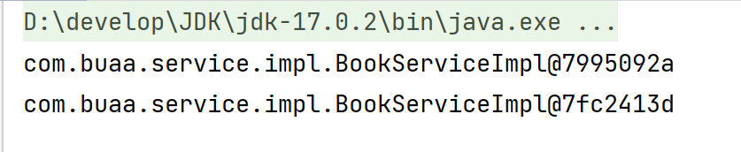
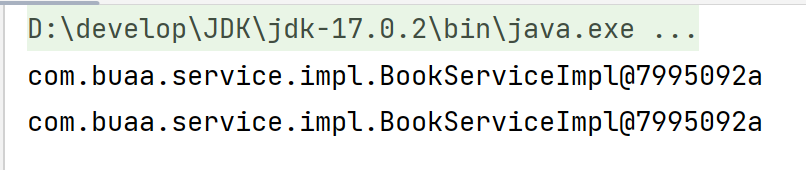

# Spring

## 一、Spring相关概念

### 1.1 初识Spring


- Spring FrameWork：Spring框架，是Spring中最早最核心的技术，也是所有其他技术的基础；
- SpringBoot：Spring是来简化开发，而SpringBoot是来帮助Spring在简化的基础上能更快速进行开发；
- Spring Cloud：用来做分布式之微服务架构的相关开发。

### 1.2 Spring系统架构


- 核心层
  - Core Container：核心容器，这个模块是Spring最核心的模块，其他的都需要依赖该模块
- AOP层
  - AOP：面向切面编程，它依赖核心层容器，目的是**在不改变原有代码的前提下对其进行功能增强**
  - Aspects：AOP是思想，Aspects是对AOP思想的具体实现
- 数据层
  - Data Access：数据访问，Spring全家桶中有对数据访问的具体实现技术
  - Data Integration：数据集成，Spring支持整合其他的数据层解决方案，比如Mybatis
  - Transactions：事务，Spring中事务管理是Spring AOP的一个具体实现，也是后期学习的重点内容
- Web层
  - 这一层的内容将在SpringMVC框架具体学习
- Test层
  - Spring主要整合了Junit来完成单元测试和集成测试

### 1.3 Spring核心概念

#### 1.3.1 目前项目中存在的问题

目前项目中存在的问题：**耦合度偏高**


- 业务层需要调用数据层的方法，就需要在业务层new数据层的对象；
- 如果数据层的实现类发生变化，那么业务层的代码也需要跟着改变，发生变更后，都需要进行编译打包和重部署。

**解决办法1：**


**不可行**，会报空指针异常（`NullPointerException`）

**Spring**的解决方案：

- 使用对象时，在程序中不要主动使用new产生对象，转换为**由外部提供对象**

#### 1.3.2 核心概念

**控制反转（Inversion of Control，IOC）**

- 使用对象时，由主动new产生对象转换为由外部提供对象，此过程中对象创建控制权由程序转移到外部
- Spring和IOC的关系：
  - Spring技术对IOC思想进行了实现，即Spring提供了一个容器，称为**IOC容器**，用来充当IOC思想中的“外部”
  - IOC容器负责对象的创建、初始化等一系列工作，其中包含了数据层和业务层的类对象，被创建或被管理的对象在IOC容器中统称为**Bean**；IOC容器中放的就是一个个的Bean对象
- 当IOC容器中创建好service和dao对象后，程序能正确执行吗？不能！需要把dao对象交给service,也就是说要绑定service和dao对象之间的关系；

**依赖注入（Dependency Injection，DI）**

- 依赖注入：**在容器中建立bean与bean之间的依赖关系**的整个过程，称为依赖注入

控制反转和依赖注入的最终目标就是**充分解耦**，具体实现靠:

* 使用IOC容器管理bean（IOC)；
* 在IOC容器内将有依赖关系的bean进行关系绑定（DI）；
* 最终结果为：使用对象时不仅可以直接从IOC容器中获取，并且获取到的bean已经绑定了所有的依赖关系。

## 二、入门案例

### 2.1 创建maven项目

### 2.2 添加Spring的依赖jar包

```xml
<dependencies>
    <dependency>
        <groupId>org.springframework</groupId>
        <artifactId>spring-context</artifactId>
        <version>5.2.10.RELEASE</version>
    </dependency>
    <dependency>
        <groupId>junit</groupId>
        <artifactId>junit</artifactId>
        <version>4.12</version>
        <scope>test</scope>
    </dependency>
</dependencies>
```

### 2.3 后续步骤略，详见后续文档

## 三、IOC相关内容

### 3.1 bean基础配置 

#### 3.1.1 bean基础配置：id和class属性

| 类别     | 描述                                                         |
| -------- | :----------------------------------------------------------- |
| 名称     | bean                                                         |
| 类型     | 标签                                                         |
| 所属     | beans标签                                                    |
| 功能     | 定义Spring核心容器管理的对象                                 |
| 属性列表 | id：bean的id，使用容器可以通过id值获取对应的bean，在一个容器中id值唯一 <br>class：bean的类型，即配置的bean的全路径类名 |

**示例**

```xml
<bean id="bookDao" class="com.buaa.dao.impl.BookDaoImpl"/>
<bean id="bookSerivce" class="com.buaa.service.BookSerivceImpl"/>
```

**注意**

- class属性**不能写接口如`BookDao`的类全名**，因为接口是没办法创建对象的；

#### 3.1.2 name属性

- 定义bean的别名，可定义多个，用逗号（，）分号（；）空格（）分隔；

- 示例：

  ```xml
  <bean id="bookService" name="service service4 bookEbi" class="com.buaa.service.impl.BookServiceImpl">
  ```

- 注意：bean依赖注入的ref属性指定bean，必须在容器中存在

  

#### 3.1.3 scope属性

- 功能：定义bean的作用范围

  - `singleton`：单例（默认）
  - `prototype`：非单例

- 示例：

  ```java
  ApplicationContext ctx = new ClassPathXmlApplicationContext("applicationContext.xml");
  BookService bookService1 = (BookService) ctx.getBean("bookService");
  BookService bookService2 = (BookService) ctx.getBean("bookService");
  System.out.println(bookService1);
  System.out.println(bookService2);
  ```

  ```xml
  <bean id="bookDao" class="com.buaa.dao.impl.BookDaoImpl" scope="prototype"/> <!--配置非单例,2次地址不一样-->
  ```

  

  ```xml
  <bean id="bookDao" class="com.buaa.dao.impl.BookDaoImpl"/> <!--默认单例,2次地址一样-->
  ```

  

  **注意**：

  - **无状态Bean**：如果bean是无状态的，即不含有可变的实例变量（成员变量），那么它通常是线程安全的。这样的bean仅仅包含不变的数据和方法，不依赖于特定的状态；
  - **有状态Bean**： 如果bean包含有可变的实例变量，那么就可能存在线程安全问题。当多个线程同时访问并操作这些变量时，可能会导致不一致的状态或其他线程安全问题。（ChatGPT）

#### 3.1.4 小结


### 3.2 bean实例化

#### 3.2.1 构造方法实例化

**实验1**：在`BookDaoImpl`中提供一个**私有**的无参构造器，程序正常执行，并打印输出语句

```java
public class BookDaoImpl implements BookDao {
    private BookDaoImpl() {
        System.out.println("book dao constructor is running");
    }

    @Override
    public void save() {
        System.out.println("Book Dao save...");
    }
}
```

**实验2**：构造函数中添加一个参数测试

```java
public class BookDaoImpl implements BookDao {
    private BookDaoImpl(int i) {
        System.out.println("book dao constructor is running ....");
    }
    public void save() {
        System.out.println("book dao save ...");
    }
}
```

**结论**：

- Spring内部走的是构造函数，并且**能访问到类中的私有构造方法**，因为Spring底层用的是反射；
- Spring底层使用的是**类的无参构造方法**；

#### 3.2.2 静态工厂实例化（了解即可）

**代码准备**

```java
public interface OrderDao {
    void save();
}
```

```java
public class OrderDaoImpl implements OrderDao {
    @Override
    public void save() {
        System.out.println("order dao save...");
    }
}
```

```java
public class OrderDaoFactory {
    public static OrderDao getOrderDao() {
        return new OrderDaoImpl();
    }
}
```

```xml
<bean id="orderDao" class="com.buaa.OrderDaoFactory" factory-method="getOrderDao"/>
```

```java
public class AppForInstanceOrder {
    public static void main(String[] args) {
        ApplicationContext ctx = new ClassPathXmlApplicationContext("applicationContext.xml");
        OrderDao orderDao = (OrderDao) ctx.getBean("orderDao");
        orderDao.save();
    }
}
```

#### 3.2.3 实例工厂实例化

**代码准备**

```java
public interface UserDao {
    void save();
}
```

```java
public class UserDaoImpl implements UserDao {
    @Override
    public void save() {
        System.out.println("user dao save...");
    }
}
```

```java
public class UserDaoFactory {
    public UserDao getUserDao() {
        return new UserDaoImpl();
    }
}
```

```xml
<bean id="userFactory" class="com.buaa.factory.UserDaoFactory"/>
<bean id="userDao" factory-method="getUserDao" factory-bean="userFactory"/>
```

```java
public class AppForInstanceUser {
    public static void main(String[] args) {
        ApplicationContext ctx = new ClassPathXmlApplicationContext("applicationContext.xml");
        UserDao userDao = (UserDao) ctx.getBean("userDao");
        userDao.save();
    }
}
```


- 第一行：创建实例化工厂
- 第二行：调用对象中的方法来创建bean
  - factory-bean：工厂的实例对象
  - factory-bean：工厂对象中的具体创建对象的方法名

#### 3.2.4 Factory Bean的使用（掌握）

```java
public class UserDaoFactoryBean implements FactoryBean<UserDao> {
    //代替原始实例工厂中创建对象的方法
    @Override
    public UserDao getObject() throws Exception {
        return new UserDaoImpl();
    }

    //返回所创建类的Class对象
    @Override
    public Class<?> getObjectType() {
        return UserDao.class;
    }
    
    //重写isSingleton，是否为单例
//    @Override
//    public boolean isSingleton() {
//        return false;
//    }    
}
```

```xml
<bean id="userDao" class="com.itheima.factory.UserDaoFactoryBean"/>
```

#### 3.2.5 小结

三种实例化bean的方式

- 构造方法（掌握）
- 静态工厂
- 实例工厂
  - FactoryBean（掌握）

### 3.3 bean的生命周期

#### 3.3.1 声明周期设置

- bean创建之后，想要添加内容，如初始化用到的资源；
- bean销毁之前，想要添加内容，如释放用到的资源；

**添加初始化和销毁方法**，方法名任意

```java
public class BookDaoImpl implements BookDao {
    @Override
    public void save() {
        System.out.println("Book Dao save...");
    }
    
	//初始化方法
    public void init() {
        System.out.println("init...");
    }

    //销毁方法
    public void destroy() {
        System.out.println("destroy...");
    }
}
```

**配置生命周期**

```xml
<bean id="bookDao" class="com.itheima.dao.impl.BookDaoImpl" init-method="init" destroy-method="destory"/>
```

**close关闭容器**

```java
public class App {
    public static void main(String[] args) {
        ClassPathXmlApplicationContext ctx =
                new ClassPathXmlApplicationContext("applicationContext.xml");
        BookService bookService = (BookService) ctx.getBean("bookService");
        bookService.save();
        ctx.close();
    }
}
```

## 四、DI相关内容

### 4.1 setter注入

#### 4.1.1 注入引用数据类型

**声明属性并提供setter方法**

```java
public class BookServiceImpl implements BookService {
    private BookDao bookDao;
    private UserDao userDao;

    @Override
    public void save() {
        userDao.save();
        bookDao.save();
        System.out.println("book service save...");
    }

    public void setUserDao(UserDao userDao) {
        this.userDao = userDao;
    }

    public void setBookDao(BookDao bookDao) {
        this.bookDao = bookDao;
    }
}
```

**配置文件中进行注入配置**

```xml
<bean id="userDao" class="com.buaa.dao.impl.UserDaoImpl"/>
<bean id="bookDao" class="com.buaa.dao.impl.BookDaoImpl"/>
<bean id="bookService" class="com.buaa.service.impl.BookServiceImpl">
    <property name="userDao" ref="userDao"/>
    <property name="bookDao" ref="bookDao"/>
</bean>
```

#### 4.1.2 注入简单数据类型

**声明简单数据类型属性，并提供setter方法**

```java
public class BookDaoImpl implements BookDao {
    private String databaseName;
    private int connectionNum;

    public void setConnectionNum(int connectionNum) {
        this.connectionNum = connectionNum;
    }

    public void setDatabaseName(String databaseName) {
        this.databaseName = databaseName;
    }

    public void save() {
        System.out.println("book dao save ..." + databaseName + "," + connectionNum);
    }
}
```

**进行注入配置**

```xml
<bean id="bookService" class="com.buaa.service.impl.BookServiceImpl">
    <property name="databaseNum" value="mysql"/>
    <property name="connectionNum" value="10"/>
</bean>
```

### 4.2 构造器注入

#### 4.2.1 构造器注入引用数据类型

**提供构造方法**

```java
public class BookServiceImpl implements BookService {
    private BookDao bookDao;
    private UserDao userDao;

    @Override
    public void save() {
        userDao.save();
        bookDao.save();
        System.out.println("book service save...");
    }

    public BookServiceImpl(BookDao bookDao, UserDao userDao) {
        this.bookDao = bookDao;
        this.userDao = userDao;
    }
}
```

**进行配置**

```xml
<bean id="bookService" class="com.buaa.service.impl.BookServiceImpl">
    <constructor-arg name="bookDao" ref="bookDao"/>
    <constructor-arg name="userDao" ref="userDao"/>
</bean>
```

- name属性为构造函数的形参名，必须一致；
- ref属性指向Spring的IOC容器中的其他bean对象；
- 两个`<constructor-arg>`的位置不能颠倒，和构造器中参数的顺序保持一致

#### 4.2.2 构造器注入简单树蕨理性

**提供构造方法**

```java
public class BookDaoImpl implements BookDao {
    private String databaseName;
    private int connectionNum;

    @Override
    public void save() {
        System.out.println("book dao save...");
        System.out.println("databaseNum: " + databaseName);
        System.out.println("connectionNum: " + connectionNum);
    }

    public BookDaoImpl(String databaseName, int connectionNum) {
        this.databaseName = databaseName;
        this.connectionNum = connectionNum;
    }
}
```

**进行配置**

```xml
<bean id="bookDao" class="com.buaa.dao.impl.BookDaoImpl">
    <constructor-arg name="databaseName" value="mysql"/>
    <constructor-arg name="connectionNum" value="10"/>
</bean>
```

### 4.3 自动配置

#### 4.3.1 按类型注入

- 在bean标签中添加autowire属性

  ```xml
  <!--autowire属性：开启自动装配，通常使用按类型装配-->
  <bean id="bookService" class="com.buaa.service.impl.BookServiceImpl" autowire="byType"/>
  ```

- 需要注入属性的类中对应属性的**setter方法不能省略**（`autowire="byType"` 使用的是setter注入（也叫做属性注入），而不是构造器注入）

- 被注入的对象必须要被Spring的IOC容器管理

- 按照类型在Spring的IOC容器中如果找到多个对象，会报`NoUniqueBeanDefinitionException`

#### 4.3.2 按名称注入

- autowire属性为byName

  ```xml
  <!--autowire属性：开启自动装配，通常使用按类型装配-->
  <bean id="bookService" class="com.buaa.service.impl.BookServiceImpl" autowire="byType"/>
  ```

- ```java
  public class BookServiceImpl implements BookService {
      private BookDao bookDao;
  
      @Override
      public void save() {
          bookDao.save();
          System.out.println("book service save...");
      }
  
      public void setBookDao(BookDao bookDao) {
          this.bookDao = bookDao;
      }
  }
  ```

  上述类中使用按名称注入，其实是将对应的set方法的方法名去掉set后首字母小写，即bookDao在容器中进行查找（实验证明：如果set方法方法名为setBookDao1，那么会找bookDao1，就报错了）

#### 4.3.3 小结

- 使用按类型装配时（byType）必须保障容器中相同类型的bean唯一，推荐使用；
- 使用按名称装配时（byName）必须保障容器中具有指定名称的bean，因变量名与配置耦合，不推荐使用。

## 六、核心容器

### 6.1 容器

#### 6.1.1 容器创建方式

`ApplicationContext`的创建方式为

```java
ApplicationConext ctx = new ClassPathXmlApplicationContext("applicationContext.xml");
```

即：类路径下的XML配置文件

#### 6.1.2 Bean的三种获取方式

调用`getBean()`方法

```java
BookDao bookDao = (BookDao) ctx.getBean("bookDao");
BookDao bookDao = ctx.getBean("bookDao"，BookDao.class);
BookDao bookDao = ctx.getBean(BookDao.class);
```

#### 6.1.3 容器类层次结构


使用BeanFactory创建IOC容器的具体实现方式为：

```java
public class AppForBeanFactory {
    public static void main(String[] args) {
        Resource resources = new ClassPathResource("applicationContext.xml");
        BeanFactory bf = new XmlBeanFactory(resources);
        BookDao bookDao = bf.getBean(BookDao.class);
        bookDao.save();
    }
}
```

其中：

- 使用`BeanFactory`创建的容器是延迟加载，只有在获取bean对象的时候才会去创建；
- 使用`ApplicationContext`创建的容器是立即加载，容器加载的时候就会创建bean对象

## 七、IOC/DI注解开发

### 7.1 纯注解开发模式

#### 7.1.1 @Component等

| 名称 | @Component/@Controller/@Service/@Repository |
| ---- | ------------------------------------------- |
| 类型 | 类注解                                      |
| 位置 | 类定义上方                                  |
| 作用 | 设置该类为Spring管理的bean                  |
| 属性 | value（默认）：定义bean的id                 |

#### 7.1.2 @Configuration

| 名称 | @Configuration              |
| ---- | --------------------------- |
| 类型 | 类注解                      |
| 位置 | 类定义上方                  |
| 作用 | 设置该类为spring配置类      |
| 属性 | value（默认）：定义bean的id |

#### 7.1.3 @ComponentScan

| 名称 | @ComponentScan                                           |
| ---- | -------------------------------------------------------- |
| 类型 | 类注解                                                   |
| 位置 | 类定义上方                                               |
| 作用 | 设置spring配置类扫描路径，用于加载使用注解格式定义的bean |
| 属性 | value（默认）：扫描路径，此路径可以逐层向下扫描          |

#### 7.1.4 代码示例

```java
@Configuration
@ComponentScan("com.buaa")
public class SpringConfig {
}
```

```java
@Component("bookDao")
public class BookDaoImpl implements BookDao {
    @Override
    public void save() {
        System.out.println("book dao save...");
    }
}
```

```java
public class App {
    public static void main(String[] args) {
        //之前使用的是ClassPathXmlApplicationContext，加载XML文件
        ApplicationContext ctx = new AnnotationConfigApplicationContext(SpringConfig.class); //加载配置类
        BookDao bookDao = ctx.getBean(BookDao.class);
        bookDao.save();
    }
}
```

### 7.2 注解开发bean作用范围和生命周期管理

#### 7.2.1 @Scope

| 名称 | @Scope                                                       |
| ---- | ------------------------------------------------------------ |
| 类型 | 类注解                                                       |
| 位置 | 类定义上方                                                   |
| 作用 | 设置该类创建对象的作用范围<br/>可用于设置创建出的bean是否为单例对象 |
| 属性 | value（默认）：**定义bean作用范围，<br/>默认值singleton（单例），可选值prototype（非单例）** |

#### 7.2.2 @PostConstruct和@PreDestroy

| 名称 | @PostConstruct             |
| ---- | -------------------------- |
| 类型 | 方法注解                   |
| 位置 | 方法上                     |
| 作用 | 设置该方法为**初始化方法** |
| 属性 | 无                         |

| 名称 | @PreDestroy              |
| ---- | ------------------------ |
| 类型 | 方法注解                 |
| 位置 | 方法上                   |
| 作用 | 设置该方法为**销毁方法** |
| 属性 | 无                       |

#### 7.2.3 代码示例

```java
@Repository
@Scope("prototype")
public class BookDaoImpl implements BookDao {
    public void save() {
        System.out.println("book dao save ...");
    }
    @PostConstruct //在构造方法之后执行，替换 init-method
    public void init() {
        System.out.println("init ...");
    }
    @PreDestroy //在销毁方法之前执行,替换 destroy-method
    public void destroy() {
        System.out.println("destroy ...");
    }
}
```

#### 7.2.4 小结


### 7.3 注解开发依赖注入

#### 7.3.1 @AutoWired

| 名称 | @Autowired                                                   |
| ---- | ------------------------------------------------------------ |
| 类型 | 属性注解  或  方法注解（了解）  或  方法形参注解（了解）     |
| 位置 | 属性定义上方  或  标准set方法上方  或  类set方法上方  或  方法形参前面 |
| 作用 | 为引用类型属性设置值                                         |
| 属性 | required：true/false，定义该属性是否允许为null               |

**代码示例**

```java
@Service
public class BookServiceImpl implements BookService {
    @Autowired
    private BookDao bookDao;

    @Override
    public void save() {
        bookDao.save();
        System.out.println("book service save...");
    }
    
//    public void setBookDao(BookDao bookDao) {
//        this.bookDao = bookDao;
//    }
}
```

**说明**

- 为什么setter方法可以删除？**自动装配基于反射设计创建对象并通过暴力反射为私有属性进行设值，所以此处无需提供setter方法；**

- `@Autowired`**默认按照类型自动装配**，如果IOC容器中同类的Bean找到多个，就按照变量名和Bean的名称匹配；

  

  上述情况按照类型会找到2个Bean对象，此时按照名称取找，但IOC容器只有名称叫`bookDao1`和`bookDao2`,所以找不到，报`NoUniqueBeanDefinitionException`;

#### 7.3.2 @Qualifier

| 名称 | @Qualifier                                           |
| ---- | ---------------------------------------------------- |
| 类型 | 属性注解  或  方法注解（了解）                       |
| 位置 | 属性定义上方  或  标准set方法上方  或  类set方法上方 |
| 作用 | 为引用类型属性指定注入的beanId                       |
| 属性 | value（默认）：**设置注入的beanId**                  |

**代码示例**

```java
@Service
public class BookServiceImpl implements BookService {
    @Autowired
    @Qualifier("bookDao1")
    private BookDao bookDao;
    
    public void save() {
        System.out.println("book service save ...");
        bookDao.save();
    }
}
```

- 在容器中按照类型找到多个Bean对象，使用`@Qualifier`来指定注入哪个名称的bean对象；
- `@Qualifier`不能独立使用，必须**和`@Autowired`一起使用**

#### 7.3.3 @Value

| 名称 | @Value                                               |
| ---- | ---------------------------------------------------- |
| 类型 | 属性注解  或  方法注解（了解）                       |
| 位置 | 属性定义上方  或  标准set方法上方  或  类set方法上方 |
| 作用 | 为  **基本数据类型**  或  **字符串类型**  属性设置值 |
| 属性 | value（默认）：要注入的属性值                        |

**示例**：使用@Value读取配置文件中的内容

```java
@Repository("bookDao")
public class BookDaoImpl implements BookDao {
    @Value("${name}")
    private String name;
    public void save() {
        System.out.println("book dao save ..." + name);
    }
}
```

```java
@Configuration
@ComponentScan("com.itheima")
@PropertySource("jdbc.properties")
public class SpringConfig {
}
```

```xml
name=Ivo10
```

## 八、IOC/DI注解开发管理第三方bean

### 8.1 使用@Bean导入

#### 8.1.1 具体流程

在配置类SpringConfig中，定义一个使用**`@Bean`**定义的方法，该**方法的返回值**即为要管理的第三方bean对象：

```java
@Configuration
@ComponentScan("com.buaa")
@PropertySource("jdbc.properties")
public class SpringConfig {
    @Bean
    public DataSource dataSource() {
        DruidDataSource ds = new DruidDataSource();
        ds.setDriverClassName("com.mysql.jdbc.Driver");
        ds.setUrl("jdbc:mysql://localhost:3306/cloud_user");
        ds.setUsername("root");
        ds.setPassword("xw20000826");
        return ds;
    }
}
```

**缺点**：所有的第三方bean都配置到Spring的配置类SpringConfig中，不利于代码的阅读和分类管理

#### 8.1.2 @Bean

| 名称 | @Bean                                  |
| ---- | -------------------------------------- |
| 类型 | 方法注解                               |
| 位置 | 方法定义上方                           |
| 作用 | 设置该方法的返回值作为spring管理的bean |
| 属性 | value（默认）：定义bean的id            |

### 8.2 使用@Import导入

#### 8.2.1 具体步骤

**定义JdbcConfig类**

```java
public class JdbcConfig {
    @Bean
    public DataSource dataSource() {
        DruidDataSource ds = new DruidDataSource();
        ds.setDriverClassName("com.mysql.jdbc.Driver");
        ds.setUrl("jdbc:mysql://localhost:3306/cloud_user");
        ds.setUsername("root");
        ds.setPassword("xw20000826");
        return ds;
    }
}
```

**在Spring配置类SpringConfig上加上@Import注解**

```java
@Configuration
@ComponentScan("com.buaa")
@PropertySource("jdbc.properties")
@Import({JdbcConfig.class})
public class SpringConfig {

}
```

**注意**

- @Import注解在配置类中只能写一次，但传入的参数是一个数组，可以引入多个配置类；

- 引用类型注入只需要为bean定义方法设置形参即可，容器会根据类型自动装配对象

  ```java
  @Bean
  public DataSource dataSource(BookDao bookDao){
      System.out.println(bookDao);
      DruidDataSource ds = new DruidDataSource();
      ds.setDriverClassName(driver);
      ds.setUrl(url);
      ds.setUsername(userName);
      ds.setPassword(password);
      return ds;
  }
  ```

#### 8.2.2 @Import

| 名称 | @Import                                                      |
| ---- | ------------------------------------------------------------ |
| 类型 | 类注解                                                       |
| 位置 | 类定义上方                                                   |
| 作用 | 导入配置类                                                   |
| 属性 | value（默认）：定义导入的配置类类名，<br/>当配置类有多个时使用数组格式一次性导入多个配置类 |

## 九、Spring整合

### 9.1 Spring整合Mybatis

- SqlSessionFactoryBean
- MapperScannerConfigurer

