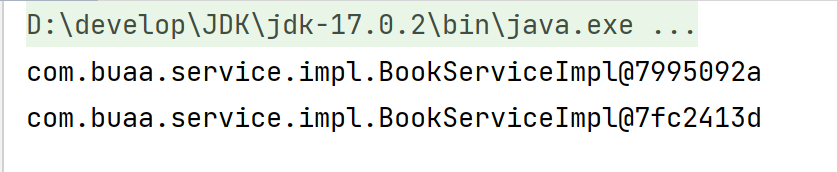
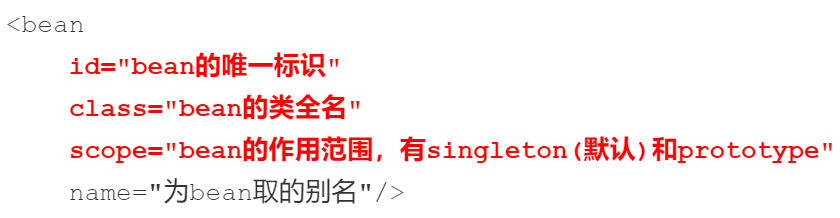

# Spring

## 一、Spring相关概念

### 1.1 初识Spring


- Spring FrameWork：Spring框架，是Spring中最早最核心的技术，也是所有其他技术的基础；
- SpringBoot：Spring是来简化开发，而SpringBoot是来帮助Spring在简化的基础上能更快速进行开发；
- Spring Cloud：用来做分布式之微服务架构的相关开发。

### 1.2 Spring系统架构


- 核心层
  - Core Container：核心容器，这个模块是Spring最核心的模块，其他的都需要依赖该模块
- AOP层
  - AOP：面向切面编程，它依赖核心层容器，目的是**在不改变原有代码的前提下对其进行功能增强**
  - Aspects：AOP是思想，Aspects是对AOP思想的具体实现
- 数据层
  - Data Access：数据访问，Spring全家桶中有对数据访问的具体实现技术
  - Data Integration：数据集成，Spring支持整合其他的数据层解决方案，比如Mybatis
  - Transactions：事务，Spring中事务管理是Spring AOP的一个具体实现，也是后期学习的重点内容
- Web层
  - 这一层的内容将在SpringMVC框架具体学习
- Test层
  - Spring主要整合了Junit来完成单元测试和集成测试

### 1.3 Spring核心概念

#### 1.3.1 目前项目中存在的问题

目前项目中存在的问题：**耦合度偏高**


- 业务层需要调用数据层的方法，就需要在业务层new数据层的对象；
- 如果数据层的实现类发生变化，那么业务层的代码也需要跟着改变，发生变更后，都需要进行编译打包和重部署。

**解决办法1：**


**不可行**，会报空指针异常（`NullPointerException`）

**Spring**的解决方案：

- 使用对象时，在程序中不要主动使用new产生对象，转换为**由外部提供对象**

#### 1.3.2 核心概念

**控制反转（Inversion of Control，IOC）**

- 使用对象时，由主动new产生对象转换为由外部提供对象，此过程中对象创建控制权由程序转移到外部
- Spring和IOC的关系：
  - Spring技术对IOC思想进行了实现，即Spring提供了一个容器，称为**IOC容器**，用来充当IOC思想中的“外部”
  - IOC容器负责对象的创建、初始化等一系列工作，其中包含了数据层和业务层的类对象，被创建或被管理的对象在IOC容器中统称为**Bean**；IOC容器中放的就是一个个的Bean对象
- 当IOC容器中创建好service和dao对象后，程序能正确执行吗？不能！需要把dao对象交给service,也就是说要绑定service和dao对象之间的关系；

**依赖注入（Dependency Injection，DI）**

- 依赖注入：**在容器中建立bean与bean之间的依赖关系**的整个过程，称为依赖注入

控制反转和依赖注入的最终目标就是**充分解耦**，具体实现靠:

* 使用IOC容器管理bean（IOC)；
* 在IOC容器内将有依赖关系的bean进行关系绑定（DI）；
* 最终结果为:使用对象时不仅可以直接从IOC容器中获取，并且获取到的bean已经绑定了所有的依赖关系。

## 二、入门案例

### 2.1 创建maven项目

### 2.2 添加Spring的依赖jar包

```xml
<dependencies>
    <dependency>
        <groupId>org.springframework</groupId>
        <artifactId>spring-context</artifactId>
        <version>5.2.10.RELEASE</version>
    </dependency>
    <dependency>
        <groupId>junit</groupId>
        <artifactId>junit</artifactId>
        <version>4.12</version>
        <scope>test</scope>
    </dependency>
</dependencies>
```

### 2.3 后续步骤略，详见后续文档

## 三、IOC相关内容

### 3.1 bean基础配置 

#### 3.1.1 bean基础配置：id和class属性

| 类别     | 描述                                                         |
| -------- | :----------------------------------------------------------- |
| 名称     | bean                                                         |
| 类型     | 标签                                                         |
| 所属     | beans标签                                                    |
| 功能     | 定义Spring核心容器管理的对象                                 |
| 属性列表 | id：bean的id，使用容器可以通过id值获取对应的bean，在一个容器中id值唯一 |
|          | class：bean的类型，即配置的bean的全路径类名                  |

**示例**

```xml
<bean id="bookDao" class="com.buaa.dao.impl.BookDaoImpl"/>
<bean id="bookSerivce" class="com.buaa.service.BookSerivceImpl"/>
```

**注意**

- class属性不能写接口如`BookDao`的类全名，因为接口是没办法创建对象的；

#### 3.1.2 name属性

- 定义bean的别名，可定义多个，用逗号（，）分号（；）空格（）分隔；

- 示例：

  ```xml
  <bean id="bookService" name="service service4 bookEbi" class="com.buaa.service.impl.BookServiceImpl">
  ```

- 注意：bean依赖注入的ref属性指定bean，必须在容器中存在

  

#### 3.1.3 scope属性

- 功能：定义bean的作用范围

  - singleton：单例（默认）
  - prototype：非单例

- 示例：

  ```java
  ApplicationContext ctx = new ClassPathXmlApplicationContext("applicationContext.xml");
  BookService bookService1 = (BookService) ctx.getBean("bookService");
  BookService bookService2 = (BookService) ctx.getBean("bookService");
  System.out.println(bookService1);
  System.out.println(bookService2);
  ```

  ```xml
  <bean id="bookDao" class="com.buaa.dao.impl.BookDaoImpl" scope="prototype"/> <!--配置非单例,2次地址不一样-->
  ```

  

  ```xml
  <bean id="bookDao" class="com.buaa.dao.impl.BookDaoImpl"/> <!--默认单例,2次地址一样-->
  ```

  

  **注意**：

  - **无状态Bean**：如果bean是无状态的，即不含有可变的实例变量（成员变量），那么它通常是线程安全的。这样的bean仅仅包含不变的数据和方法，不依赖于特定的状态；
  - **有状态Bean**： 如果bean包含有可变的实例变量，那么就可能存在线程安全问题。当多个线程同时访问并操作这些变量时，可能会导致不一致的状态或其他线程安全问题。

#### 3.1.4 小结



### 3.2 bean实例化

#### 3.2.1 构造方法实例化

**实验1**：在`BookDaoImpl`中提供一个**私有**的无参构造器，程序正常执行，并打印输出语句

```java
public class BookDaoImpl implements BookDao {
    private BookDaoImpl() {
        System.out.println("book dao constructor is running");
    }

    @Override
    public void save() {
        System.out.println("Book Dao save...");
    }
}
```

**实验2**：构造函数中添加一个参数测试

```java
public class BookDaoImpl implements BookDao {
    private BookDaoImpl(int i) {
        System.out.println("book dao constructor is running ....");
    }
    public void save() {
        System.out.println("book dao save ...");
    }
}
```

**结论**：

- Spring内部走的是构造函数，并且能访问到类中的**私有**构造方法，因为Spring底层用的是反射；
- Spring底层使用的是类的**无参**构造方法；

#### 3.2.2 静态工厂实例化（了解即可）

**代码准备**

```java
public interface OrderDao {
    void save();
}
```

```java
public class OrderDaoImpl implements OrderDao {
    @Override
    public void save() {
        System.out.println("order dao save...");
    }
}
```

```java
public class OrderDaoFactory {
    public static OrderDao getOrderDao() {
        return new OrderDaoImpl();
    }
}
```

```xml
<bean id="orderDao" class="com.buaa.OrderDaoFactory" factory-method="getOrderDao"/>
```

```java
public class AppForInstanceOrder {
    public static void main(String[] args) {
        ApplicationContext ctx = new ClassPathXmlApplicationContext("applicationContext.xml");
        OrderDao orderDao = (OrderDao) ctx.getBean("orderDao");
        orderDao.save();
    }
}
```

#### 3.2.3 实例工厂实例化

**代码准备**

```java
public interface UserDao {
    void save();
}
```

```java
public class UserDaoImpl implements UserDao {
    @Override
    public void save() {
        System.out.println("user dao save...");
    }
}
```

```java
public class UserDaoFactory {
    public UserDao getUserDao() {
        return new UserDaoImpl();
    }
}
```

```xml
<bean id="userFactory" class="com.buaa.factory.UserDaoFactory"/>
<bean id="userDao" factory-method="getUserDao" factory-bean="userFactory"/>
```

```java
public class AppForInstanceUser {
    public static void main(String[] args) {
        ApplicationContext ctx = new ClassPathXmlApplicationContext("applicationContext.xml");
        UserDao userDao = (UserDao) ctx.getBean("userDao");
        userDao.save();
    }
}
```


- 第一行：创建实例化工厂
- 第二行：调用对象中的方法来创建bean
  - factory-bean：工厂的实例对象
  - factory-bean：工厂对象中的具体创建对象的方法名

#### 3.2.4 Factory Bean的使用

```java
public class UserDaoFactoryBean implements FactoryBean<UserDao> {
    //代替原始实例工厂中创建对象的方法
    @Override
    public UserDao getObject() throws Exception {
        return new UserDaoImpl();
    }

    //返回所创建类的Class对象
    @Override
    public Class<?> getObjectType() {
        return UserDao.class;
    }
    
    //重写isSingleton，是否为单例
//    @Override
//    public boolean isSingleton() {
//        return false;
//    }    
}
```

```xml
<bean id="userDao" class="com.itheima.factory.UserDaoFactoryBean"/>
```

#### 3.2.5 小结

三种实例化bean的方式

- 构造方法（掌握）
- 静态工厂
- 实例工厂
  - FactoryBean（掌握）

### 3.3 bean的生命周期

#### 3.3.1 声明周期设置

- bean创建之后，想要添加内容，如初始化用到的资源；
- bean销毁之前，想要添加内容，如释放用到的资源；

**添加初始化和销毁方法**，方法名任意

```java
public class BookDaoImpl implements BookDao {
    @Override
    public void save() {
        System.out.println("Book Dao save...");
    }
    
	//初始化方法
    public void init() {
        System.out.println("init...");
    }

    //销毁方法
    public void destroy() {
        System.out.println("destroy...");
    }
}
```

**配置生命周期**

```xml
<bean id="bookDao" class="com.itheima.dao.impl.BookDaoImpl" init-method="init" destroy-method="destory"/>
```

**close关闭容器**

```java
public class App {
    public static void main(String[] args) {
        ClassPathXmlApplicationContext ctx =
                new ClassPathXmlApplicationContext("applicationContext.xml");
        BookService bookService = (BookService) ctx.getBean("bookService");
        bookService.save();
        ctx.close();
    }
}
```

## 四、DI相关内容

### 4.1 setter注入

#### 4.1.1 注入引用数据类型

**声明属性并提供setter方法**

```java
public class BookServiceImpl implements BookService {
    private BookDao bookDao;
    private UserDao userDao;

    @Override
    public void save() {
        userDao.save();
        bookDao.save();
        System.out.println("book service save...");
    }

    public void setUserDao(UserDao userDao) {
        this.userDao = userDao;
    }

    public void setBookDao(BookDao bookDao) {
        this.bookDao = bookDao;
    }
}
```

**配置文件中进行注入配置**

```xml
<bean id="userDao" class="com.buaa.dao.impl.UserDaoImpl"/>
<bean id="bookDao" class="com.buaa.dao.impl.BookDaoImpl"/>
<bean id="bookService" class="com.buaa.service.impl.BookServiceImpl">
    <property name="userDao" ref="userDao"/>
    <property name="bookDao" ref="bookDao"/>
</bean>
```

#### 4.1.2 注入简单数据类型

**声明简单数据类型属性，并提供setter方法**

```java
public class BookDaoImpl implements BookDao {
    private String databaseName;
    private int connectionNum;

    public void setConnectionNum(int connectionNum) {
        this.connectionNum = connectionNum;
    }

    public void setDatabaseName(String databaseName) {
        this.databaseName = databaseName;
    }

    public void save() {
        System.out.println("book dao save ..."+databaseName+","+connectionNum);
    }
}
```

**进行注入配置**

```xml
<bean id="bookService" class="com.buaa.service.impl.BookServiceImpl">
    <property name="databaseNum" value="mysql"/>
    <property name="connectionNum" value="10"/>
</bean>
```

### 4.2 构造器注入

#### 4.2.1 构造器注入引用数据类型

**提供构造方法**

```java
public class BookServiceImpl implements BookService {
    private BookDao bookDao;
    private UserDao userDao;

    @Override
    public void save() {
        userDao.save();
        bookDao.save();
        System.out.println("book service save...");
    }

    public BookServiceImpl(BookDao bookDao, UserDao userDao) {
        this.bookDao = bookDao;
        this.userDao = userDao;
    }
}
```

**进行配置**

```xml
<bean id="bookService" class="com.buaa.service.impl.BookServiceImpl">
    <constructor-arg name="bookDao" ref="bookDao"/>
    <constructor-arg name="userDao" ref="userDao"/>
</bean>
```

- name属性为构造函数的形参名，必须一致；
- ref属性指向Spring的IOC容器中的其他bean对象；
- 两个`<constructor-arg>`的位置不能颠倒，和构造器中参数的顺序保持一致

#### 4.2.2 构造器注入简单树蕨理性

**提供构造方法**

```java
public class BookDaoImpl implements BookDao {
    private String databaseName;
    private int connectionNum;

    @Override
    public void save() {
        System.out.println("book dao save...");
        System.out.println("databaseNum: " + databaseName);
        System.out.println("connectionNum: " + connectionNum);
    }

    public BookDaoImpl(String databaseName, int connectionNum) {
        this.databaseName = databaseName;
        this.connectionNum = connectionNum;
    }
}
```

**进行配置**

```xml
<bean id="bookDao" class="com.buaa.dao.impl.BookDaoImpl">
    <constructor-arg name="databaseName" value="mysql"/>
    <constructor-arg name="connectionNum" value="10"/>
</bean>
```

