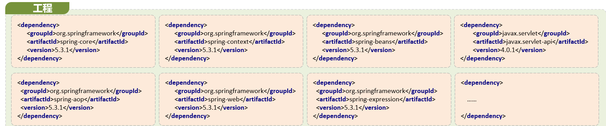
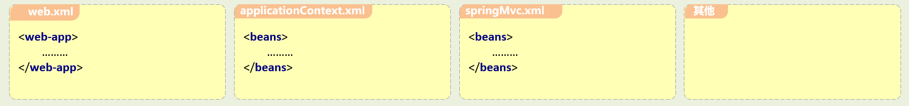
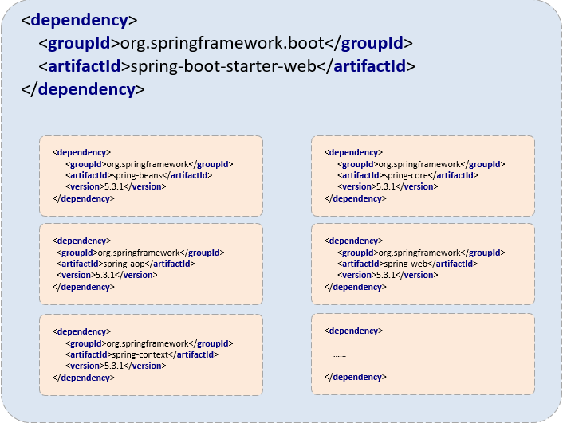
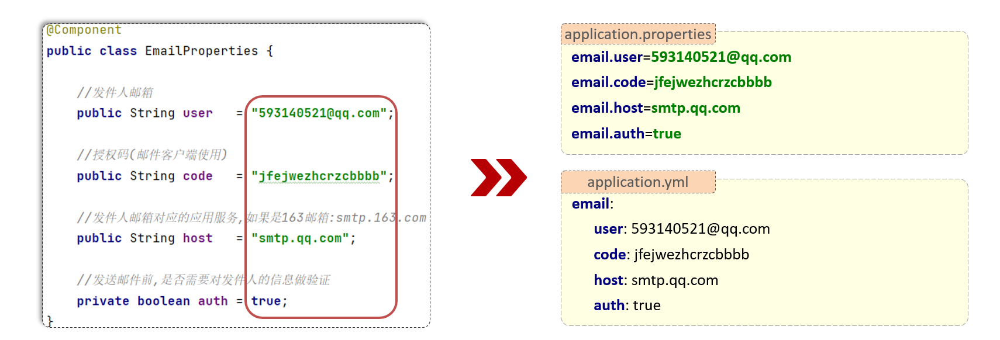

# SpringBoot3

## 一、SpringBoot介绍

### 1.1 概述

- SpringBoot是Spring提供的一个子项目，用于快速构建Spring应用程序

- 传统方式构建Spring应用程序的**缺点**

  - 导入依赖繁琐

    

  - 项目配置繁琐

    

### 1.2 SpringBoot特性

- **起步依赖**

  - 本质就是一个Maven坐标，整合了完成一个功能需要的所有坐标

    

- **自动配置**

  - 遵循约定大约配置的原则，在SpringBoot程序启动后，一些bean对象会自动注入到IOC容器，不需要手动声明，简化开发

- 内嵌的Tomcat、Jetty（无序部署WAR文件）

- 外部化配置

- 不需要XML配置（properties/yml）

### 1.3 SpringBoot入门程序

1. 创建Maven工程
2. 导入spring-boot-starter-web起步依赖
3. 编写Controller
4. 提供启动类

## 二、学习路径

### 2.1 配置文件

#### 2.1.1 properties配置文件

**application.properties**

```properties
server.port=9090
server.servlet.context-path=/start
```

#### 2.1.2 yml/yaml配置文件

```yaml
server:
  port: 9191
  servlet:
    context-path: /start2
```

#### 2.1.3 SpringBoot配置文件加载顺序

- `application.properties` > `application.yml` > `application.yaml`
- **注意**
  - SpringBoot核心配置文件名为application
  - SpringBoot内置属性过多，且所有属性集中在一起修改，在使用时，通过**提示键+关键字**修改属性

### 2.2 yml配置信息书写与获取

#### 2.2.1 yml语法规则

- 属性值前边必须有空格，作为分隔符（属性名和属性值之间使用冒号+空格作为分隔）；

- 使用空格作为缩进表示层级关系，相同的层级左侧对齐

  ```yaml
  email:
    user: 2841903634@qq.com
    code: jsadfiegscwegv
    host: smtp.qq.com
    auth: true
  ```

- 数组数据在数据书写位置的下方使用`-`作为数据开始符号，每行书写一个数据，`-`与数据间空格分隔

  ```yaml
  enterprise:
    subject:
      - Java
      - Vue
      - Python
  ```

#### 2.2.2 yml配置信息获取

- 第三方配置信息：写入配置文件即可，并不需要程序进行读取

- 自定义配置信息：需要将配置信息写入配置文件后，程序进行读取



#### 2.2.3 yml配置信息获取三种方式

属性数据

```yaml
lesson: SpringBoot
server:
  port: 8080

enterprise:
  name: buaa
  age: 71
  tel: 12111111111
  subject:
    - Java
    - Vue
    - Python
```

##### **@Value**：直接读取

- 读取单个数据，属性名引用方式：`${一级属性名.二级属性名}`

  ```java
  @Value("${lesson}")
  private String lesson;
  
  @Value("${server.port}")
  private Integer port;
  
  @Value("${enterprise.subject[0]}")
  private String subject;
  ```

##### 封装全部数据到Environment对象

```java
@Autowired
private Environment environment;

System.out.println(environment.getProperty("server.port"));
System.out.println(environment.getProperty("enterprise.subject[0]"));
System.out.println(environment.getProperty("lesson"));
```

##### @ConfigurationProperties：实体类封装属性

自定义对象封装指定数据

```java
@Component
@ConfigurationProperties(prefix = "enterprise")
public class EnterPrise {
    private String name;
    private Integer age;
    private String[] subject;
    private String tel;

    @Override
    public String toString() {
        return "EnterPrise{" +
                "name='" + name + '\'' +
                ", age=" + age +
                ", subject=" + Arrays.toString(subject) +
                ", tel='" + tel + '\'' +
                '}';
    }

    public String getName() {
        return name;
    }

    public void setName(String name) {
        this.name = name;
    }

    public Integer getAge() {
        return age;
    }

    public void setAge(Integer age) {
        this.age = age;
    }

    public String[] getSubject() {
        return subject;
    }

    public void setSubject(String[] subject) {
        this.subject = subject;
    }

    public String getTel() {
        return tel;
    }

    public void setTel(String tel) {
        this.tel = tel;
    }
}
```

