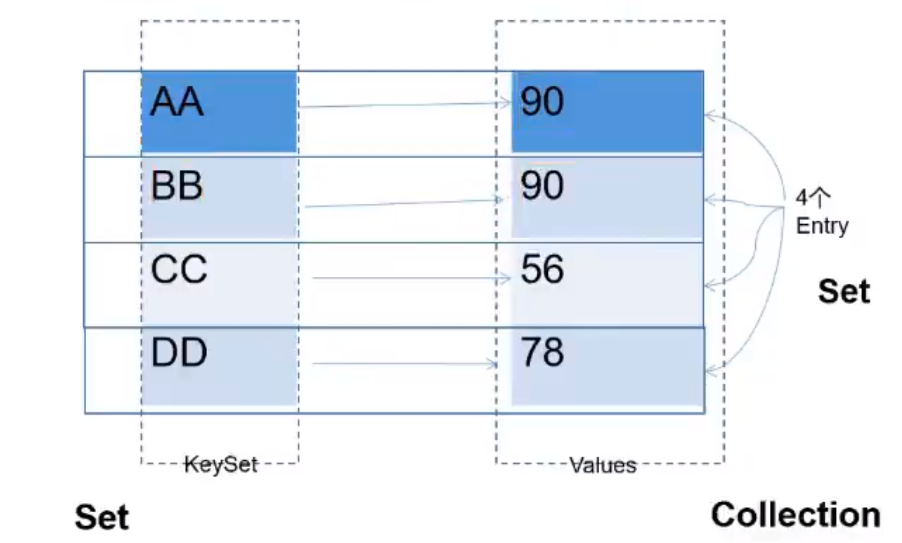
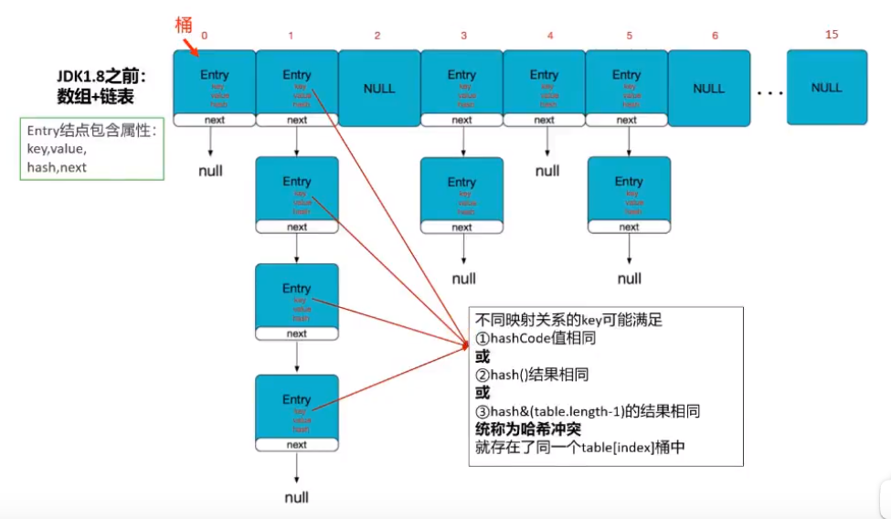
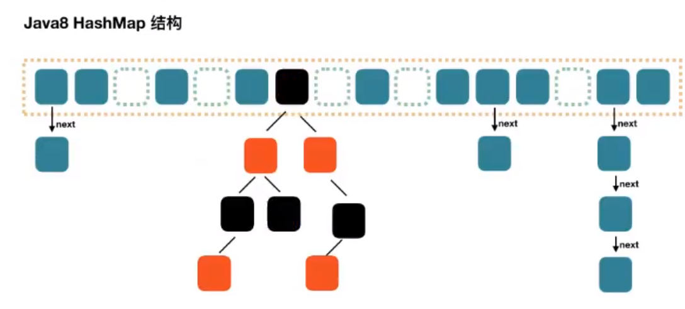

# 集合框架

## 一、集合框架概述

### 1.1 数组存储数据的弊端？（为什么要引入集合）

- 数组一旦初始化，其长度就不可变了；
- 数组中存储数据特点的单一性。对于无序的、不可重复的场景的多个数据就无能为力了；
- 数组中可用的方法、属性都极少。具体的需求都需要自己来组织相关的代码逻辑；
- 针对数组中元素的删除、插入操作，性能较差；
- （优点）：元素的类型既可以是基本数据类型，也可以是引用数据类型。

### 1.2 Java集合框架体系（`java.util`包下）

- `java.util.Collection`：存储一个一个的数据
  - 子接口`List`：有序的，可重复的数据（动态数组）
    - 实现类：`ArrayList`（主要实现类）、`LinkedList`、`Vector`
  - 子接口`Set`：无序的、不可重复的数据
    - 实现类：`HashSet`、`LinkedHashSet`、`TreeSet`

- `java.util.Map`：存储一对一对的数据（`key-value`键值对）
  - 实现类：`HashMap`、`LinkedHashMap`、`TreeMap`、`Hashtable`、`Properties`

## 二、Collection接口及方法

### 2.1 添加

- `boolean add(E e)`：添加元素对象到当前集合中

- `boolean addAll(Collection<? extends E> c)`：添加c集合中的所有元素到当前集合

- **`coll.addAll(other)`和`coll.add(other)`区别**：前者为加入other中的所有元素，后者是other作为整体看成一个元素添加

  

### 2.2 判断

- `int size()`：获取当前集合中实际存储的元素个数
- `boolean isEmpty()`：判断当前集合是否为空
- `boolean contains(Object o)`：判断当前集合中是否存在一个与`o`对象`equals`返回`true`的元素（调用对象`o`的`equals`方法）
- `boolean containsAll(Collection<?> c)`：判断`c`中的元素是否在当前集合中都存在
- `boolean equals(Object o)`：判断当前集合与`obj`是否相等

### 2.3 删除

- `void clear()`：清空集合元素
- `boolean remove(Object o)`：从当前集合中删除**第一个**找到的与`obj`对象`equals`返回`true`的元素（找到`equals`就返回`true`了）；
- `boolean removeAll(Collection<?> c)`：从当亲集合中删除**所有**与c集合中相同的元素（遍历当前集合所有元素，如果contains在c中就删除）；
- `boolean retainAll(Collection<?> c)`：从当前集合中删除两个集合不同的元素

### 2.4 其他

- `Object[] toArray()`：
- `int hashCode()`：
- `Iterator<E> iterator()`：

### 2.5 集合和数组的相互转换

- 集合$\rightarrow$数组：`toArray()`
- 数组$\rightarrow$集合：`Arrays.asList(T... a)`

### 2.6 向Collection中添加元素的要求

要求元素所属的类一定要重写`equals()`

原因：因为`Collection`中的相关方法在使用时，要调用元素所在类的`equals()`

## 三、Iterator迭代器接口

### 3.1 Iterator接口

作用：遍历集合元素

如何获取：`Iterator iterator = coll.iterator();`

遍历实现：

```java
while (iterator.hasNext()) {
    System.out.println(iterator.next()); //①指针下移动；②返回元素
}
```

### 3.2 迭代器的执行原理


### 3.3 增强for循环

1. **作用**

   用来遍历数组集合

2. **说明**

   - 针对于集合来讲，增强for循环的底层仍然使用的是迭代器；

   - 增强for循环的执行过程中，是将集合或数组中的元素一次赋值给临时变量。注意，循环体中对临时变量的修改，**可能不会导致原有集合或数组中元素的修改**

     ```java
     // 修改失败
     public void test1() {
         Collection<String> coll = new ArrayList<>();
         coll.add("AA");
         coll.add("BB");
         coll.add("CC");
         for (String str : coll) {
             str = "HHH";
         }
         for (String str : coll) {
             System.out.println(str);//AA BB CC
         }
     }
     ```

     ```java
     // 修改成功
     public class IteratorTest {
         @Test
         public void test1() {
             Collection<Person> coll = new ArrayList<>();
             coll.add(new Person("Ivo10", 12));
             for (Person p : coll) {
                 p.setName("Ivo29");
             }
             for (Person p : coll) {
                 System.out.println(p); //Person{name='Ivo29', id=12}
             }
         }
     }
     
     class Person {
         private String name;
         private int id;
     
         @Override
         public String toString() {
             return "Person{" +
                     "name='" + name + '\'' +
                     ", id=" + id +
                     '}';
         }
     
         public Person(String name, int id) {
             this.name = name;
             this.id = id;
         }
     
         public String getName() {
             return name;
         }
     
         public void setName(String name) {
             this.name = name;
         }
     
         public int getId() {
             return id;
         }
     
         public void setId(int id) {
             this.id = id;
         }
     }
     ```

## 四、Collection子接口1：List

### 4.1 List接口方法

- 增：`add(Object obj)`、`addAll(Collection coll)`
- 删：`remove(Object obj)`、`remove(int index)`
- 改：`set(int index, Object ele)`
- 查：`get(int index)`
- 插：`add(int index, Object ele)`、`addAll(int index, Collection eles)`
- 长度：`size()`

**注意**：`remove()`方法的重载

```java
List<Integer> list = new ArrayList<>();
for (int i = 0; i < 10; i++) {
    list.add(9 - i);
}
list.remove(0); //删除索引为0的元素
list.remove(Integer.valueOf(0)); //删除值为0的元素
System.out.println(list);
```

### 4.2 List及其实现类的特点

**`ArrayList`**

- List的主要实现类
- 线程不安全的，效率高
- 底层使用`Object[]` 存储
- 在添加数据、查询数据时效率较高；在插入、删除数据时，效率较低

**`LinkedList`**

- 底层使用双向链表的方式进行存储
- 在插入、删除数据时，效率较高；在添加数据、查找数据时，效率较低；
- 在对集合中的数据进行频繁地删除、插入操作时，建议使用此类

**`Vector`**

- `List`的古老实现类
- 线程安全的，效率低
- 底层使用`Object[]`存储

### 4.3 `ArrayList`源码剖析

#### 4.3.1 jdk7版本（以jdk1.7.0_07为例）

执行如下代码，底层会初始化数组，数组的长度为10：`Object[] elementData = new Object[10];`

```java
List<String> list = new ArrayList<>();
list.add("AA");
list.add("BB");
```

当添加到第11个元素的时候，底层的`elementData`数组已满，则需要扩容。默认扩容为原来长度的1.5倍，并将原有数组中的元素复制到新的数组中（如果给出了初始化容量，那么也是数组满的时候就扩容到1.5倍，如：3$\rightarrow$4$\rightarrow$6$\rightarrow$9）。

```java
public class ArrayList<E> extends AbstractList<E> implements List<E>,RandomAccess,Cloneable,java.io.Serializable{
    // 底层的数组，数组类型为Object，正因为是Object类型，所以可以放不同数据类型数据
    private transient Object[] elementData;
    // 数组中的有效数据长度
    private int size;
    
    public ArrayList(){
        this(10);
    }
    
   	public ArrayList(int initialCapacity){
        super();
        // 健壮性代码
        if(initialCapacity < 0)
            throw new IllegalArgumentException("Illegal Capacity: " + initialCapacity);
        // 给elementData数组初始化，默认长度为10
        this.elementData = new Object[initialCapacity];
    }
    
    // 调用add方法向底层数组中添加元素
    public boolean add(E e){
        // 数组的扩容操作
        ensureCapacityInternal(size + 1);
        // 最开始size为0，添加元素后size+1操作
        elementData[size++] = e;
        // 添加成功返回true
        return true;
    }
    
    // 数组扩容
    public void ensureCapacityInternal(int minCapacity){
        modCount++;
        if(minCapacity - elementData.length > 0)
            grow(minCapacity);
    }
    
    private void grow(int minCapacity){
        int oldCapacity = elementData.length;
        // 新数组空间 = 当前数组长度 + 当前数组/2
        // 15 = 10 + 5，扩容相当于新建了长度为15的数组
        int newCapacity = oldCapacity + (oldCapacity >> 1);
        if(newCapacity - minCapacity < 0)
            newCapacity = minCapacity;
        if(newCapacity - MAX_ARRAY_SIZE > 0)
            newCapacity = hugeCapacity(minCapacity);
        // elementData数组指向扩容后的数组
        // Arrays.copyof做的事就是将旧数组里的元素拷贝到新数组中
        elementData = Arrays.copyof(elementData,newCapacity);
    }
}
```

#### 4.3.2 jdk8版本

底层初始化如下：

```java
Object[] elementData = new Object[]{};
```

首次添加元素时，会初始化数组`elementData = new Object[10];`

#### 4.3.3 小结

- jdk1.7.0_07版本中，`ArrayList`类似于饿汉式
- jdk1.8.0_271版本中，`ArrayList`类似于懒汉式

### 4.4 Vector源码解析

```java
List<String> list = new Vector<>();
```

底层初始化数组，长度为10：`Object[] elementData = new Object[10];`

当添加到第11个元素时，需要扩容，默认扩容为原来的**2倍**

```java
int newCapacity = ArraysSupport.newLength(oldCapacity,
                minCapacity - oldCapacity, /* minimum growth */
                capacityIncrement > 0 ? capacityIncrement : oldCapacity //preferred growth = oldCapacity
                                           /* preferred growth */);
```

### 4.5 `LinkedList`源码解析

`LinkedList`内部声明了一个内部类：双向链表

```java
private static class Node<E> {
    E item;
    Node<E> next;
    Node<E> prev;

    Node(Node<E> prev, E element, Node<E> next) {
        this.item = element;
        this.next = next;
        this.prev = prev;
    }
}
```

add方法调用linkLast方法

```java
void linkLast(E e) {
    final Node<E> l = last;
    final Node<E> newNode = new Node<>(l, e, null);
    last = newNode;
    if (l == null)
        first = newNode;
    else
        l.next = newNode;
    size++;
    modCount++;
}
```

## 五、Collection子接口2：Set

### 5.1 概述

1. **Set及其实现类特点**

    子接口`Set`：无序的、不可重复的数据

    - `HashSet`：主要实现类；底层使用的时`HashMap`，即使用**数组+单向链表+红黑树**结构进行存储（jdk8中）
      - `LinkedHashSet`：`HashSet`的子类；在现有的数组+单向链表+红黑树结构上，添加了一组**双向链表**，用于记录添加元素的先后顺序。即，我们可以按照添加元素的顺序进行遍历，便于频繁地查询操作；
    - ``TreeSet`：底层使用红黑树进行存储；可以按照添加的元素地指定的属性大小顺序进行遍历；

2. **开发中的使用频率及场景**
   
   - 较List、Map来说，Set使用的频率较少
   - 用来过滤重复数据
3. **Set中的常用方法**：即为Collection中声明的15个抽象方法，没有新增的方法

### 5.2 Set中无序性、不可重复性的理解

#### 5.2.1 无序性

- 不等于随机性（每次遍历顺序都一样）；
- 添加元素的顺序和遍历元素的顺序不一致，也不是无序性；
- **无序性**：与添加的元素的位置有关，不像`ArrayList`一样时依次紧密排列的；**这里是根据添加的元素的哈希值，计算的其在数组中的存储位置。此位置不是依次排列的，表现为无序性**

#### 5.2.2 不可重复性

- 添加到`Set`中的元素是不能相同的

- 比较的标准：需要判断的`hashCode()`得到的哈希值以及`equals()`得到的`boolean`型的结果
- 哈希值相同且`equals()`返回`true`，则认为元素是相同的

#### 5.2.3 添加到`HahSet`/`LinkedHashSet`中元素的要求

- 重写两个方法：`equals()`和`hashCode()`
- `equals()`和`hashCode()`保持一致性(`equals()`为`true`，则`hashCode()`一定相等

**举例**:

```java
public class IteratorTest {  
	public void test3() {
        Set<Person> set = new HashSet<>();
//        List<Person> set = new ArrayList<>();//不写hashCode方法时，List判断为true，而set判断为false
        set.add(new Person("Ivo10", 12));
        System.out.println(set.contains(new Person("Ivo10", 12))); //true
    }
}

class Person {
    private String name;
    private int id;

    @Override
    public String toString() {
        return "Person{" +
                "name='" + name + '\'' +
                ", id=" + id +
                '}';
    }

    public Person(String name, int id) {
        this.name = name;
        this.id = id;
    }

    public String getName() {
        return name;
    }

    public void setName(String name) {
        this.name = name;
    }

    public int getId() {
        return id;
    }

    public void setId(int id) {
        this.id = id;
    }

    @Override
    public boolean equals(Object o) {
        if (this == o) return true;
        if (o == null || getClass() != o.getClass()) return false;
        Person person = (Person) o;
        return id == person.id && Objects.equals(name, person.name);
    }

    @Override
    public int hashCode() {
//        System.out.println("Person:hashCode");
        return Objects.hash(name, id); //让其所有属性参与计算
    }
}
```

### 5.3 `TreeSet`的使用

1. **底层的数据结构**：红黑树
2. **添加数据后的特点**：可以按照添加的元素的指定属性的大小顺序进行遍历
3. **向`TreeSet`中添加的元素的要求**：要求添加到`TreeSet`中的元素必须是同一个类型的对象，否则会报`ClassCastException`
4. **判断数据是否相同的标准**：
   - 不再考虑`hashCode()`和`equals()`了，也就意味着添加到`TreeSet`中的元素所在的类不需要重写这两个方法；
   - 比较元素大小或是否相等的标准：考虑自然排序或定制排序中，`compareTo()`或者`compare()`的返回值
     - 若`compareTo()`或`compare()`的返回值为0，则认为两个对象是相等的，后一个相等的元素就不能添加到`TreeSet`中了

## 六、Map接口的使用

### 6.1 Map及其实现类对比

- `HashMap`：主要实现类；线程不安全的，效率高；可以添加null的key或value值；底层使用**数组+单向链表+红黑树**存储（jdk8）；
  - `LinkedHashMap`：是HashMap的子类；在HashMap使用的数据结构基础上，增加了一对双向链表，用于记录添加元素的先后顺序，进而我们在遍历元素时，可以按照添加的顺序遍历；开发中对于频繁的遍历操作，建议使用此类。
- `TreeMap`：底层使用红黑树存储；可以按照key-value中的key元素的指定的属性大小顺序进行遍历；需要考虑使用①自然排序②定制排序
- `Hashtable`：古老实现类；线程安全的。效率低；不可以添加null的key或value值；底层使用**数组+单向链表**存储（jdk8）；
  - `Properties`：其key和value都是String类型；常用于处理属性文件

### 6.2 HashMap中元素的特点



- `HashMap`中的所有的`key`彼此之间是不可重复的、无序的，所有的key构成一个Set集合$\rightarrow$key所在的类要重写hashCode()和equals()
- `HashMap`中的所有的value彼此之间是可重复的、无序的，所有的value构成一个Collection集合$\rightarrow$value所在的类要重写`equals()`
- `HashMap`中的一个key-value，就够构成了一个entry；所有的entry彼此之间是不可重复的、无序的，所有的entry构成一个Set集合

### 6.3 `Map`中的常用方法

### 6.4 `HashMap`源码解析

#### 6.4.1 jdk7中创建对象和添加数据过程

底层使用**数组+单向链表**实现



##### 6.4.1.1 实例化过程

```java
// 创建对象的过程中，底层会初始化数组Entry[] table = new Entry[16];
Map<String, Integer> map = new HashMap<>();
```

对应的源码：

```java
public HashMap() {
    this(DEFAULT_INITIAL_CAPACITY, DEFAULT_LOAD_FACTOR);
}

public HashMap(int initialCapacity, float loadFactor) {
    if (initialCapacity < 0)
        throw new IllegalArgumentException("Illegal initial capacity: " +
                                           initialCapacity);
    if (initialCapacity > MAXIMUM_CAPACITY)
        initialCapacity = MAXIMUM_CAPACITY;
    if (loadFactor <= 0 || Float.isNaN(loadFactor))
        throw new IllegalArgumentException("Illegal load factor: " +
                                           loadFactor);

    // 通过次循环，得到capacity的最终值，此最终值决定了Entry数组的长度。此时的capacity一定是2的整数倍
    int capacity = 1;
    while (capacity < initialCapacity)
        capacity <<= 1; //capacity扩展到16了

    // 确定了加载因子的值
    this.loadFactor = loadFactor;
    
    // 初始化阈值
    threshold = (int)Math.min(capacity * loadFactor, MAXIMUM_CAPACITY + 1);
    
    // 初始化Entry数组
    table = new Entry[capacity];
    
    useAltHashing = sun.misc.VM.isBooted() &&
        (capacity >= Holder.ALTERNATIVE_HASHING_THRESHOLD);
    init();
}
```

其中：

```java
static final int DEFAULT_INITIAL_CAPACITY = 16;
static final float DEFAULT_LOAD_FACTOR = 0.75f;

final float loadFactor;
int threshold;
```

##### 6.4.1.2 `put(key1, value1)`过程

- 首先，需要调用key1所在类的hashCode()方法，计算key1对应的哈希值1，此哈希值经过某种算法（`hashCode()`）方法之后，得到哈希值2
- 哈希值2再经过某种算法（`indexFor()`）之后，就确定了（key1，value1）在数组table中的索引位置i
  - 如果此索引位置i的数组上没有元素，则(key1, value1)添加成功       $\rightarrow$情况1
  - 如果此索引位置i的数组上有元素（key2，value2），则需要比较key1和key2的哈希值2
    - 如果key1的哈希值2和key2的哈希值2不相同，则(key1, value1)添加成功           $\rightarrow$情况2
    - 如果key1的哈希值2和key2的哈希值2相同。则需要继续比较key1和key2的equals()。
      - equals()返回false，则(key1, value1)添加成功          $\rightarrow$情况3
      - equals()返回true，则认为key1和key2是相同的。默认情况下，value1替换原有的value2
- 说明：
  - 情况1：将(key1, value1)存放到数组的索引i的位置
  - 情况2、情况3：(key1, value1)元素与现有的(key2, value2)构成单向链表结构，(key1, value1)指向(key2, value2)
- **源码**

```java
public V put(K key, V value) {
    if (key == null) 
        return putForNullKey(value);
    // 将key传入hash()，内部使用了key的哈希值1，此方法执行结束后，返回哈希值2
    int hash = hash(key); 
    
    // 确定当前key-value在数组中的存放位置i
    int i = indexFor(hash, table.length); 
    
    // 该位置有元素，进for循环；没有元素，跳过for循环
    for (Entry<K,V> e = table[i]; e != null; e = e.next) {
        Object k;
        if (e.hash == hash && ((k = e.key) == key || key.equals(k))) {
            V oldValue = e.value;
            e.value = value;
            e.recordAccess(this);
            return oldValue; // 如果put是修改操作，会返回原有旧的value
        }
    }
    // 没有在相同hash值的链表中找到key相同的节点
    modCount++;
    addEntry(hash, key, value, i); // 在i位置对应的链表上添加一个节点
    return null;
}
```

其中

```java
final int hash(Object k) {
    int h = 0;
    if (useAltHashing) {
        if (k instanceof String) {
            return sun.misc.Hashing.stringHash32((String) k);
        }
        h = hashSeed;
    }

    h ^= k.hashCode();

    // This function ensures that hashCodes that differ only by
    // constant multiples at each bit position have a bounded
    // number of collisions (approximately 8 at default load factor).
    h ^= (h >>> 20) ^ (h >>> 12);                                                                                          
    return h ^ (h >>> 7) ^ (h >>> 4);
}
```

```java
static int indexFor(int h, int length) {
    return h & (length-1); //解释了capacity为什么是2的整数幂（取了h的后四位）
}
```

```java
void addEntry(int hash, K key, V value, int bucketIndex) {
    // 扩容的条件
    if ((size >= threshold) && (null != table[bucketIndex])) { 
        resize(2 * table.length); // 默认扩容为原有容量的2倍
        hash = (null != key) ? hash(key) : 0; // key为null的时，hash值设为0
        bucketIndex = indexFor(hash, table.length); // 确定是哪一个链表（bucket下标）
    }

    createEntry(hash, key, value, bucketIndex);
}
```

```java
void createEntry(int hash, K key, V value, int bucketIndex) {
    Entry<K,V> e = table[bucketIndex];
    table[bucketIndex] = new Entry<>(hash, key, value, e);
    size++;
}
```

##### 6.4.1.3 Entry的定义

```java
// 静态内部类
static class Entry<K,V> implements Map.Entry<K,V> {
    final K key;
    V value;
    Entry<K,V> next; // 指向下一个entry节点
    int hash;

    Entry(int h, K k, V v, Entry<K,V> n) {
        value = v;
        next = n; 
        key = k;
        hash = h;
    }
}
```

参考链接：[JDK1.7之 HashMap 源码分析-CSDN博客](https://blog.csdn.net/crazy1235/article/details/75451812)

#### 6.4.2 jdk8中的不同之处



1. 在jdk8中，当我们创建了`HashMap`实例以后，底层并没有初始化`table`数组；当首次添加`(key, value)`时，进行判断；如果发现`table`尚未初始化，则对数组进行初始化；
2. 在jdk8中，`HashMap`底层定义了`Node`内部类，替换了jdk7中的`Entry`内部类。意味着，我们创建的数组是`Node[]`；
3. 在jdk8中，如果当前的`(key,value)`经过一系列判断之后，可以添加到当前的数组角标i中。如果此时角标i位置上有元素，在jdk7中是将新的`(key,value)`指向已有的旧的新元素（**头插法**），而在jdk8中是旧的元素指向新的`(key, value)`元素（**尾插法**）；
4. jdk7：数组+单向链表，jdk8：数组+单向链表+红黑树
   - **单向链表$\rightarrow$红黑树**：如果数组索引`i`位置上的元素个数达到8，并且数组的长度达到64，我们就将此索引`i`位置上的多个元素改为使用红黑树的结构进行存储。（为什么修改呢？红黑树进行`put()`/`remove()`/`get()`操作的时间复杂度为$O(logN)$，比单向链表的时间复杂度$O(N)$性能高）
   - **红黑树$\rightarrow$单向链表**：当使用红黑树的索引i位置上的个数低于6的时候，就会将红黑树的结构退化为单向链表。
