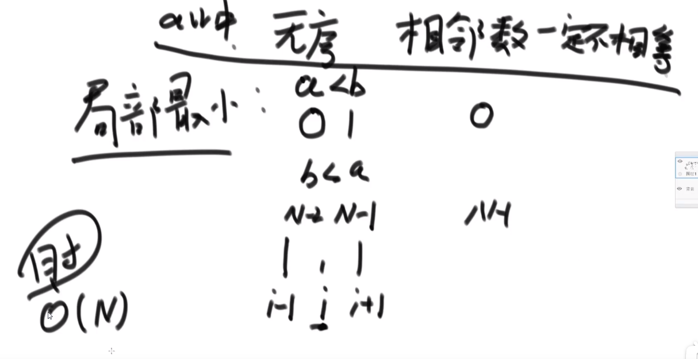
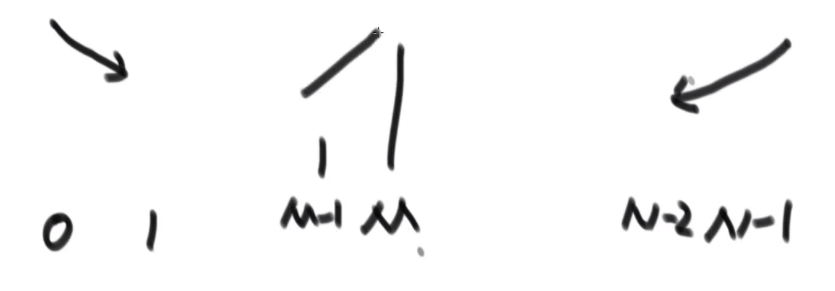

# 算法

## Class1

### 题目一：认识时间复杂度

#### 常数时间的操作

- 一个操作如果**和样本的数据量没有关系**，每次都是固定时间内完成的操作，叫做常数操作。

    如

    ```java
    int a = arr[i]; // 常数操作
    int b = list.get(i); // 不是常数操作了
    // +、-、*、/都是常数操作
    ```

- 时间复杂度为一个算法流程中，常数操作数量的一个指标。具体来说，先要对一个算法流程非常熟悉，然后写出这个算法流程中，发生了多少常数操作，进而总结出常数操作数量的表达式。

- 表达式中，**只要高阶项，不要低阶项，也不要高阶项的系数**，剩下的部分如果为$f(N)$，那么时间复杂度为$O(f(N))$

- 评价一个算法流程的好坏，先看时间复杂度的指标，然后再分析数据样本下的**实际运行时间**，也就是“常数项”时间

### 题目二：选择排序和冒泡排序

时间复杂度$O(N^2)$，额外空间复杂度$O(1)$

**选择排序**：每次选一个最小的放到当前第一个位置。

```java
public class Code01_SelectionSort {
    public static void selectionSort(int[] arr) {
        if (arr == null || arr.length < 2) {
            return;
        }
        for (int i = 0; i < arr.length - 1; i++) {
            int minIndex = i;
            for (int j = i + 1; j < arr.length; j++) {
                minIndex = arr[j] < arr[minIndex] ? j : minIndex;
            }
            swap(arr, i, minIndex);
        }
    }
    
    public static void swap(int[] arr, int i, int j) {
        int tmp = arr[i];
        arr[i] = arr[j];
        arr[j] = tmp;
    }
}
```

**冒泡排序**：每次相邻两个数交换（每次交换导致最大值交换到当前最后一个位置了）

```java
public class Code02_BubbleSort {
    public static void bubbleSort(int[] arr) {
        if (arr == null || arr.length < 2) {
            return;
        }
        for (int e = arr.length - 1; e > 0; e--) {// 0~e
            for (int i = 0; i < e; i++) {
                if (arr[i] > arr[i + 1]) {
                    swap(arr, i, i + 1);
                }
            }
        }
    }

    // 异或完成两数交换（不用申请额外的空间，但必须保证二者是独立的内存）
    public static void swap(int[] arr, int i, int j) {
        arr[i] = arr[i] ^ arr[j];
        arr[j] = arr[i] ^ arr[j];
        arr[i] = arr[i] ^ arr[j];
    }
}
```

### 题目三：插入排序

1. 算法流程：

    arr[0]~arr[i-1]已经有序，后面加上arr[i]，和前面的数比较，最终选择合适的位置插入

2. **不同的数据状况对算法的影响不同**：

    ```
    输入数据为：7，6，5，4，3，2，1 ————————算法复杂度为O(N^2)
    输入数据为：1，2，3，4，5，6，7 ————————算法复杂度为O(N)
    ```

    算法流程按照最差情况估计时间复杂度。时间复杂度$O(N^2)$，空间复杂度为$O(1)$

```java
public static void InsertionSort(int[] arr) {
    if (arr == null || arr.length < 2) {
        return;
    }
    for (int i = 1; i < arr.length; i++) {
        for (int j = i; j > 0 && arr[j] < arr[j - 1]; j--) { // 表示插入arr[j]
            swap(arr, j - 1, j);
        }
    }
}
```

### 题目四：二分法的详解和扩展

1. 在一个有序数组中，找某个数是否存在（可能提前结束）

2. 在一个有序数组中，找到≥某个数最左侧的位置（二分到结束）

   **上述连个问题都可以用二分来解决**

3. 局部最小值问题 

   题目：找出数组中存在的一个局部最小值点即可

   

   思路：

   - 判断arr[0]和arr[N-1]是否为局部最小值点，如果是即返回；
   - 令M=(N-1)/2，判断arr[M]是否为局部最小值点，如果是即返回；不是，不妨假设arr[M]<arr[M-1]；在arr[0]~arr[M-1]之间继续二分即可。

​				

### 题目五：异或运算的性质和扩展

- 相同为0， 不同为1；也可以理解为**无进位相加**

- 异或的性质：

    ```
    0 ^ N = N
    N ^ N = 0
    
    a ^ b = b ^ a
    (a ^ b) ^ c = a ^ (b ^ c)
    ```

- 不用额外变量交换两个数-

-   **题目**

    

    **算法思想**：

    1. 所有数异或一遍（偶数次的自己和自己异或都异或为0了，只剩下出现奇数次的那个数）；

       代码：

       ```java
       public static void printOddTimesNum1(int[] arr) {
           int eor = 0;
           for (int cur : arr) {
               eor ^= cur;
           }
           System.out.println(eor);
       }
       ```

    2. 假设出现奇数次的两个数是$a$和$b$

       - 将数组中所有数异或一遍，会得到`eor = a ^ b`
       - 由于a和b不相等，那么eor一定有一位为1，不妨假设为第8位；
       - 可将数组中所有数分为两类：第8位为1的，第8位为0的。a和b一定属于上述不同的两类中；
       - 将所有第8位为1的数进行异或，即可得到a；`eor ^ a = b`。
       - **补充**：`a&(~a+1)`提取`a`最右的1

       代码：

       ```java
       public static void printOddTimesNNum2(int[] arr) {
           int eor = 0;
           for (int curNum : arr) {
               eor ^= curNum;
           }
           int rightOne = eor & (~eor + 1); // 提取最右的1
           int onlyOne = 0; // eor'
           for (int cur : arr) {
               if ((cur & rightOne) == 0) {
                   onlyOne ^= cur;
               }
           }
           System.out.println(onlyOne + " " + (onlyOne ^ eor));
       }
       ```

### 题目六：对数器的概念和使用

1. 有一个你想要测的方法a；
2.  实现一个绝对正确但是复杂度不好的方法b；
3. 实现一个随机样本产生器；
4. 实现对比算法a和b的方法；
5. 把方法a和方法b比对多次来验证方法a是否正确；
6. 如果有一个样本使得比对出错，打印样本分析是哪个方法出错；
7. 当样本数量很多时比对测试依然正确，可以确定方法a已经正确。

```java
// 方法b
public static void comparator(int[] arr) {
    Arrays.sort(arr);
}

public static void main(String[] args) {
    int testTims = 50000;
    int maxSize = 100;
    int maxValue= 100;
    boolean succeed = true;
    for (int i = 0; i < testTims; i++) {
        int[] arr1 = generateRandomArray(maxSize, maxValue);
        int[] arr2 = copyArray(arr1);
        InsertionSort(arr1);
        comparator(arr2);
        if (!isEquals(arr1, arr2)) {
            succeed = false;
            break;
        }
    }
    System.out.println(succeed ? "Nice!" : "Fucking fucked");
    int[] arr = generateRandomArray(maxSize, maxValue);
    printArray(arr);
    InsertionSort(arr);
    printArray(arr);
}
```

### 题目七：剖析递归行为和递归行为时间复杂度的估算

**master公式：**
$$
T(N)=a*T(\frac{N}{b})+O(N^d)
$$

- $T(N)$：母问题的数据量是$N$级别的
- $T(\frac{N}{b})$：子问题是$\frac{N}{b}$规模的
- $a$：子问题被调用了$a$次
- $O(N^d)$：其余过程的时间复杂度

1. $\log_{b}{a}>d$，复杂度为$O(N^{\log_{b}{a}})$
2. $\log_{b}{a}=d$，复杂度为$O(N^d*\log{N})$
3. $\log_{b}{a}<d$，复杂度为$O(N^{d})$

## Class2

### 题目一：归并排序

1. 基本思路：整体就是一个简单递归，左边排好序、右边排好序，然后merge使得整体有序；

   ```java
   public class Code01_MergeSort {
       public static void mergeSort(int[] arr) {
           if (arr == null || arr.length < 2) {
               return;
           }
           process(arr, 0, arr.length - 1);
       }
   
       public static void process(int[] arr, int L, int R) {
           if (L == R) {
               return;
           }
           int mid = L + ((R - L) >> 1);
           process(arr, L, mid);
           process(arr, mid + 1, R);
           merge(arr, L, mid, R);
       }
   
       public static void merge(int[] arr, int L, int M, int R) {
           int[] help = new int[R - L + 1];
           int i = 0;
           int p1 = L;
           int p2 = M + 1;
           while (p1 <= M && p2 <= R) {
               help[i++] = arr[p1] <= arr[p2] ? arr[p1++] : arr[p2++];
           }
           while (p1 <= M) {
               help[i++] = arr[p1++];
           }
           while (p2 <= R) {
               help[i++] = arr[p2++];
           }
           for (int j = 0; j < help.length; j++) {
               arr[L + j] = help[j];
           }
       }
   }
   ```

2. 让其整体有序的过程里用了外排序方法；

3. 利用master公式来求解时间复杂度；
   $$
   T(N)=2*T(\frac{N}{2})+O(N)
   $$
   时间复杂度$O(N\log{N})$，额外空间复杂度$O(N)$（每次用完就释放了）

4. 归并排序比冒泡、选择、插入排序时间复杂度低的原因：

   - 归并排序每次排序的结果被利用起来了，参与下一次的合并
   - 上述三种排序耗费大量时间在比较操作上，分别比较N-1、N-2、N-3...次
