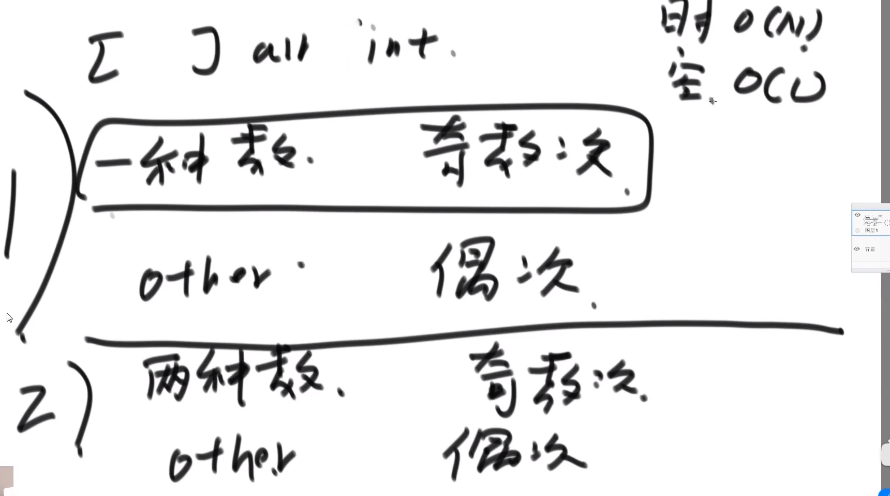

# 算法

## Class1

### 题目一：认识时间复杂度

#### 常数时间的操作

- 一个操作如果**和样本的数据量没有关系**，每次都是固定时间内完成的操作，叫做常数操作。

    如

    ```java
    int a = arr[i]; // 常数操作
    int b = list.get(i); // 不是常数操作了
    // +、-、*、/都是常数操作
    ```

- 时间复杂度为一个算法流程中，常数操作数量的一个指标。具体来说，先要对一个算法流程非常熟悉，然后写出这个算法流程中，发生了多少常数操作，进而总结出常数操作数量的表达式。

- 表达式中，只要高阶项，不要低阶项，也不要高阶项的系数，剩下的部分如果为$f(N)$，那么时间复杂度为$O(f(N))$

- 评价一个算法流程的好坏，先看时间复杂度的指标，然后再分析数据样本下的**实际运行时间**，也就是“常数项”时间

### 题目二：选择排序和冒泡排序

时间复杂度$O(N^2)$，额外空间复杂度$O(1)$

**选择排序**：每次选一个最小的放到当前第一个位置。

```java
public class Code01_SelectionSort {
    public static void selectionSort(int[] arr) {
        if (arr == null || arr.length < 2) {
            return;
        }
        for (int i = 0; i < arr.length - 1; i++) {
            int minIndex = i;
            for (int j = i + 1; j < arr.length; j++) {
                minIndex = arr[j] < arr[minIndex] ? j : minIndex;
            }
            swap(arr, i, minIndex);
        }
    }
    
    public static void swap(int[] arr, int i, int j) {
        int tmp = arr[i];
        arr[i] = arr[j];
        arr[j] = tmp;
    }
}
```

**冒泡排序**：每次相邻两个数交换（每次交换导致最大值交换到当前最后一个位置了）

```java
public class Code02_BubbleSort {
    public static void bubbleSort(int[] arr) {
        if (arr == null || arr.length < 2) {
            return;
        }
        for (int e = arr.length - 1; e > 0; e--) {// 0~e
            for (int i = 0; i < e; i++) {
                if (arr[i] > arr[i + 1]) {
                    swap(arr, i, i + 1);
                }
            }
        }
    }

    // 异或完成两数交换（不用申请额外的空间，但必须保证二者是独立的内存）
    public static void swap(int[] arr, int i, int j) {
        arr[i] = arr[i] ^ arr[j];
        arr[j] = arr[i] ^ arr[j];
        arr[i] = arr[i] ^ arr[j];
    }
}
```

#### 补充：异或运算

相同为0， 不同为1；也可以理解为**无进位相加**

异或的性质：

```
0 ^ N = N
N ^ N = 0

a ^ b = b ^ a
(a ^ b) ^ c = a ^ (b ^ c)
```

**题目**



**算法思想**：

1. 所有数异或一遍（偶数次的自己和自己异或都异或为0了，只剩下出现奇数次的那个数）；

   代码：

   ```java
   public static void printOddTimesNum1(int[] arr) {
       int eor = 0;
       for (int cur : arr) {
           eor ^= cur;
       }
       System.out.println(eor);
   }
   ```

2. 假设出现奇数次的两个数是$a$和$b$

   - 将数组中所有数异或一遍，会得到`eor = a ^ b`
   - 由于a和b不相等，那么eor一定有一位为1，不妨假设为第8位；
   - 可将数组中所有数分为两类：第8位为1的，第8位为0的。a和b一定属于上述不同的两类中；
   - 将所有第8位为1的数进行异或，即可得到a；`eor ^ a = b`。
   - **补充**：`a&(~a+1)`提取`a`最右的1

   代码：

   ```java
   public static void printOddTimesNNum2(int[] arr) {
       int eor = 0;
       for (int curNum : arr) {
           eor ^= curNum;
       }
       int rightOne = eor & (~eor + 1); // 提取最右的1
       int onlyOne = 0; // eor'
       for (int cur : arr) {
           if ((cur & rightOne) == 0) {
               onlyOne ^= cur;
           }
       }
       System.out.println(onlyOne + " " + (onlyOne ^ eor));
   }
   ```

### 题目三：插入排序

1. 算法流程：

    0~i范围有序了，后面插入第i+1个数，和前边的数比较。

2. 不同的数据状况对算法的影响不同：

    ```
    输入数据为：7，6，5，4，3，2，1 ————————算法复杂度为O(N^2)
    输入数据为：1，2，3，4，5，6，7 ————————算法复杂度为O(N)
    ```

    算法流程按照最差情况估计时间复杂度。时间复杂度$O(N^2)$，空间复杂度为$O(1)$

```java
public static void InsertionSort(int[] arr) {
    if (arr == null || arr.length < 2) {
        return;
    }
    for (int i = 1; i < arr.length; i++) {
        for (int j = i; j > 0 && arr[j] < arr[j - 1]; j--) { // 表示插入arr[j]
            swap(arr, j - 1, j);
        }
    }
}
```

### 题目四：二分法的详解和扩展

1. 在一个有序数组中，找某个数是否存在

2. 在一个有序数组中，找到≥某个数最左侧的位置

   **上述连个问题都可以用二分来解决**

3. 局部最小值问题 
