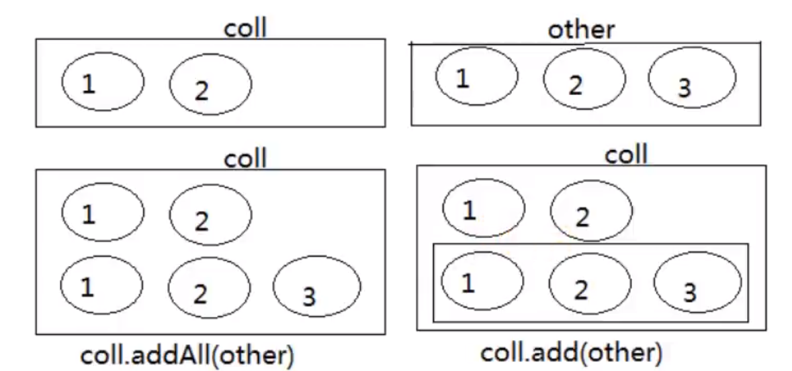
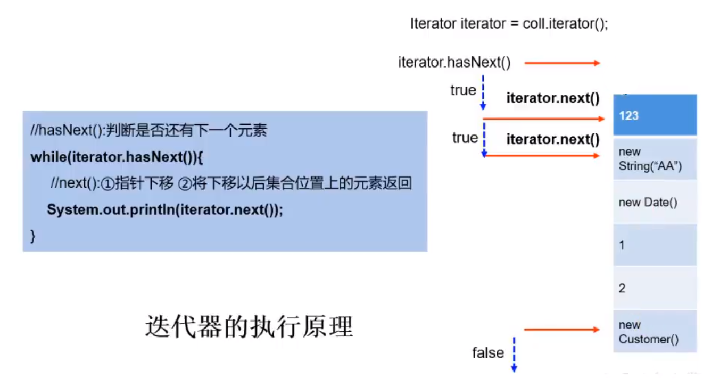

# 集合框架

## 一、集合框架概述

### 1.1 数组存储数据的弊端？（为什么要引入集合）

- 数组一旦初始化，其长度就不可变了；
- 数组中存储数据特点的单一性。对于无序的、不可重复的场景的多个数据就无能为力了；
- 数组中可用的方法、属性都极少。具体的需求都需要自己来组织相关的代码逻辑；
- 针对数组中元素的删除、插入操作，性能较差；
- （优点）：元素的类型既可以是基本数据类型，也可以是引用数据类型。

### 1.2 Java集合框架体系（`java.util`包下）

- `java.util.Collection`：存储一个一个的数据
  - 子接口`List`：有序的，可重复的数据（动态数组）
    - 实现类：`ArrayList`（主要实现类）、`LinkedList`、`Vector`
  - 子接口`Set`：无序的、不可重复的数据
    - 实现类：`HashSet`、`LinkedHashSet`、`TreeSet`

- `java.util.Map`：存储一对一对的数据（key-value键值对）
  - 实现类：`HashMap`、`LinkedHashMap`、`TreeMap`、`Hashtable`、`Properties`

## 二、Collection接口及方法

### 2.1 添加

- `boolean add(E e)`：添加元素对象到当前集合中

- `boolean addAll(Collection<? extends E> c)`：添加c集合中的所有元素到当前集合

- **`coll.addAll(other)`和`coll.add(other)`区别**：前者为加入other中的所有元素，后者是other作为整体看成一个元素添加

  

### 2.2 判断

- `int size()`：获取当前集合中实际存储的元素个数
- `boolean isEmpty()`：判断当前集合是否为空
- `boolean contains(Object o)`：判断当前集合中是否存在一个与`o`对象`equals`返回`true`的元素（调用对象`o`的`equals`方法）
- `boolean containsAll(Collection<?> c)`：判断c中的元素是否在当前集合中都存在
- `boolean equals(Object o)`：判断当前集合与obj是否相等

### 2.3 删除

- `void clear()`：清空集合元素
- `boolean remove(Object o)`：从当前集合中删除**第一个**找到的与obj对象equals返回true的元素（找到equals就返回true了）；
- `boolean removeAll(Collection<?> c)`：从当亲集合中删除**所有**与c集合中相同的元素（遍历当前集合所有元素，如果contains在c中就删除）；
- `boolean retainAll(Collection<?> c)`：从当前集合中删除两个集合不同的元素

### 2.4 其他

- `Object[] toArray()`：
- `int hashCode()`：
- `Iterator<E> iterator()`：

### 2.5 集合和数组的相互转换

- 集合$\rightarrow$数组：`toArray()`
- 数组$\rightarrow$集合：`Arrays.asList(T... a)`

### 2.6 向Collection中添加元素的要求

要求元素所属的类一定要重写`equals()`

原因：因为Collection中的相关方法在使用时，要调用元素所在类的`equals()`

## 三、Iterator迭代器接口

### 3.1 Iterator接口

作用：遍历集合元素

如何获取：`Iterator iterator = coll.iterator();`

遍历实现：

```java
while (iterator.hasNext()) {
    System.out.println(iterator.next()); //①指针下移动；②返回元素
}
```

### 3.2 迭代器的执行原理




### 3.3 增强for循环

1. **作用**

   用来遍历数组集合

2. **说明**

   - 针对于集合来讲，增强for循环的底层仍然使用的是迭代器；

   - 增强for循环的执行过程中，是将集合或数组中的元素一次赋值给临时变量。注意，循环体中对临时变量的修改，**可能不会导致原有集合或数组中元素的修改**

     ```java
     // 修改失败
     public void test1() {
         Collection<String> coll = new ArrayList<>();
         coll.add("AA");
         coll.add("BB");
         coll.add("CC");
         for (String str : coll) {
             str = "HHH";
         }
         for (String str : coll) {
             System.out.println(str);//AA BB CC
         }
     }
     ```

     ```java
     // 修改成功
     public class IteratorTest {
         @Test
         public void test1() {
             Collection<Person> coll = new ArrayList<>();
             coll.add(new Person("Ivo10", 12));
             for (Person p : coll) {
                 p.setName("Ivo29");
             }
             for (Person p : coll) {
                 System.out.println(p); //Person{name='Ivo29', id=12}
             }
         }
     }
     
     class Person {
         private String name;
         private int id;
     
         @Override
         public String toString() {
             return "Person{" +
                     "name='" + name + '\'' +
                     ", id=" + id +
                     '}';
         }
     
         public Person(String name, int id) {
             this.name = name;
             this.id = id;
         }
     
         public String getName() {
             return name;
         }
     
         public void setName(String name) {
             this.name = name;
         }
     
         public int getId() {
             return id;
         }
     
         public void setId(int id) {
             this.id = id;
         }
     }
     ```

## 三、List及其实现类特点

ArrayList：

- List的主要实现类，线程不安全的、效率高

